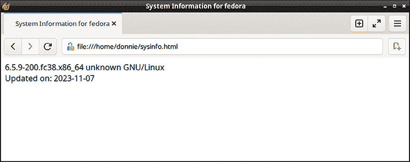

# 使用 here Documents 和 expect 自动化脚本

那么，究竟*here*在哪里呢？嗯，我想它就只是我所在的地方，或者从你的角度来看，任何你所在的地方。更大的谜团是，似乎没有人弄明白，为什么这个非常有用的 shell 脚本结构会有如此奇怪的名字。

**here document**，也可以称为**here script**或**heredoc**，其实并不是一个文档，也与任何人的当前位置无关。但是，正如你很快会看到的，它在很多不同的方面非常有用，比如自动化脚本。

我将展示的第二种自动化方法是**expect**，它是一个具有自己脚本语言的脚本环境。

本章的主题包括：

+   使用 here Documents

+   使用 expect 自动化响应

好的，准备好进行自动化吧！

# 技术要求

你可以使用任何 Linux 虚拟机来完成本章的内容。此外，像往常一样，你可以通过以下方式从 GitHub 获取脚本和文本文件：

```
git clone https://github.com/PacktPublishing/The-Ultimate-Linux-Shell-Scripting-Guide.git 
```

# 使用 here Documents

*Here document* 是你放入脚本中的一块代码，用于执行特定任务。是的，我知道，我之前说过函数也是这么说的。但*here documents*完全不同。它们自 Unix 早期就存在，并且可以在各种不同的编程语言中使用。

**格式说明**：Unix 和 Linux 中公认的写法是将“here document”一词全部用小写字母书写。不过，这可能有点让人困惑。所以，为了消除混淆，我将在本书的其余部分将该术语斜体化，像这样：*here document*。

*Here documents* 的工作原理是通过提供另一种方式将输入重定向到特定命令。执行此重定向的代码被一对**限界字符串**括起来，通常长这样：

```
command << _EOF_
. . .
Code to execute or data to display
. . .
_EOF_ 
```

`<<` 序列是一种特殊类型的重定向符号。它从两个限界字符串之间的代码或文本中获取输入，这些字符串在本例中称为 `_EOF_`。传统上，通常使用 `_EOF_` 或 `EOF` 作为限界字符串，但实际上你可以使用几乎任何文本字符串，只要它们在代码块的开始和结束位置相同，并且不会与任何变量或函数的名称冲突。事实上，如果你为限界字符串取个描述性的名字，通常有助于提高脚本的可读性。（一些教程中使用**token**而非**limit string**，但其实它们是一样的。）

除了使用`<<`作为重定向符号外，你还可以使用`<<-`，像这样：

```
command <<- _EOF_
. . .
Code to execute or data to display
. . .
_EOF_ 
```

添加破折号可以防止任何前导制表符字符缩进任何显示的文本。（前导空格仍然会缩进文本，但制表符则不会。我稍后会对此进行更详细的解释。）这样，你就可以缩进脚本中的代码，使其更具可读性，而不会导致输出内容被缩进。

以下是你可以使用*here documents*做的一些事情：

+   从 shell 脚本中显示多行注释。

+   创建一个简单的查找目录。

+   自动化文档的创建，比如网页内容文件或报告。

你的*here 文档*可以处理静态数据或动态数据。让我们从静态数据开始，因为它们是最简单的。

## 使用静态数据创建 Here 文档

有时你可能希望当用户调用脚本时，脚本显示一种多行消息。这条消息可以是帮助信息、版权信息或许可信息。你可以通过一系列`echo`命令来实现，这看起来像这样：

```
#!/bin/bash
echo "This software is released under the GNU GPL 3 license."
echo "Anyone who uses this software must respect the terms"
echo "of this license."
echo
echo "GNU GPL 3 is a license that aims to protect software freedom." 
```

这样有效，但如果你需要显示长消息，输入许多单独的 echo 命令会变得有些繁琐。使用*here 文档*来显示消息会让事情变得更加简单。以下是`here-doc1.sh`脚本中显示这种效果的方式：

```
#!/bin/bash
cat << licensing
This software is released under the GNU GPL 3 license.
Anyone who uses this software must respect the terms
of this license.
GNU GPL 3 is a license that aims to protect software freedom.
licensing 
```

在这种情况下，我使用`licensing`作为限制字符串，而不是传统的`_EOF_`。这样，我可以一眼看出*here 文档*在做什么。以下是我运行脚本时发生的情况：

```
[donnie@fedora ~]$ ./here-doc1.sh
This software is released under the GNU GPL 3 license.
Anyone who uses this software must respect the terms
of this license.
GNU GPL 3 is a license that aims to protect software freedom.
[donnie@fedora ~]$ 
```

如你所见，位于两个`licensing`字符串之间的文本会被重定向到`cat`命令，后者会将文本显示在屏幕上。

有时你需要为任何自由软件或 shell 脚本选择许可证。自由软件许可有很多种，你需要选择最适合你需求的一个。基本上，你可以将各种许可证分为宽松许可和非宽松许可。宽松许可，如 MIT 和 BSD 许可证，允许将被许可的代码嵌入到专有软件中，并且不要求将最终产品的源代码提供给客户。（这就是为什么苹果可以将 FreeBSD 代码包含在其专有的 OS X 和 macOS 操作系统中的原因。）非宽松许可，如各种 GNU 通用公共许可证，禁止将被许可的代码用于专有软件，并且要求软件供应商将最终产品的源代码提供给客户。总之，你可以在这里阅读有关各种自由软件许可的详细信息：[`opensource.org/licenses/`](https://opensource.org/licenses/)

顺便提一下，MIT 代表麻省理工学院，BSD 代表伯克利软件分发，GNU 是一个递归首字母缩略词，代表“GNU 不是 Unix”。

有时你可能希望将代码缩进到你的*here 文档*中，以使脚本更具可读性。`here-doc1.sh`脚本并不是这样做的，但我们假设它是这样。我们来创建`here-doc1-tabs.sh`脚本，看看它是怎么做的：

```
#!/bin/bash
cat << licensing  
                This software is released under the GNU GPL 3 license.
        Anyone who uses this software must respect the terms
        of this license.
   GNU GPL 3 is a license that aims to protect software freedom.
licensing 
```

这与`here-doc1.sh`相同，只不过我在“这款软件...”行前面放了两个制表符，在“任何人...”和“...此许可证...”行前面放了一个制表符，在“GNU GPL 3...”行前面放了三个空格。看看当我运行这个新脚本时会发生什么：

```
donnie@fedora:~$ ./here-doc1-tabs.sh
		This software is released under the GNU GPL 3 license.
	    Anyone who uses this software must respect the terms
	    of this license.
   GNU GPL 3 is a license that aims to protect software freedom.
donnie@fedora:~$ 
```

现在，假设我们想保留脚本中的制表符和空格，但又不希望制表符出现在输出中。我们需要做的就是将`<<`改为`<<-`，正如你在`here-doc1-tabs-dash.sh`脚本中看到的那样：

```
#!/bin/bash
cat <<- licensing  
                This software is released under the GNU GPL 3 license.
        Anyone who uses this software must respect the terms
        of this license.
   GNU GPL 3 is a license that aims to protect software freedom.
licensing 
```

现在，看看我运行它时发生了什么：

```
donnie@fedora:~$ ./here-doc1-tabs-dash.sh
This software is released under the GNU GPL 3 license.
Anyone who uses this software must respect the terms
of this license.
   GNU GPL 3 is a license that aims to protect software freedom.
donnie@fedora:~$ 
```

这次，脚本中所有以制表符开头的行现在都会输出与左边缘对齐的文本。然而，以三个空格开头的那一行则输出带有三个空格的文本。

正如我在本节开头段落中提到的，使用`<<-`代替`<<`可以防止*here 文档*中的前导制表符出现在脚本的输出中。但它允许任何前导空格显示出来。

重要的是要记住，在结束限制字符串前不能有任何空格。如果我在`here-doc1.sh`脚本中的结束`licensing`字符串前插入空格，我会得到类似如下的错误信息：

```
[donnie@fedora ~]$ ./here-doc1.sh
./here-doc1.sh: line 10: warning: here-document at line 3 delimited by end-of-file (wanted `licensing')
This software is released under the GNU GPL 3 license.
Anyone who uses this software must respect the terms
of this license.
GNU GPL 3 is a license that aims to protect software freedom.
 licensing
[donnie@fedora ~]$ 
```

当然，这不是你想要的。

这个`here-doc1.sh`脚本本身不是很有用，因为它唯一的作用就是显示一条信息。所以通常，你会将其余的代码放在*here 文档*之后。你可以做一个很酷的技巧，就是在*here 文档*后面立即放置一个`sleep`命令和一个`clear`命令，这样开头的消息将在主脚本开始执行之前显示指定的秒数。

此外，你并不局限于在脚本开头使用这种*here 文档*。你可以将它放在脚本的任何地方，只要你需要向用户传达某些信息。

接下来，让我们创建一个简单的查找目录，列出一些电话号码。这里是实现这一功能的`here-doc2.sh`脚本：

```
#!/bin/bash
grep $1 <<directory
lionel          555-1234
maggie          555-2344
katelyn         555-4555
cleopatra       555-4818
vicky           555-1919
charlie         555-2020
frank           555-2190
goldie          555-8340       
directory
exit 
```

在这个脚本中，我将一个名称作为位置参数传递给`grep`命令。电话目录条目位于两个`directory`限制字符串之间。请注意，在这个脚本中，我没有像上一个例子那样在`<<`和第一个限制字符串之间放置空格。这只是告诉你，空格是可选的，哪种方式都可以。无论如何，以下是我查找莱昂内尔电话号码时发生的情况：

```
[donnie@fedora ~]$ ./here-doc2.sh lionel
lionel		555-1234
[donnie@fedora ~]$ 
```

如果你的*here 文档*中包含任何元字符，这些字符会导致 Shell 采取某种动作，你需要用反斜杠将它们转义，正如你在`here-doc3.sh`脚本中看到的那样：

```
#!/bin/bash
grep $1 <<donations
lionel             \$5.00
maggie             \$2.50
katelyn            \$10.00
cleopatra          \$7.35
vicky              \$20.00
charlie            \$3.00
frank              \$8.25
goldie             \$9.05
donations
exit 
```

用引号包围包含特殊字符的字符串是行不通的，因为*here 文档*会将所有引号符号视为字面字符。

这种处理特殊字符的方法是可行的，但有更简单的方法。只需在限制字符串前加一个反斜杠，像这样：

```
#!/bin/bash
grep $1 <<\donations
lionel          $5.00
maggie          $2.50
katelyn         $10.00
cleopatra       $7.35
vicky           $20.00
charlie         $3.00
frank           $8.25
goldie          $9.05
donations
exit 
```

你也可以用一对单引号将限制字符串包围起来，像这样：

```
#!/bin/bash
grep $1 <<'donations'
lionel          $5.00
maggie          $2.50
katelyn         $10.00
cleopatra       $7.35
vicky           $20.00
charlie         $3.00
frank           $8.25
goldie          $9.05
donations
exit 
```

虽然这两种方法都很好用，而且比需要逐个转义每个特殊字符要容易，但如果你需要使用`$`来获取变量的值，它们可能会弄乱你的代码。这是因为即使你不希望这样，所有内容都会被当作字面字符串处理。为了看看这是如何工作的，让我们看一下`here-doc3-wrong.sh`脚本：

```
#!/bin/bash
grep $1 <<\donations
lionel          $5.00
maggie          $2.50
katelyn         $10.00
cleopatra       $7.35
vicky           $20.00
charlie         $3.00
frank           $8.25
goldie          $9.05
$1
donations
exit 
```

你看到我在开头的`donations`限制字符串前面放了一个反斜杠，用来转义所有的`$`元字符。我还将`$1`单独放在一行，在关闭的`donations`限制字符串之前。我想要的效果是将`$1`位置参数的值打印到输出的末尾。但是，当我运行它时，看看会发生什么：

```
donnie@fedora:~$ ./here-doc3-wrong.sh lionel
lionel		$5.00
donnie@fedora:~$ 
```

现在，让我们去掉开头限制字符串前面的反斜杠，并且分别转义所有的`$`元字符，除了位置参数中的那个。这段脚本现在应该如下所示：

```
#!/bin/bash
grep $1 <<donations
lionel          \$5.00
maggie          \$2.50
katelyn         \$10.00
cleopatra       \$7.35
vicky           \$20.00
charlie         \$3.00
frank           \$8.25
goldie          \$9.05
$1
donations
exit 
```

当我现在运行脚本时，底部的`$1`的值应该会打印出来，像这样：

```
donnie@fedora:~$ ./here-doc3-wrong.sh lionel
lionel		$5.00
lionel
donnie@fedora:~$ 
```

这里的教训是，尽管我们的某些编程快捷方式非常有用，但它们并不总是适合使用。

这基本涵盖了静态部分。现在，让我们来看动态部分。

## 使用动态数据创建 here 文档

除了在*here 文档*中包含正常数据外，你还可以包括你通常会使用的编程结构和命令。然后，只需将输出重定向到动态生成的文档中。以下是`here-doc4.sh`脚本，它展示了将输出重定向到`.html`文件的一个简单示例：

```
#!/bin/bash
title="System Information for $HOSTNAME"
current_date=$(date +%F)
cat <<- _system-info_ > sysinfo.html
<title>
$title
</title>
<body>
$(uname -opr) <br>
Updated on:  $current_date
</body>
_system-info_ 
```

为了证明它有效，只需在网页浏览器中打开结果文件。网页应该看起来像这样：



图 12.1：由`here-doc4.sh`脚本生成的网页

当然，我在这里保持简单，创建了一个非常简单的文档，只有一些简单的 HTML 标签来格式化它。但是，如果你擅长 HTML 编码，你可以将文档做得非常精美。

如果你在想，HTML 代表**超文本标记语言**。很久以前，当公共互联网刚刚问世，我还留着满头的头发时，创建网站的唯一方法就是用 HTML 手工编写代码。（啊，是的，那是个美好的时代。）

你还可以创建其他格式的文档。例如，如果你想创建一个`.pdf`文档，有几种方法可以做到。最简单的方法是从你的 Linux 或 FreeBSD 发行版的仓库中安装适当的`pandoc`包。（它也可用于 macOS，但你需要从 Pandoc 网站下载安装程序包。）这里的一个小问题是，你还需要安装一个**PDF 引擎**，而且并非所有发行版都有 PDF 引擎可用。你最好的选择是坚持使用**pdflatex 引擎**，因为它几乎可以在所有 Linux 发行版上使用，同时也支持 FreeBSD 和 macOS。（遗憾的是，没有适用于 OpenIndiana 的`pandoc`或 PDF 引擎包。）在你的 Fedora 虚拟机上，可以使用这个简单的命令来安装`pandoc`和 pdflatex 引擎：

```
[donnie@fedora ~]$ sudo dnf install pandoc-pdf 
```

这个命令也可以在 Red Hat Enterprise Linux 类发行版上安装`pandoc`，但你首先需要安装 EPEL 仓库。在 AlmaLinux 和 Rocky Linux 上，像这样安装 EPEL：

```
[donnie@rocky ~]$ sudo dnf install epel-release 
```

在 Debian 或 Ubuntu 类的发行版上，只需执行：

```
donnie@ubuntu2204:~$ sudo apt install pandoc texlive-latex-recommended 
```

在 FreeBSD 上执行：

```
donnie@freebsd-1:~ $ sudo pkg install hs-pandoc texlive-full 
```

请注意，对于 FreeBSD，我假设你已经安装了`sudo`包，将自己添加到`wheel`组，并配置了`visudo`。如果没有，你可以现在以 root 用户登录，以便进行安装。此外，如果你还没有这样做，务必安装`bash`包，并在`/bin/`目录下创建一个指向`bash`的符号链接，方法如下：

```
donnie@freebsd-1:~ $ sudo ln -s /usr/local/bin/bash /bin/bash 
```

到目前为止，我向你展示的`here-doc`脚本将在 FreeBSD 默认使用的`/bin/sh` shell 上工作，但我很快会向你展示一个需要实际`bash`的脚本。

对于 macOS，你需要从各自的网站下载 Pandoc 和 MacTeX 安装程序。

如果你在使用 OpenIndiana，很遗憾，你会失望的，因为没有可用于该系统的`pandoc`或 pdf 引擎包。不过没关系，正如你将在稍后看到的，我已经制作了即将展示的演示脚本，使它依然可以在 OpenIndiana 上运行。

无论如何，安装`pandoc`和 pdf 引擎包需要一些时间，因为许多依赖项也需要安装。因此，在等待的时候，你不妨去拿一杯你最喜欢的饮品。

一旦安装了`pandoc`，在除了 OpenIndiana 之外的所有系统上，将以下几行添加到你的`here-doc4.sh`脚本的末尾：

```
pandoc -o sysinfo.pdf sysinfo.html
rm sysinfo.html 
```

现在，当你运行`here-doc4.sh`脚本时，最终会生成`sysinfo.pdf`文件作为结果。你可以在你喜欢的文档查看器中打开该文件，或者添加一行代码让文件自动打印出来。假设你已经安装了适当的打印机驱动程序并设置了默认打印机，你可以在脚本末尾添加以下命令来实现这一功能：

```
lpr sysinfo.pdf 
```

提示

我已经在*第七章，文本流过滤器 - 第二部分*中向你展示了如何设置默认打印机并使用`lpr`。

我之所以在这个*这里文档*示例中使用 HTML，仅仅是因为 HTML 非常简单。如果你对其他文档标记语言如 Postscript、Markdown、Troff 或 LaTeX 非常熟悉，可以随意用它们替代 HTML。在所有情况下，如果你需要，你都可以将生成的文件转换为`.pdf`文件。另一方面，如果你不需要那么复杂的格式，可以省略所有标记语言标签，直接将输出保存为纯文本文件。然后，使用适当的文本流过滤器，如`fmt`和`pr`，将文件准备好用于打印。可能性仅受你自己想象力的限制。

现在我们已经介绍了基础内容，让我们来看一些稍微复杂一点的内容。

## 在此文档中使用函数

对于这一部分，我创建了`sysinfo.lib`文件，你可以从 Github 下载。然后，将它复制到你的`/usr/local/lib/`目录中。最后，从 Github 下载`system-info.sh`脚本。我不能在这里展示库文件或 shell 脚本的完整内容，但我可以给你展示一些代码片段并提供一些解释。

在这个演示中，你将看到我为使这个脚本能够在 Linux、FreeBSD、macOS 和 OpenIndiana 上工作所做的事情。

库中的前两个函数，`show_uptime()`和`drive_space()`，非常简单。每个函数仅执行一个简单的系统信息命令，然后添加一些 HTML 标签，正如你在这里看到的：

```
show_uptime() {
                echo "<h2>System uptime</h2>"
                echo "<pre>"
                uptime
                echo "</pre>"
        }
        drive_space() {
            echo "<h2>Filesystem space</h2>"
            echo "<pre>"
            df -P
            echo "</pre>"
        } 
```

我在`drive_space()`函数中使用了`df -P`，以便在 macOS 上正确格式化输出。（`-P`在 Linux、FreeBSD 或 OpenIndiana 上并不需要，但加上它也没有坏处。）

现在，看看`home_space()`函数：

```
home_space() {
            echo "<h2>Home directory space by user</h2>"
            echo "<pre>"
            echo "Bytes Directory"
            if [ $(uname) = SunOS ]; then
                    du -sh /export/home/* | sort -nr
            elif [ $(uname) = Darwin ]; then
                    du -sh /Users/* | sort -nr
            else
                    du -sh /home/* | sort -nr
            fi
            echo "</pre>"
        } 
```

这个函数使用`du`工具报告每个用户的主目录占用的磁盘空间。一个小问题是，OpenIndiana 和 macOS 不像 Linux 和 FreeBSD 那样将用户的主目录放在`/home/`目录下。所以，我加入了代码来确定`du`应该查看的位置，这取决于操作系统。

接下来是`open_files()`和`open_files_root()`函数，它们报告了 apache 和 root 用户打开的文件数量。两个函数除了指定的用户不同外是相同的，因此我这里只展示其中一个：

```
open_files_root() {
            echo "<h2>Number of open files for root</h2>"
            echo "<pre>"
            lsof -u root | wc -l
            echo "</pre>"
        } 
```

你会发现它非常简单，只是将`lsof -u`的输出传递给`wc -l`来统计指定用户打开的文件数量。

下一个函数是`open_files_users()`，稍微复杂一些。我再次需要考虑主目录位置的差异，正如你在函数前半部分看到的：

```
open_files_users() {
            echo "<h2> Number of open files for normal users</h2>"
            if [ $(uname) = SunOS ]; then
                 cd /export/home
            elif [ $(uname) = Darwin ]; then
                cd /Users
            else
                cd /home
            fi 
```

函数的第二部分是一个*for*循环，它读取用户主目录的名称，然后在`lsof`命令中使用这些名称。但这里还有一个问题需要解决。如果你的 Linux 机器将`/home/`目录挂载到自己的分区上，并且该分区使用`ext3`或`ext4`文件系统格式化，那么会有一个`lost+found`目录，它不是用户的主目录。在 macOS 上，你会看到一个`Shared`目录，它也不是用户的主目录。如果你尝试将这两个目录名称之一作为`lsof`的参数，你会收到错误。因此，我必须添加一些代码来排除这两个目录名称不被使用，如下所示：

```
for user in *
           do
           if [[ $user != "lost+found" ]] && [[ $user != "Shared" ]]; then
                   echo "There are $(lsof -u $(id -u $user) | wc -l) open files for $user. "
                   echo "<br>"
           fi
           done
           cd
        } 
```

你可以看到，我使用了`&&`序列作为`and`操作符，这样我就能把两个测试条件放入一个`if..then`结构中。我找到的一个参考文献指出，`and`（`&&`）和`or`（`||`）操作符在与`[[..]]`测试结构一起使用时，比与`[..]`测试结构一起使用时效果更好。不过，我测试了这两种方式，对我来说都可以正常工作。我还向你展示了一些我不记得以前展示过的内容。也就是说，你可以将一个命令替换结构嵌套在另一个命令替换结构中，正如你在第一个`echo`命令中看到的那样。

最后是`system_info()`函数，它在不同操作系统上会有所不同。这是因为在 Linux 和 FreeBSD 中，系统信息保存在`/etc/os-release`文件中，而在 OpenIndiana 中，系统信息保存在`/etc/release`文件中。在 macOS 上根本没有任何类型的发行版文件，因此我不得不使用其他方法。无论如何，下面是这个函数的前部分，适用于 Linux 和 FreeBSD：

```
system_info() {
           # Find any release files in /etc
           if [ -f /etc/os-release ]; then
                   os=$(grep "PRETTY_NAME" /etc/os-release)
                   echo "<h2>System release info</h2>"
                   echo "<pre>"
                   echo "${os:12}"
                   echo "<br>"
                   uname -orp
                   echo "</pre>" 
```

如果存在`/etc/os-release`文件，则`os`变量的值将是该文件中的`PRETTY_NAME`行。`echo "${os:12}"`命令将去掉`PRETTY_NAME`部分，这样只留下 Linux 或 FreeBSD 发行版的实际版本名称。然后我使用`uname -orp`命令显示我希望每个人看到的系统信息。（我会让你查看`uname`的手册页，了解所有选项的作用。）

函数的下一部分是适用于 OpenIndiana 的，如下所示：

```
elif [ $(uname) = SunOS ]; then
                   echo "<h2>System release info</h2>"
                   echo "<pre>"
                   head -1 /etc/release
                   echo "<br>"
                   uname -orp
                   echo "</pre>" 
```

OpenIndiana 中的`/etc/release`文件与 Linux 和 FreeBSD 中的`/etc/os-release`文件不同。因此，我使用`head -1`命令读取文件的第一行，该行包含了发行版的版本名称。

该函数的最后部分是适用于 OS X/macOS 的，如下所示：

```
elif [ $(uname) = Darwin ]; then
                   echo "<h2>System release info</h2>"
                   echo "<pre>"
                   sw_vers
                   echo "<br>"
                   uname -sprm
                   echo "</pre>"
else
                   echo "Unknown operating system"
} 
```

由于没有任何类型的发行版文件，我改用了`sw_vers`命令，这个命令仅在 OS X 和 macOS 上可用。该命令的输出如下所示：

```
Donald-Tevaults-Mac-Pro:~ donnie$ sw_vers
ProductName:    Mac OS X
ProductVersion: 10.14.6
BuildVersion:   18G9323
Donald-Tevaults-Mac-Pro:~ 
```

是的，那是一个非常旧的 Mac 操作系统版本。但是，这台机器是 2010 年中期型号的 Mac Pro，而这是它可以运行的最新版本。（嗯，它可以运行更近期的版本，但我必须执行一些苹果未授权的非正常操作才能实现。这涉及安装 OpenCore Legacy Patcher，它将修改 Mac 的引导程序，让你能够安装更新的 macOS 版本。不过要注意，可能会发生问题，导致你的 Mac 无法启动。相信我，我知道这是什么感觉。）

我还不得不为`uname`使用不同的选项组合，因为 macOS 使用的是不同版本的`uname`。（再说一遍，查看你 Mac 上`uname`的 man 页面，看看选项开关的作用。）

这就是函数库文件的全部内容。现在，我们需要查看使用这个库的`system_info.sh`脚本。以下是顶部部分：

```
#!/bin/bash
# sysinfo_page - A script to produce an HTML file
. /usr/local/lib/sysinfo.lib
title="System Information for $HOSTNAME"
right_now=$(date +"%x %r %Z")
time_stamp="Updated on $right_now by $USER" 
```

我们在*第八章，基本 Shell 脚本构建*中讨论过的 shebang 行必须是`#!/bin/bash`，因为一些由`#!/bin/sh`引用的替代 Shell 与我需要使用的某些编程结构不兼容。因此，如果你在 Alpine Linux 或 FreeBSD 上运行此脚本，你需要安装`bash`。

剩下的顶部部分只是读取函数库并设置我将在脚本其余部分使用的变量。所以，这里没有什么难的。

下一部分是*here 文档*，它插入了正确的 HTML 标签并调用了几个函数，如下所示：

```
cat <<- _system-info_ > sysinfo.html
    <html>
    <head>
        <title>
. . .
. . .
    $(home_space)
    $(open_files_root)
    $(open_files_users)
    </body>
    </html>
_system-info_ 
```

所以，再次强调，这里没有什么难的。

脚本的最后一部分将`.html`输出文件转换为`.pdf`文件，前提是已经安装了`pandoc`包。如果没有安装，它将保持`.html`文件不变。如下所示：

```
if [[ -f /usr/local/bin/pandoc ]] || [[ -f /usr/bin/pandoc ]]; then
        pandoc -o sysinfo.pdf sysinfo.html
        rm sysinfo.html
fi
exit 
```

尽管我希望总是有一个`.pdf`文件，但在 OpenIndiana 上这是不可能的。正如我之前提到的，`pandoc`不在 OpenIndiana 的仓库中。我看到的唯一其他可用于 OpenIndiana 的`.pdf`创建工具是`groff`，但那涉及使用完全不同的标记语言。

当你运行这个脚本时，你需要使用`sudo`权限才能访问其他用户的信息。另外，如果你收到关于脚本无法访问的目录的错误消息，不必惊慌，因为即使使用`sudo`，这也会发生。例如，在我的 Fedora 工作站上，脚本无法访问位于我的主目录中的`pCloud`目录，因为它是远程驱动器的挂载点。

关于*here 文档*，我现在就说这么多。但在*第二十章，Shell 脚本可移植性*中，我会进一步介绍它们，并展示更多让脚本能够跨各种操作系统和 Shell 运行的方法。不过现在，让我们看看接下来会发生什么。

# 使用 expect 自动化响应

可能会有一些时候，你需要运行一个会多次暂停，提示你输入某些信息的脚本。如果需要多次在多个服务器或工作站上运行这个脚本，这可能会变得有些繁琐。难道不希望能够自动化输入吗？那么，恕我直言，你可以使用`expect`来做到这一点。

那么，`expect`是什么呢？它是一个编程环境，类似于你在`bash`中使用的环境。如果你有一个交互式的 shell 脚本，它*期望*某些响应，你可以使用`expect`自动发送正确的响应。让我们从最简单的例子开始。首先，创建`interactive_script.sh`脚本，如下所示：

```
#!/bin/bash
echo "Hello. What is your name?"
read $reply
echo "What's your favorite operating system?"
read $reply
echo "How many cats to you have?"
read $reply
echo "How many dogs do you have?"
read $reply 
```

当你运行这个脚本时，它会在每个`read $reply`命令处暂停，以便你输入响应。当然，这对于这个简单的脚本来说不是什么大问题。但现在，假设你写了一个长且复杂的软件测试脚本，需要软件测试人员不断输入响应。如果你不喜欢痛苦（我怀疑你会喜欢），你可能不想一直坐在工作站前，不停地为这些长时间的测试输入响应。因此，你最好的选择是自动化这个过程，而自动化的最佳方式就是使用`expect`。在 Mac 上你应该会发现它已经预装好了，但对于其他操作系统，你需要自行安装它。

通过以下命令验证它是否已安装：

```
which expect 
```

如果它没有安装，它应该可以在你使用的发行版的仓库中找到，作为`expect`包提供。在 FreeBSD 上，你需要额外创建一个符号链接，这样你就不需要修改脚本就能在 FreeBSD 上运行。可以这样做：

```
donnie@freebsd-1:~ $ sudo ln -s /usr/local/bin/expect /bin/expect
donnie@freebsd-1:~ $ 
```

安装完成后，创建`interactive_script.exp`伴随脚本。最简单的做法是使用`autoexpect`，像这样：

```
[donnie@fedora ~]$ autoexpect -f interactive_script.exp ./interactive_script.sh
autoexpect started, file is script.exp
Hello. What is your name?
Donnie
What's your favorite operating system?
Linux
How many cats do you have?
1
How many dogs do you have?
0
autoexpect done, file is script.exp
[donnie@fedora ~]$ 
```

如你所见，`autoexpect`运行原始的`interactive_script.sh`脚本，并提示你输入响应。响应将被保存到你通过`-f`选项指定的`interactive_script.exp`脚本中。注意，如果原始脚本位于你的主目录中，你需要在脚本名之前加上`./`，这样`autoexpect`才能找到它。由于整个`interactive_script.exp`脚本太长，无法显示，我将展示一些片段并做些解释。

首先需要注意的是，`expect`脚本有自己的 shebang 行，格式如下：

```
#!/bin/expect -f 
```

`-f`表示响应将从此文件读取。

接下来我想展示的是`spawn`命令，它是这样的：

```
spawn ./interactive_script.sh 
```

当我运行`expect`脚本时，它将自动启动原始的 shell 脚本。

接下来，让我们来看一下`expect`脚本如何提供响应：

```
expect -exact "Hello. What is your name?\r
"
send -- "Donnie\r"
expect -exact "Donnie\r
What's your favorite operating system?\r
"
send -- "Linux\r"
expect -exact "Linux\r
How many cats to you have?\r
"
send -- "1\r"
expect -exact "1\r
How many dogs do you have?\r
"
send -- "0\r" 
```

`expect` 命令复制了原始 shell 脚本中的问题。通过包含 `-exact` 选项，问题必须与原始问题完全相同。第一个 `expect` 命令只会询问我的名字，其他所有命令既会返回响应，又会拉取下一个问题。每行末尾的 `\r` 提供了回车符，使得下一个响应或问题会显示在新的一行。（请注意，这并不是那种在文本文件或配置文件中可能引发麻烦的 Windows 类型回车符。）

`expect` 脚本的最后一行如下所示：

```
expect eof 
```

正如你所料，这表示文件结束。

`autoexpect` 另一个酷的功能是，它会自动为它生成的脚本文件设置可执行权限。因此，你不必自己做这件事。现在，这是我运行这个 `expect` 脚本时发生的情况：

```
[donnie@fedora ~]$ ./interactive_script.exp
spawn ./interactive_script.sh
Hello. What is your name?
Donnie
What's your favorite operating system?
Linux
How many cats to you have?
1
How many dogs do you have?
0
[donnie@fedora ~]$ 
```

所有的问题都自动得到了回答，我完全没有与脚本进行任何交互。

如此强大的 `autoexpect` 也有一些缺点。首先，它仅随 Linux 发行版的 `expect` 软件包提供。在一些奇怪的情况下，它没有提供给 FreeBSD、OpenIndiana 或 macOS。因此，如果你需要为这些操作系统创建 `expect` 脚本，最好的方法是先在 Linux 机器上创建，再将其传输到非 Linux 机器。其次，如果你用它来处理使用 `curl` 或 `wget` 下载软件的软件安装脚本，`curl` 或 `wget` 显示下载状态的输出会成为 `expect` 脚本的一部分。你需要手动从 `expect` 脚本中删除这些内容，才能确保脚本正常运行。最后，你不能指望 `autoexpect` 做所有事情。有时，你需要亲自编写 `expect` 脚本。

## 使用 `expect` 的安全隐患

有很多使用 `expect` 的方法，但在我个人看来，它在软件测试或安装的自动化中最为有用。你会发现大多数其他教程展示了如何自动化 `ssh` 登录会话或 `scp` 文件传输，但如果你用 `expect` 做类似的事情，必须小心。问题是目标机器的密码会以明文格式存储在 `expect` 脚本中，而这个脚本本身也是明文的。更糟糕的是，一些教程让你像这样访问目标机器的 root 用户帐户。

现在，我的通用规则是在设置服务器时永远不启用 root 用户账户，只要操作系统安装程序给我这个选择。当设置像 FreeBSD 这样的系统时，如果没有这个选择，我喜欢将`sudo`安装并配置为我的第一个安装后步骤，然后禁用 root 账户。然而，有时确实需要启用 root 用户账户，并使用`scp`将文件传输到 root 用户账户。如果确实需要这样做，那么禁用服务器上的密码认证，并改用基于密钥的认证会更安全。

即便如此，我只在严格控制的本地网络内访问 root 用户账户，而不是通过互联网。说到这些，如果你仍然觉得有必要在 expect 脚本中存储明文`ssh`密码，一定要将脚本存储在只有你或你团队的信任成员能访问的地方。（但希望你能找到其他不需要将密码放入`expect`脚本中的方法。）

我对`expect`唯一要说的就是它是一个庞大的话题，至少有一本完整的书已经写了它。（如果有人感兴趣，我会在*进一步阅读*部分提供链接。）

好的，让我们结束本章并继续下一章。

# 总结

在本章中，我向你展示了一些很酷的技巧，帮助你自动化脚本。首先我向你展示了*here 文档*，以及如何用几种不同的方式使用它们。接着，我向你展示了 expect，它本身就是一种完整的脚本语言。我展示了几种使用 expect 的方法，并讨论了它的一些安全影响。

在下一章，我将向你展示一些用于 ImageMagick 的脚本技巧。我们在那里见。

# 问题

1.  什么是 here 文档？

    1.  它显示了你当前的位置。

    1.  它是一个特定目的的代码块。

    1.  它是一种可执行脚本类型。

    1.  它是一个静态数据块。

1.  以下哪项陈述是正确的？

    1.  here 文档使用它自己的脚本语言。

    1.  here 文档只能在 bash 脚本中使用。

    1.  here 文档可以与多种编程和脚本语言一起使用。

    1.  here 文档只能用于显示注释或其他静态数据。

1.  你如何定义一个 here 文档？

    1.  在脚本中加入`#!/`bin/here 作为 shebang 行。

    1.  用一对双引号包围整个 here 文档。

    1.  用一对单引号包围整个 here 文档。

    1.  用一对限制字符串包围整个*here 文档*。

1.  以下哪项陈述是正确的？

    1.  你可以在任何情况下使用`autoexpect`，然后无需编辑即可使用生成的`expect`脚本。

    1.  `autoexpect`创建的`expect`脚本可能需要手动编辑才能正常工作。

    1.  你可以在任何操作系统上使用`autoexpect`，包括 Linux、FreeBSD、macOS 和 OpenIndiana。

    1.  你绝不应该使用`autoexpect`来做任何事情。

1.  使用`expect`有什么一个影响？

    1.  使用`expect`自动化`ssh`登录或`scp`传输时，目标服务器的密码会以明文存储在`expect`脚本中。

    1.  没有什么影响。

    1.  这并不是很高效。

    1.  创建 expect 脚本太难了。

# 进一步阅读

+   如何在 Linux 中使用“Here Documents”： [`www.howtogeek.com/719058/how-to-use-here-documents-in-bash-on-linux/`](https://www.howtogeek.com/719058/how-to-use-here-documents-in-bash-on-linux/)

+   如何在 BASH 中创建 TXT 模板脚本： [`www.maketecheasier.com/create-txt-template-scripts-bash/`](https://www.maketecheasier.com/create-txt-template-scripts-bash/)

+   Here Documents： [`tldp.org/LDP/abs/html/here-docs.html`](https://tldp.org/LDP/abs/html/here-docs.html)

+   如何在 Shell 脚本中使用 Heredoc： [`www.tecmint.com/use-heredoc-in-shell-scripting/`](https://www.tecmint.com/use-heredoc-in-shell-scripting/)

+   编写 Shell 脚本-第 3 课：Here 脚本： [`linuxcommand.org/lc3_wss0030.php`](http://linuxcommand.org/lc3_wss0030.php)

+   如何在 Linux Shell 脚本中使用 Here Document（heredoc）： [`linuxtldr.com/heredoc/`](https://linuxtldr.com/heredoc/)

+   Linux expect 命令示例： [`phoenixnap.com/kb/linux-expect`](https://phoenixnap.com/kb/linux-expect)

+   使用 expect 命令自动化输入到 Linux 脚本： [`www.howtogeek.com/devops/automate-inputs-to-linux-scripts-with-the-expect-command/`](https://www.howtogeek.com/devops/automate-inputs-to-linux-scripts-with-the-expect-command/)

+   Linux 中的 Expect 命令与示例： [`www.geeksforgeeks.org/expect-command-in-linux-with-examples/`](https://www.geeksforgeeks.org/expect-command-in-linux-with-examples/)

+   Expect 命令及如何像魔法一样自动化 Shell 脚本： [`likegeeks.com/expect-command/`](https://likegeeks.com/expect-command/)

+   使用 expect 和 autoexpect 在 Linux 上自动化响应脚本： [`www.networkworld.com/article/969513/automating-responses-to-scripts-on-linux-using-expect-and-autoexpect.html`](https://www.networkworld.com/article/969513/automating-responses-to-scripts-on-linux-using-expect-and-autoexpect.html)

+   探索 Expect： [`amzn.to/3MSNqAV`](https://amzn.to/3MSNqAV)

# 回答

1.  b

1.  c

1.  d

1.  b

1.  a

# 加入我们的 Discord 社区！

与其他用户、Linux 专家和作者本人一起阅读这本书。

提问，提供解决方案给其他读者，通过“问我任何问题”环节与作者聊天，等等。扫描二维码或访问链接加入社区。

[`packt.link/SecNet`](https://packt.link/SecNet)


