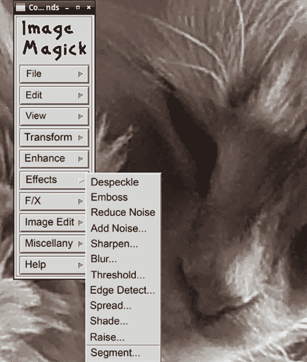
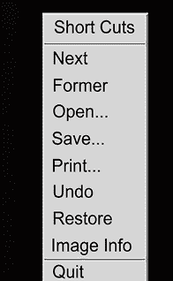
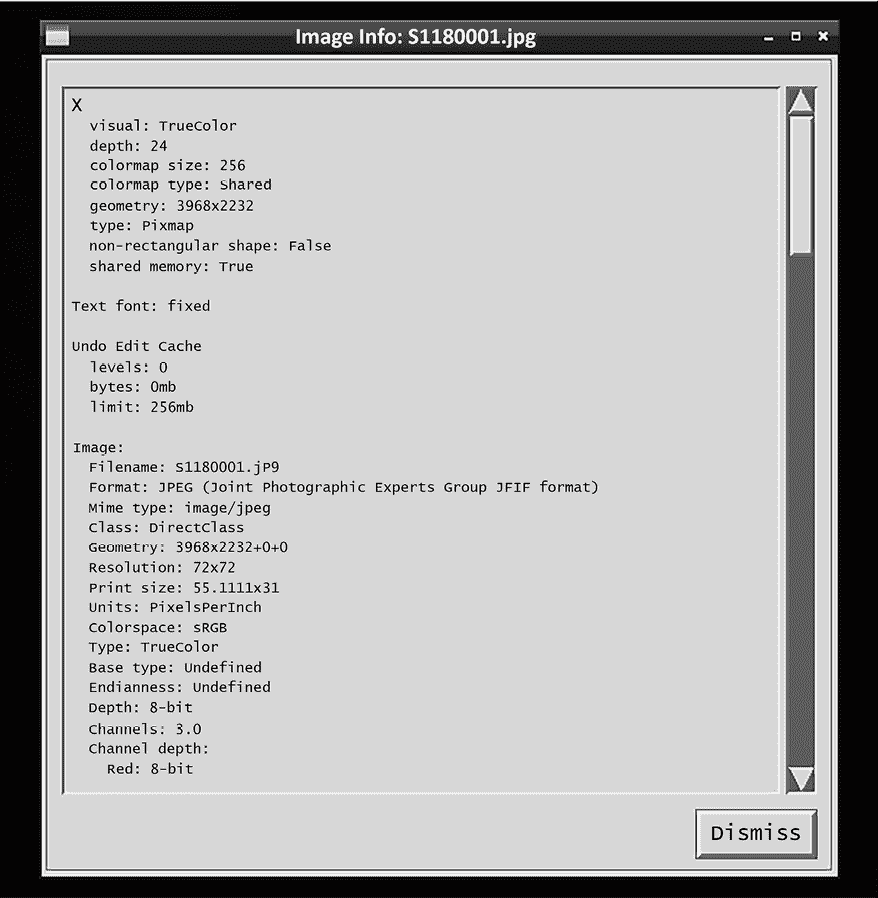
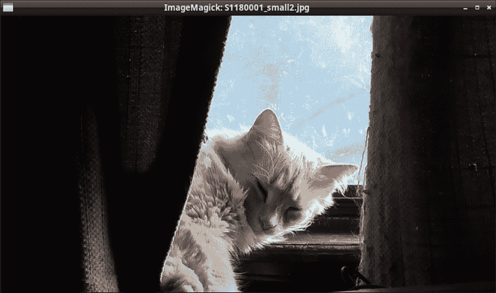
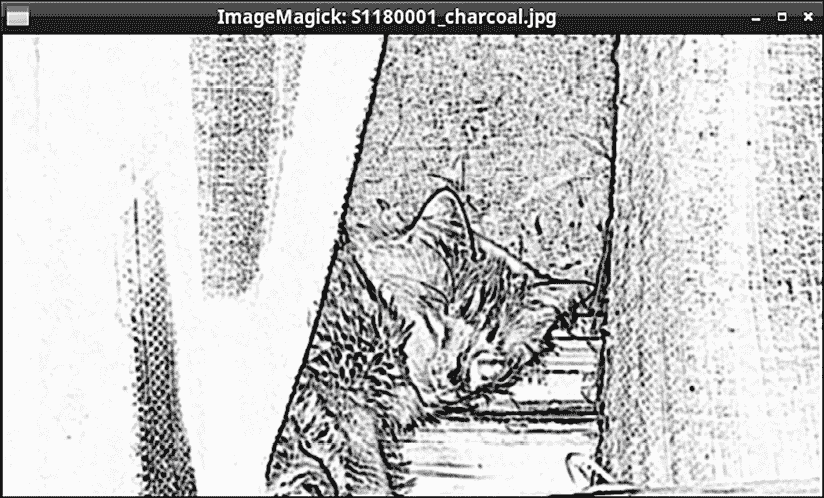
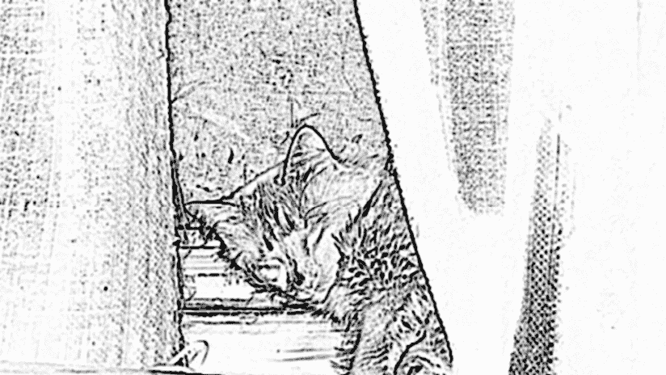
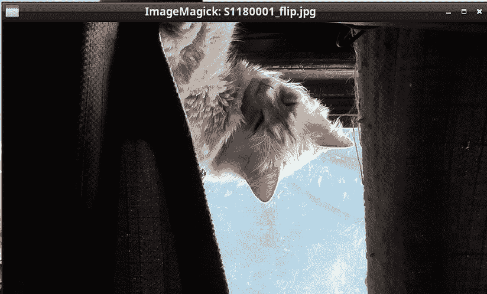
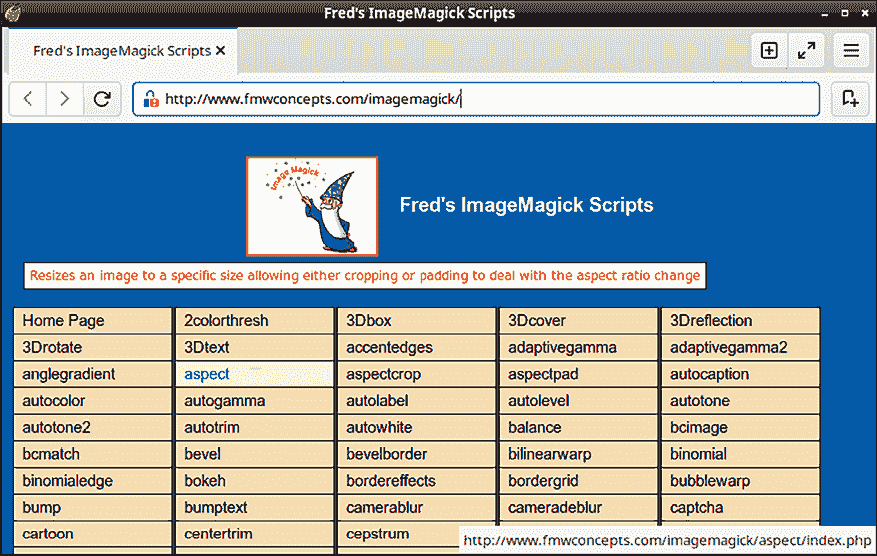

# 第十三章：使用 ImageMagick 脚本

ImageMagick 是一款强大的图形处理工具包。您可以使用这些工具执行许多与使用图形界面工具（如 GIMP 和 Adobe Photoshop）相同的任务。但是，ImageMagick 工具是命令行工具，这使得您可以将它们用于脚本中，从而自动化许多任务。这些脚本可以是普通的 Shell 脚本，或者是使用 ImageMagick 脚本环境的脚本。

本章包括以下内容：

+   转换非标准文件名扩展名

+   安装 ImageMagick

+   显示图像

+   查看图像属性

+   调整大小和定制图像

+   批量处理图像文件

+   使用 Fred 的 ImageMagick 脚本

如果您准备好了，就让我们开始吧。

# 技术要求

在本章中，我使用的是 Fedora 的桌面版，因为它自带最新版的 ImageMagick。而 Debian 12 自带的是旧版，但我在这里介绍的命令和技巧同样适用于 Debian 12。

同样，您可以通过执行以下操作下载本章的脚本：

```
git clone https://github.com/PacktPublishing/The-Ultimate-Linux-Shell-Scripting-Guide.git 
```

# 转换非标准文件名扩展名

在开始使用 ImageMagick 之前，我需要先解决一个让我比较头痛的问题。那就是 Linux 和 Unix 操作系统是区分大小写的，而其他操作系统则不是。所以在 Linux 和 Unix 上，`somegraphic.png` 和 `somegraphic.PNG` 是两个不同的文件，而在 Windows 上，它们表示的是同一个文件。在 Linux 和 Unix 上，更常见的做法是使用小写字母作为文件扩展名。如果您正在使用桌面版的 Linux 或 Unix，您可能会发现，如果文件的扩展名是大写字母，GUI 文件管理器就无法自动在图形文件查看器中打开这些文件。虽然这看似不是什么大问题，但某些 Windows 工具和某些数码相机总是将图形文件的文件名全部使用大写字母。而且，如果您创建一个脚本对整个目录中的图像文件执行批处理操作，某些文件的扩展名是大写字母，某些是小写字母，这会给您带来困扰。所以，您需要将这些文件重命名，以符合 Linux/Unix 的约定。如果您有一个满是文件的目录需要转换，您就需要自动化这个过程。所以，来看看这个实用的 `rename_extension.sh` 脚本，它可以帮您解决这个问题：

```
#!/bin/bash
for file in *.JPG; do
        mv -- "$file" "${file%.JPG}.jpg"
done 
```

如你所见，这只是一个简单的 `for` 循环，它会查找当前目录中所有具有 `.JPG` 文件扩展名的文件。真正的魔力是通过循环中的 `mv` 命令实现的。（记住，`mv` 不仅可以用于重命名文件和目录，还可以将它们移动到其他位置。）`--` 序列标志着 `mv` 选项列表的结束，并防止了任何以 `-` 开头的文件名导致的问题。在行尾，你看到一个变量扩展结构，它将所有文件名中的 `.JPG` 替换为 `.jpg`。在这里，我需要提醒一下。

请始终确保你的变量替换结构是使用一对大括号而不是一对圆括号构建的。如果你不小心使用了圆括号而不是大括号，脚本会删除它找到的所有文件，这可能不是你想要的结果。

无论如何，让我们测试一下脚本，看看会发生什么。这是我运行脚本之前图形目录的内容：

```
[donnie@fedora script_test]$ ls
rename_extension2.sh  S1180001.JPG  S1340001.JPG  S1340003.JPG
rename_extension.sh   S1180002.JPG  S1340002.JPG
[donnie@fedora script_test]$ 
```

现在，让我们运行脚本，然后查看目录内容：

```
[donnie@fedora script_test]$ ./rename_extension.sh
[donnie@fedora script_test]$ ls
rename_extension2.sh  S1180001.jpg  S1340001.jpg  S1340003.jpg
rename_extension.sh   S1180002.jpg  S1340002.jpg
[donnie@fedora script_test]$ 
```

如果你不想处理变量扩展，或者如果你使用的 shell 不支持它，你可以使用 `basename` 工具，如你在 `rename_extension2.sh` 脚本中看到的那样：

```
#!/bin/bash
for file in *.JPG; do
        mv -- $file "$(basename -- "$file" .JPG).jpg"
done 
```

`basename` 工具通过从文件名中去除目录路径，并在指定时去除文件名扩展名。下面是当我只想去除目录路径时的操作方式：

```
[donnie@fedora ~]$ basename Pictures/script_test/rename_extension.sh
rename_extension.sh
[donnie@fedora ~]$ 
```

这是当我想去除目录路径和文件名扩展名时的操作方式：

```
[donnie@fedora ~]$ basename Pictures/script_test/rename_extension.sh .sh
rename_extension
[donnie@fedora ~]$ 
```

当然，这适用于任何文件名扩展名，如你在这里看到的：

```
[donnie@fedora ~]$ basename Pictures/script_test/S1340001.JPG .JPG
S1340001
[donnie@fedora ~]$ 
```

对我来说，`.JPG` 和 `.MP4` 文件是最大的问题，因为我的小型松下摄像机/相机会以这些命名格式保存文件。如果你需要处理来自 Windows 机器的截图，你将处理 `.PNG` 文件。调整我刚刚展示的任一脚本以将这些文件名扩展名转换为全小写字母是件简单的事。

现在，随着这些前提条件的解决，让我们来看看 ImageMagick。

# 安装 ImageMagick

你会在 OpenIndiana 和几乎所有的 Linux 发行版的仓库中找到 ImageMagick。你还会在 FreeBSD 及其面向桌面的衍生版（如 GhostBSD 和 MidnightBSD）中找到它。安装过程简单快捷，只有几个小注意事项。

第一个注意事项与 Debian 相关。如你所知，Debian 往往有自己独特的节奏，并且在将最新的软件包更新到仓库中方面相对较慢。

所以，如果你在 Debian 12 或更早版本上安装 ImageMagick，你将得到较旧的 ImageMagick 6，而不是当前的 ImageMagick 7。（如果你切换到 Debian Testing 或 Debian Unstable，你可能会得到版本 7，但我没有确认过，因为我更喜欢使用稳定版本。）

另一个需要注意的事项是，不同的发行版对 ImageMagick 包的命名方式并不一致。例如，Fedora 上的包名是 `ImageMagick`，Debian、OpenIndiana 和 Alpine Linux 上是 `imagemagick`，FreeBSD 及其桌面衍生版本上是 `ImageMagick7`。不过，在所有情况下，只需使用发行版的常规包管理工具进行安装即可。

如果你使用的是 macOS 或 Windows，可以在官方的 ImageMagick 网站上找到如何在这两个系统上安装 ImageMagick 的说明。（你可以在*进一步阅读*部分找到到 ImageMagick 网站的链接。）

现在你已经安装了 ImageMagick，我们来看看可以用它做些什么。

## 显示图像

要显示图像，使用 `display` 命令，像这样：

```
donnie@fedora script_test]$ display S1180001.jpg 
```

我知道，你可能会想，为什么我要花一整节章节来告诉你这些。别急，因为还有更多内容。

打开图像后，你可以点击鼠标的左右按钮来弹出一个菜单。左键弹出的菜单包含许多图像操作功能，和你在命令行中可以做的操作一样。菜单长这样：



图 13.1：ImageMagick 左键菜单

右键菜单比你看到的要简单得多：



图 13.2：ImageMagick 右键菜单

右键菜单的一个功能是显示图像的信息，显示的内容像这样：



图 13.3：从右键菜单显示图像信息

你可以通过随意点击这些菜单，了解每个功能的作用。虽然这些功能都很酷，但它们并不能帮助我们进行脚本编程。所以，我们仍然需要看看如何从命令行使用 ImageMagick。

## 查看图像属性

使用 `identify` 命令查看图像的属性，像这样：

```
[donnie@fedora script_test]$ identify S1180001.jpg
S1180001.jpg JPEG 3968x2232 3968x2232+0+0 8-bit sRGB 1.90756MiB 0.000u 0:00.000
[donnie@fedora script_test]$ 
```

若要查看更多信息，请使用 `-verbose` 选项，像这样：

```
[donnie@fedora script_test]$ identify -verbose S1180001.jpg
Image:
  Filename: S1180001.jpg
  Permissions: rw-r--r--
  Format: JPEG (Joint Photographic Experts Group JFIF format)
  Mime type: image/jpeg
. . .
. . .
  Number pixels: 8.85658M
  Pixel cache type: Memory
  Pixels per second: 55.2201MP
  User time: 0.160u
  Elapsed time: 0:01.160
  Version: ImageMagick 7.1.1-15 Q16-HDRI x86_64 21298 https://imagemagick.org
[donnie@fedora script_test]$ 
```

我们从上面的例子可以看到，这张图片非常大，尺寸为 3968x2232 像素，大小为 1.90756 MiB。我不需要它这么大，所以我们来看一下如何让它更小。

# 调整和自定义图像大小

假设我想将我的图像调整为 1000x1000 像素。我会这样做：

```
[donnie@fedora script_test]$ convert -resize 1000x1000 S1180001.jpg S1180001_small.jpg
[donnie@fedora script_test]$ 
```

默认情况下，`convert` 命令会保持图像的原始宽高比。因此，我的缩小后的图像尺寸实际上是 1000x563 像素，像这样：

```
[donnie@fedora script_test]$ identify S1180001_small.jpg
S1180001_small.jpg JPEG 1000x563 1000x563+0+0 8-bit sRGB 328914B 0.000u 0:00.000
[donnie@fedora script_test]$ 
```

你可以通过指定图像的大小占原始大小的百分比，而不是指定像素数，像这样：

```
[donnie@fedora script_test]$ convert -resize 20% S1180001.jpg S1180001_small2.jpg
[donnie@fedora script_test]$ 
```

现在，当我显示图像时，它会适应我的电脑屏幕。长这样：



图 13.4：Goldie，睡在我卧室窗台上

你可以在调整图像大小的同时应用特殊效果。例如，假设我们将 Goldie 的这张照片转为炭笔画，像这样：

```
[donnie@fedora script_test]$ convert -resize 15% -charcoal 2 S1180001.jpg S1180001_charcoal.jpg
[donnie@fedora script_test]$ 
```

`-charcoal` 选项要求你指定一个数值来确定效果的强度。在这种情况下，我只用了 `-charcoal 2`，这给了我我想要的效果。（我一开始使用了 `-charcoal 15`，但那样看起来一点也不好。）结果如下所示：



图 13.5：Goldie 带有木炭效果

你可以对图片应用的效果种类繁多，以至于我不可能在这里列出所有内容。要查看完整列表，只需查看 `convert` 手册页。

关于 ImageMagick 的一个令人惊讶的好消息是，通过查阅 `magick` 和 ImageMagick 手册页、ImageMagick 网站或各种在线教程，你可以很快学会如何做这些事情。实际上，每次我尝试用类似 GIMP 或 PhotoShop 这样的图形界面程序做类似的事时，总是花费我大量时间才搞明白。

一直让我感到困扰的是，平板和智能手机在自拍模式下拍摄时，图片总是会被反转。所以，假设我拍一张我弹吉他的自拍照。我是右手吉他手，但用智能手机拍的自拍会让我看起来像是左手吉他手。（保罗·麦卡特尼，世界上最著名的左手吉他手，拍的照片看起来会像右手吉他手。）ImageMagick 通过使用 `convert` 和 `-flop` 选项可以轻松纠正这个问题，如下所示：

```
[donnie@fedora script_test]$ convert -flop S1180001_charcoal.jpg S1180001_charcoal_flop.jpg 
```

我目前手头没有自拍照，所以我反转了 Goldie 的图片。结果如下所示：



图 13.6：Goldie 的图片，被反转

如果你曾经犯过把相机倒过来拍照的错误，你也可以使用 `-flip` 选项来垂直翻转你的图片，如下所示：

```
donnie@fedora:~/Pictures/script_test$ convert -resize 15% -flip S1180001.jpg S1180001_flip.jpg
donnie@fedora:~/Pictures/script_test$ 
```

结果如下所示：



图 13.7：Goldie 被翻转过来了

我将展示的最后一个技巧是如何将一种图片格式转换为另一种格式。只需使用 `convert`，不带任何选项，如下所示：

```
[donnie@fedora script_test]$ convert S1180001_small2.jpg S1180001_small2.png
[donnie@fedora script_test]$ ls -l *.png
-rw-r--r--. 1 donnie donnie 494190 Dec  4 17:19 S1180001_small2.png
[donnie@fedora script_test]$ 
```

所以，现在我有一个 `.png` 文件与 `.jpg` 文件配合使用。要查看 ImageMagick 能处理的所有图片格式，只需执行：

```
[donnie@fedora ~]$ identify -list format 
```

你不仅限于处理现有的图片文件。你还可以创建带有各种特效的原创文本图像文件。例如，假设我们创建一个包含我名字的花哨图片文件，如下所示：

```
[donnie@fedora Pictures]$ convert -size 320x115 xc:lightblue  -font Comic-Sans-MS -pointsize 72 -fill Navy -annotate 0x0+12+55 'Donnie' -fill RoyalBlue -annotate 0x130+25+80 'Donnie' font_slewed.jpg
[donnie@fedora Pictures]$ 
```

当然，你指定的字体必须已安装在你的系统中。在这种情况下，我使用的是那个人人都爱恨交加的臭名昭著的 Comic Sans 字体。（它是微软的字体，我确实在这台 Fedora 机器上安装了它。我总是会在我的 Linux 机器上安装完整的微软字体套件，这样我就可以和我的出版商以及客户合作。）另外，请注意，字体名称中不能包含空格。将每个空格替换为连字符，就可以了。要理解命令的其余部分，可以在 ImageMagick 的手册页中查找所有选项的解释。总之，下面是我新图像的样子：


图 13.8：我使用 ImageMagick 创建的文本图像文件

很酷，对吧？当你查看官方 ImageMagick 文档中字体效果页面上的大量示例时，它会变得更加酷，你可以在这里找到：[`imagemagick.org/Usage/fonts/`](https://imagemagick.org/Usage/fonts/)

你可以用 ImageMagick 做的事情远不止这些，但目前这些已经足够了。接下来我们来谈谈在 shell 脚本中使用 ImageMagick。

# 批量处理图像文件

现在，假设你有一个包含大量图像文件的目录，你需要以相同的方式处理所有这些文件。使用图形用户界面（GUI）程序会非常繁琐，因为你只能一次处理一个文件。而使用 ImageMagick，你只需要写一个简单的脚本，就能为你完成所有工作。例如，看看这个 `resize.sh` 脚本：

```
#!/bin/bash
for picture in *.jpg; do
        convert -resize 15% "$picture" "${picture%.jpg}_small.jpg"
done 
```

如你所见，它与我之前展示过的 `rename_extension.sh` 脚本没有太大区别。只需要一个简单的 `for` 循环和一些变量扩展就足够了。当然，你可以将这个 `-resize` 命令替换成你想要的任何其他 ImageMagick 命令。

好的，这基本上涵盖了简单的内容。现在让我们继续探讨更复杂的内容。

# 使用 Fred 的 ImageMagick 脚本

通过我刚才给你展示的简单类型的 ImageMagick 命令，你可以做很多事情。对于简单的项目，你可能不需要更复杂的东西。但是，如果你是专业的图形艺术家，可能需要更多功能。你可以使用很酷的效果来创建一些令人惊艳的图像，但这可能需要使用一组非常复杂的 ImageMagick 命令。幸运的是，有一种作弊的方法，因为已经有人为你完成了这项工作。

**Fred 的 ImageMagick 脚本**是`bash`脚本，结合了非常复杂的 ImageMagick 命令集。截止到我在 2023 年 12 月写这篇文章时，Fred Weinhaus 先生总共有 375 个脚本，你可以从他的网站下载。这些脚本供个人使用时免费，但如果你需要将其用于商业用途，Fred 请求你联系他并安排付款。我甚至无法开始描述所有这些脚本以及它们可以创建的效果。因此，我建议你直接去 Fred 的网站，下载一些脚本来进行自己的学习。你可以在这里找到 Fred 的网站：

[`www.fmwconcepts.com/imagemagick/`](http://www.fmwconcepts.com/imagemagick/)

这是网站的样子：



图 13.9: Fred 的 ImageMagick 脚本网站

正如你在这张图中看到的，你可以通过将光标移动到脚本名称上来查看每个脚本的作用描述。

我认为这就是关于 ImageMagick 脚本的入门介绍。让我们总结一下并继续前进。

# 总结

ImageMagick 是一个非常适合休闲和专业图形艺术家的工具。你可以使用一些非常简单的命令进行简单的图像操作，或者使用更复杂的命令创建炫酷的效果。

在本章中，我首先解释了如何自动化将非标准文件扩展名转换为标准的 Linux/Unix 格式的过程。接着，我解释了如何在各种操作系统上安装 ImageMagick。然后，我向你展示了如何在命令行中显示图片、查看图片属性以及如何调整大小和自定义图片。最后，我向你展示了如何通过学习和尝试 Fred 的 ImageMagick 脚本来“作弊”。

当然，你可以用 ImageMagick 做的事情远比我在这里展示的要多。网络上到处都有 ImageMagick 教程，你可以通过你喜欢的搜索引擎轻松找到它们。更好的是，去 YouTube 搜索 ImageMagick 教程吧。

在下一章中，我将向你展示如何使用`awk`进行文本处理。我们在那里见。

# 问题

1.  以下哪项陈述是错误的？

    1.  使用 ImageMagick 的功能有限，因为它没有图形用户界面。

    1.  有时候，使用 ImageMagick 应用效果比使用 GUI 类型的程序要简单。

    1.  你可以通过将 ImageMagick 命令放入 Shell 脚本中来批量处理整个目录的图形文件。

    1.  ImageMagick 对于简单任务很容易使用，但你也可以使用更复杂的脚本执行更复杂的图像处理操作。

1.  你可以使用哪两种方法来自动化整个目录图形文件的文件扩展名更改过程？

    1.  使用命令替换

    1.  使用变量扩展

    1.  使用命令扩展

    1.  使用`basename`工具

1.  你会使用哪个 ImageMagick 命令来显示图像属性？

    1.  `show`

    1.  `identify`

    1.  `show_properties`

    1.  `properties`

# 深入阅读

+   bash--如何更改多个文件的扩展名？: [`unix.stackexchange.com/questions/19654/how-do-i-change-the-extension-of-multiple-files`](https://unix.stackexchange.com/questions/19654/how-do-i-change-the-extension-of-multiple-files)

+   ImageMagick.org: [`imagemagick.org/`](https://imagemagick.org/)

+   开始使用 ImageMagick: [`opensource.com/article/17/8/imagemagick`](https://opensource.com/article/17/8/imagemagick)

+   入门 ImageMagick: [`riptutorial.com/imagemagick`](https://riptutorial.com/imagemagick)

+   使用 ImageMagick 命令行工具操作图像: [`www.baeldung.com/linux/imagemagick-edit-images`](https://www.baeldung.com/linux/imagemagick-edit-images)

+   Fred 的 ImageMagick 脚本: [`www.fmwconcepts.com/imagemagick/`](http://www.fmwconcepts.com/imagemagick/)

# 答案

1.  a

1.  b 和 d

1.  b

# 加入我们的 Discord 社区！

与其他用户、Linux 专家以及作者本人一起阅读本书。

提出问题，为其他读者提供解决方案，通过“问我任何事”环节与作者聊天，等等。扫描二维码或访问链接加入社区。

[`packt.link/SecNet`](https://packt.link/SecNet)


