# 第十六章：使用 yad、dialog 和 xdialog 创建用户界面

我知道，你可能在想 shell 脚本不过是进入终端输入无聊的纯文本命令而已。但如果我告诉你，你可以通过添加用户界面来让你的脚本更炫酷呢？如果我告诉你，你可以为桌面系统添加图形界面，为文本模式的服务器添加非图形界面呢？没错，你完全可以做到，而我会告诉你怎么做。

本章内容包括：

+   使用 `yad` 创建图形用户界面

+   使用 `dialog` 和 `xdialog` 创建用户界面

如果你准备好了，我们就开始吧。

# 技术要求

对于 `yad` 和 `xdialog`，你需要使用桌面版的 Linux。使用哪种发行版并不重要，只要 `yad` 和 `xdialog` 包在软件仓库中即可。只需使用你发行版的标准包管理工具来安装它们。（`yad` 和 `xdialog` 包也适用于 GhostBSD，它是 FreeBSD 的一个版本，支持 Mate 或 Xfce 桌面环境。如果你在 Mac 上，你需要通过 Homebrew 安装 `yad` 或 `xdialog`。遗憾的是，OpenIndiana 上没有这两个工具，而 `yad` 在任何 RHEL 9 类的发行版上都不可用。）

对于 `dialog` 部分，你可以使用桌面或文本模式服务器实现的 Linux。

一如既往，你可以通过运行以下命令来获取脚本：

```
git clone https://github.com/PacktPublishing/The-Ultimate-Linux-Shell-Scripting-Guide.git 
```

好的，让我们从 `yad` 开始看起。

# 使用 yad 创建图形用户界面

**Yet Another Dialog**，简称 **yad**，是一个非常酷的程序，可以让你为 shell 脚本添加图形化界面。你可以用它做很多事情，我想给你展示几个简单的例子。

## yad 基础

在 `yad` 的手册页中，你会看到一列预定义的组件，可以在你的 `yad` 脚本中使用。例如，如果你运行 `yad --file`，你会打开一个像这样的文件管理器：

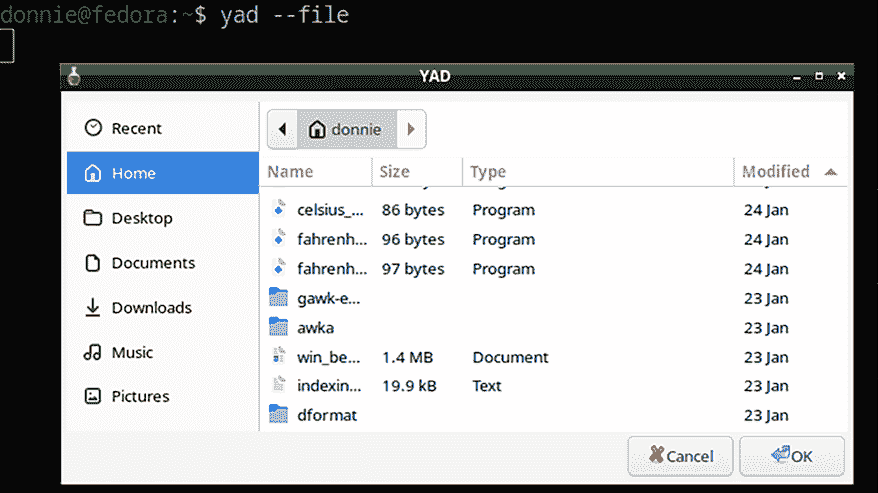

图 16.1：yad 文件管理器

就目前而言，这个文件管理器对你没有任何帮助。如果你点击一个文件，然后点击 **OK** 按钮，管理器会关闭，并且你选择的文件名会打印在命令行上，像这样：

```
donnie@fedora:~$ yad --file
/home/donnie/win_bentley.pdf
donnie@fedora:~$ 
```

为了使它更有用，你需要添加代码，对所选文件执行一些预期的操作。不过，在尝试这么复杂的操作之前，我们先从一些稍微简单的内容开始。

## 创建数据输入表单

假设你是一个经典汽车收藏爱好者，你需要创建一个简单的数据库来跟踪你庞大的收藏。我们将从测试基本脚本开始，脚本内容如下：

```
#!/bin/bash
yad --title="Classic Autos" --text="Enter the info about your classic auto:" --form --width=400 --field="Year":NUM --field="Make" --field="Model" --field="Body Style" >> classic_autos.txt 
```

不过，这个有点难读。所以，让我们稍微调整一下 `yad-form-auto1.sh` 脚本，使其更具可读性，像这样：

```
#!/bin/bash
yad --title="Classic Autos" --text="Enter the info about your classic auto:" \
        --form --width=400 \
        --field="Year":NUM \
        --field="Make" \
        --field="Model" \
        --field="Body Style" >> classic_autos.txt 
```

这个`yad`命令实际上是一个长命令。为了使其更易读，我将其分成了几行，每个选项定义后都加上了反斜杠。如果你愿意，也可以去掉反斜杠，将整个命令写成一行，就像上面看到的那样，但分行显示要好得多。

在第一行，我同时设置了`--title`和`--text`定义，这些应该是显而易见的。第二行定义了一个宽度为 400 像素的表单。接下来的定义是数据输入字段。请注意，`Year`字段只能接受数字值，如`:NUM`参数所示。最后，我将输出重定向到`classic_autos.txt`文件中。（我使用`>>`操作符，以便可以将多个汽车信息添加到文件中。）这是我运行脚本时的样子：

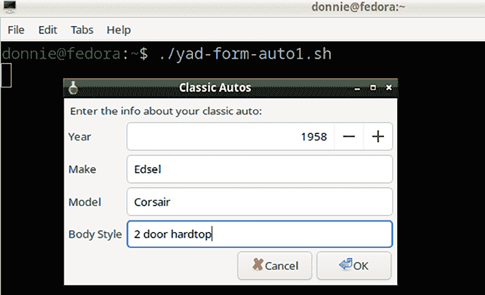

图 16.2：运行 yad-form-auto1.sh

当我点击**OK**按钮时，输出将被保存到`classic_autos.txt`文件中，内容如下所示：

```
donnie@fedora:~$ cat classic_autos.txt
1958|Edsel|Corsair|2 door hardtop|
donnie@fedora:~$ 
```

默认情况下，`yad`使用`|`符号作为输出字段分隔符。这是可以的，因为如果你在电子表格程序中打开此文件，你可以设置`|`符号作为字段分隔符，它会正常工作。不过，如果你愿意，你也可以更改字段分隔符。例如，如果你想创建`.csv`文件，只需在`--form`行中添加`--separator=","`参数。

这个脚本有一个小问题，每当你点击**OK**按钮将一个条目创建到文本文件中时，脚本就会退出。每次添加一辆车，你都需要重新启动脚本。让我们通过在`yad-form-auto2.sh`脚本中使用`while`循环来修复这个问题：

```
#!/bin/bash
while :
do
yad --title="Classic Autos" --text="Enter the info about your classic auto:" \
        --form --width=400 \
        --field="Year":NUM \
        --field="Make" \
        --field="Model" \
        --field="Body Style" \
        --field="Date Acquired":DT >> classic_autos.txt
done 
```

通过使用`:`作为`while`条件，我们创建了一个所谓的无限循环。换句话说，除非按下**Ctrl-c**，否则它将永远不会退出。

在此过程中，我添加了`Date Acquired`字段，并使用了`:DT`选项。这个选项会在我点击日历图标时弹出一个方便的日历。这里是它的显示样式：

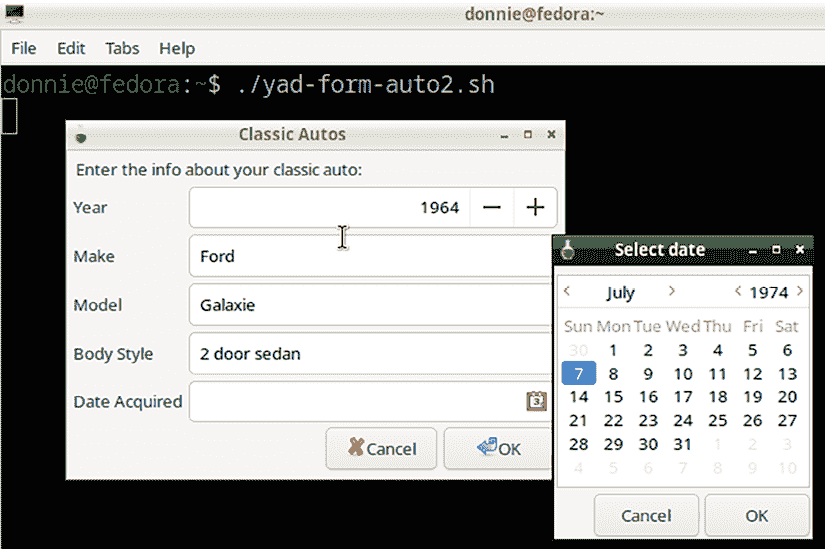

图 16.3：yad-form-auto2.sh 脚本

这样做不错，但仍然不完美。由于使用了`:`作为`while`条件，结束这个脚本的唯一方法就是**Ctrl-c**，因为**取消**按钮不会起作用。要解决这个问题，你需要明白，**OK**按钮返回 0 作为退出代码，而**取消**按钮返回 1 作为退出代码。

如果你需要复习退出代码的概念，请参考*第八章，基本 Shell 脚本构建*。

所以，让我们修改一下`yad-form-auto3.sh`脚本中的`while`循环：

```
#!/bin/bash
while [ $? == 0 ]
do
yad --title="Classic Autos" --text="Enter the info about your classic auto:" \
        --form --width=400 \
        --field="Year":NUM \
        --field="Make" \
        --field="Model" \
        --field="Body Style" \
        --field="Date Acquired":DT >> classic_autos.txt
done 
```

`$? == 0`参数获取退出代码并验证它是否为 0。这使得脚本在你没有点击**取消**按钮或窗口右上角的**X**时一直运行。（我忘记提到，点击**X**会返回退出代码 252。）

现在，让我们通过最后一次修改来结束这一部分。

## 创建下拉列表

这次，我们将添加一个下拉列表供选择车身样式，并加入一个自由文本框。以下是`yad-form-auto4.sh`脚本，展示了如何实现：

```
#!/bin/bash
bodystyles=$(echo "2 door hardtop,2 door sedan,4 door hardtop,4 door sedan,station wagon,convertible,pickup truck,other")
while [ $? == 0 ]
do
yad --title="Classic Autos" --text="Enter the info about your classic auto:" \
        --form --width=400 --item-separator="," \
        --field="Year":NUM \
        --field="Make" \
        --field="Model" \
        --field="Body Style":CBE \
        --field="Date Acquired":DT >> classic_autos.txt \
        --field="Add any additional notes:":TXT \
        "" "" "" "$bodystyles" "Click on the calender icon"
done 
```

`bodystyles=`行、`--form`行中的`--item-separator`参数和`"" "" ""`行一起工作，创建了下拉列表。`bodystyles=`定义了可用车身样式的列表，样式之间用逗号分隔。这与`--item-separator`参数配合使用，确保下拉列表每行只显示一个车身样式，而不是将所有车身样式放在同一行。

`--field="Body Style"`行末的`:CBE`参数将此字段定义为下拉列表，并在选择**其他**选项时可以编辑。`while`循环中的最后一行告诉`yad`在哪里放置`bodystyles`变量的值。我们看到`Body Style`字段是第四个字段。所以为了表示前三个字段（默认是空的），我们在`$bodystyles`变量前放置了三对双引号。行末的最后一项将一行文本放入`Date Acquired`字段。最终字段定义是自由文本框，正如通过`:TXT`参数看到的。（文本框字段在下拉列表字段之后，这意味着您不需要再添加一对双引号作为占位符。）当我选择车身样式时，它看起来是这样的：

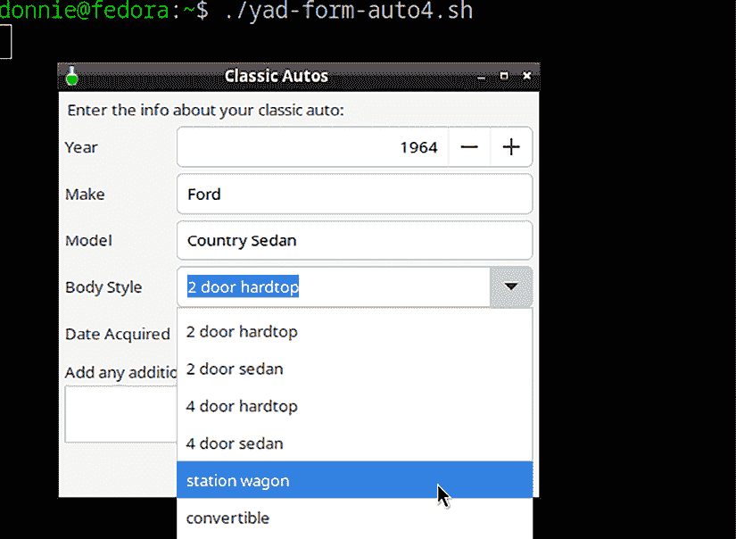

图 16.4：使用下拉列表

当然，您可以将这个脚本适应于几乎任何目的。这包括管理您个人收藏的库存、商店商品或软件许可证。（让您的想象力尽情驰骋。）

这就是本次演示的结束。现在，让我们来管理一些文件吧。

## 使用 yad 文件管理器

与文件交互的最简单方法是创建一个变量，并通过`yad`命令替换结构为其赋值。然后，您可以对该变量的值执行任何操作。我们来看看可以做些什么。

### 创建文件校验和工具

对于第一个例子，假设您想创建一个包含`sha512`校验和的文件列表。以下是实现此功能的`yad-file-checksum1.sh`脚本：

```
#!/bin/bash
filetocheck=$(yad --file)
sha512sum $filetocheck >> file_checksums.txt 
```

点击一个文件会将该文件的名称赋值给`filetocheck`变量。然后，我们可以使用该变量的值作为`sha512sum`命令的参数。

它的样子如下：

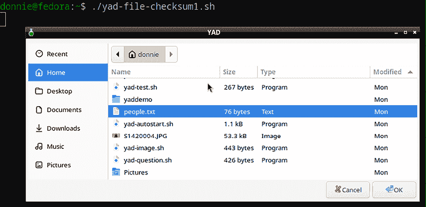

图 16.5：使用 yad-file-checksum1.sh 脚本打开文件

点击**确定**按钮会创建`file_checksum.txt`文件，该文件包含`people.txt`文件的 SHA512 校验和，内容如下所示：

```
donnie@fedora:~$ cat file_checksums.txt
0aa501cc947b22c48c8b2bca0e2a9675fad58440133af8794d8e2b51160f72fa6851c6d76a8554 6938c23ff5bf70b841bd1099ca727b39a59f486348d3dcee50  /home/donnie/people.txt
donnie@fedora:~$ 
```

很好，但一如既往地，我们可以让它更精致。在`yad-file-checksum2.sh`脚本中，我们将添加一个`while`循环，使**取消**按钮能够工作，并且还可以选择多个文件。同时，我们还会加入一个文件预览功能。它看起来是这样的：

```
#!/bin/bash
while [ $? == 0 ]
do
        filetocheck=$(yad --file --multiple --separator='\n' --add-preview --width=800)
        sha512sum $filetocheck >> file_checksums.txt
done 
```

`--multiple`和`--separator='\n'`选项一起工作。没有`--separator`选项时，`--multiple`选项会导致所有文件名作为一行显示，文件名之间用`|`符号分隔。这会导致`sha512sum`工具将这一行视为单个文件名，从而导致错误。在每个文件名后面加上换行符可以解决这个问题。`--add-preview`和`--width`选项应该不言自明，因此我不再赘述。总之，以下是这个新脚本的工作方式：

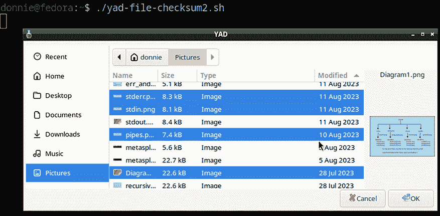

图 16.6：带预览和多个文件选项的文件选择器

你可以通过按住**Ctrl**键选择多个不连续的文件，或者按住**Shift**键选择多个连续的文件。最终结果将是一个文本文件，包含所有选中文件的 SHA512 校验和。

我必须承认，这个脚本有点怪异，让我感到困惑。当你点击**取消**按钮或**X**按钮时，弹窗应该会关闭。但由于某些奇怪的原因，进程并没有结束，这意味着终端永远不会返回到命令提示符。我试过了所有能想到的非自然手段来解决这个问题，但都没有成功。所以，看起来每次运行这个脚本时，完成后你只需**Ctrl-c**退出即可。

好的，接下来我们继续下一个例子。

### 创建一个图形界面前端用于 ImageMagick

接下来，我们来看看能否为我们在*第十三章，使用 ImageMagick 编写脚本*中提到的 ImageMagick 程序创建一个图形界面前端。我们将从`yad-image-resize1.sh`脚本开始，脚本内容如下：

```
#!/bin/bash
imageFile=$(yad --file --title="Select the image file" --width=800)
dialog=$(yad --title "Image Resize" --form --field="Resize parameter" --field="Quality")
size=$(echo $dialog | awk 'BEGIN {FS="|" } { print $1 }')
quality=$(echo $dialog | awk 'BEGIN {FS="|" } { print $2 }')
convert "$imageFile" -resize "$size" -quality "$quality"% "$imageFile"
yad --title="Status" --width=300  --button="OK:0"  --text="All done. Yay!" 
```

第一行创建了初始的文件选择窗口。然后，它将所选文件的文件名分配给`imageFile`变量。以下是这个初始窗口的样子：

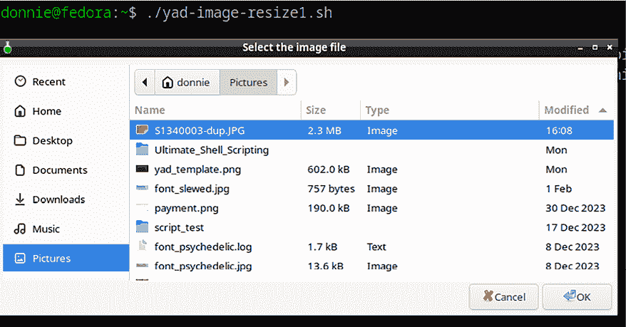

图 16.7：用于调整图像大小的初始文件选择窗口

第二行创建了**图像调整大小**窗口，你将用它来输入调整大小和质量参数。当你输入所需的参数时，它们会以单行的形式存储在`dialog`变量中，两个参数之间用`|`符号分隔。

接下来的两行创建了`size`和`quality`变量，使用存储在`dialog`变量中的值。我们需要一种方法来提取每个单独的参数，而`awk`为我们提供了一个方便的方法。总之，以下是**图像调整大小**窗口的样子：

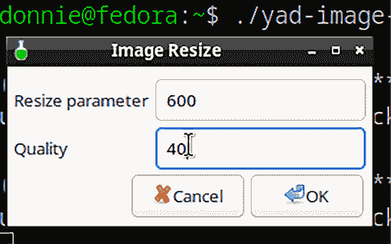

图 16.8：图像调整大小窗口

接下来是`convert`行，它执行实际的调整大小操作。你会看到它使用了`size`、`quality`和`imageFile`变量中的值。当我点击**确定**按钮时，调整大小过程将会发生。

最后一行创建了**状态**窗口，显示处理过程已完成。默认情况下，`yad`窗口有**取消**和**确定**按钮。在这种情况下，我们只需要**确定**按钮，因此我们通过显式创建一个**确定**按钮来覆盖默认行为，使用`--button`选项。以下是该窗口的样子：

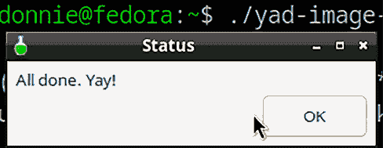

图 16.9：状态窗口

在你的目录中查看，你应该能看到图像确实已经被调整大小。

说一句公道话，我借用了这段脚本，它最初出现在 2012 年的一篇*Linux Magazine*文章中，并对其做了几个小的修改。你可以在*进一步阅读*部分找到原始文章的链接。

这个脚本的主要缺陷是它会用调整大小后的版本覆盖原始的图形文件。让我们修改它，使得它能够将调整大小后的版本保存为一个新文件，并且使用新的文件名。以下是执行此操作的`yad-image-resize2.sh`脚本：

```
#!/bin/bash
imageFile=$(yad --file --title="Select the image file" --width=800 --add-preview)
newfilename=${imageFile%%.*}
suffix=${imageFile: -4}
dialog=$(yad --title "Image Resize" --form --field="Resize parameter" --field="Quality")
size=$(echo $dialog | awk 'BEGIN {FS="|"} {print $1}')
quality=$(echo $dialog | awk 'BEGIN {FS="|"} {print $2}')
convert -resize "$size" -quality "$quality" "$imageFile" -delete 1 "$newfilename"_resized"$suffix"
yad --title="Status" --width=300  --button="OK:0"  --text="All done. Yay!" 
```

为了实现这一点，我创建了两个新变量，并使用变量扩展为它们赋值。`newfilename=${imageFile%%.*}`这一行提取了`imageFile`文件名的第一部分，直到文件扩展名的点为止。例如，假设`imageFile`的值是`somegraphic.jpg`。使用变量扩展来去除`.jpg`后，将`somegraphic`赋值给`newfilename`变量。`suffix`变量使用了变量扩展的偏移特性。在这种情况下，`${imageFile: -4}`构造会提取文件名的最后四个字符。因此，它会将`.jpg`赋值给`suffix`变量。

接下来的要点是如何修改`convert`命令。（顺便提一下，请注意，这个`convert`命令相当长，并且在页面上会换行。）我所做的只是将`-delete 1 "$newfilename"_resized"$suffix"`部分添加到我之前的命令末尾。你可能已经猜到，在我们当前的示例中，这会创建一个新文件，文件名为`somegraphic_resized.jpg`。但是，你可能会对`-delete 1`这一部分感到困惑。其实，这只是因为在某些条件下，`convert`命令会创建两个输出文件，而不仅仅是一个，正如你在这里看到的：

```
donnie@fedora:~/Pictures$ ls -l *dup*
-rw-r--r--. 1 donnie donnie 2324036 Feb 11 14:38 S1340003-dup.JPG
-rw-r--r--. 1 donnie donnie   29745 Feb 11 15:57 S1340003-dup_resized-0.JPG
-rw-r--r--. 1 donnie donnie  293424 Feb 11 15:57 S1340003-dup_resized-1.JPG
donnie@fedora:~/Pictures$ 
```

在输出文件名参数之前添加`-delete 1`参数，解决了这个问题，正如你在这里看到的：

```
donnie@fedora:~/Pictures$ ls -l *dup*
-rw-r--r--. 1 donnie donnie 2324036 Feb 11 14:38 S1340003-dup.JPG
-rw-r--r--. 1 donnie donnie   29745 Feb 11 16:00 S1340003-dup_resized.JPG
donnie@fedora:~/Pictures$ 
```

我将展示的最终修改，我会将其放入`yad-image-resize3.sh`，它会使文件管理器只显示特定类型的文件。由于我们处理的是图形文件，所以我们只希望文件管理器显示`.JPG`、`.jpg`、`.PNG`和`.png`扩展名的文件。我们可以通过将`--file-filter "Graphics files | *.JPG *.jpg *.PNG *.png"`选项添加到脚本顶部的`imageFile=`行来实现。新的行现在看起来是这样的：

```
imageFile=$(yad --file --title="Select the image file" --width=800 --add-preview --file-filter "Graphics files | *.JPG *.jpg *.PNG *.png") 
```

由于这一行相当长，我们可以通过使用反斜杠将其分成多行，以便提高可读性，像这样：

```
imageFile=$(yad --file --title="Select the image file" \
        --width=800 --add-preview \
        --file-filter "Graphics files | *.JPG *.jpg *.PNG *.png") 
```

那看起来好多了，对吧？

好的，让我们继续进行最后一个例子。

## 编程表单按钮

在这个场景中，我们处在一个软件开发者的工作室，运行着一小队由 Fedora Linux 驱动的工作站。我们想创建一个图形界面类型的设置工具，以简化设置新工作站的过程。此外，我们还希望将这个工具存放在 USB 闪存盘中，这样我们可以直接从闪存盘运行它，或者将它复制到每台工作站上。幸运的是，使用`yad`很容易做到这一点。下面是完成这项工作的`yad-system-tool.sh`脚本：

```
#!/bin/bash
yad --title "System tools for a Fedora Workstation" --form --columns=3 \
        --width=540 --height=190 \
        --text="Tools for setting up Fedora or RHEL-type distros" \
        --field="<b>Update System</b>":FBTN "dnf -y upgrade" \
        --field="<b>Authoring and Publishing</b>":FBTN "dnf -y groupinstall --with-optional 'Authoring and Publishing'" \
        --field="<b>Development Tools</b>":FBTN "dnf -y --with-optional groupinstall 'Development Tools'" \
        --button=Exit:1 
```

在这个脚本中，你会看到一些你之前没见过的选项。第一行中的`--columns=3`选项表示我们想要在每一行中创建三个按钮。第二行中你会看到`--height`选项以及`--width`选项。在每个`--field`行中，你会看到`：FBTN`选项，它定义了这些字段为可编程按钮。围绕按钮文本的`<b>`和`</b>`标签使按钮文本以粗体显示。每个`--field`行的最后一部分是点击按钮时将运行的命令。

第一个按钮被编程为使用`dnf -y upgrade`命令执行系统更新。`-y`使得命令在运行时不会停止并提示用户是否真的要继续。我必须使用`-y`选项，因为如果没有它，操作会在提示时中止。接下来的两个按钮每个安装一组选定的软件包。如果你想查看每个组中包含的软件包，只需运行这两个命令：

```
donnie@fedora:~$ sudo dnf group info "Authoring and Publishing"
donnie@fedora:~$ sudo dnf group info "Development Tools" 
```

由于我们在这个脚本中使用了管理员命令，因此我们需要用`sudo`来运行它。下面是它的样子：

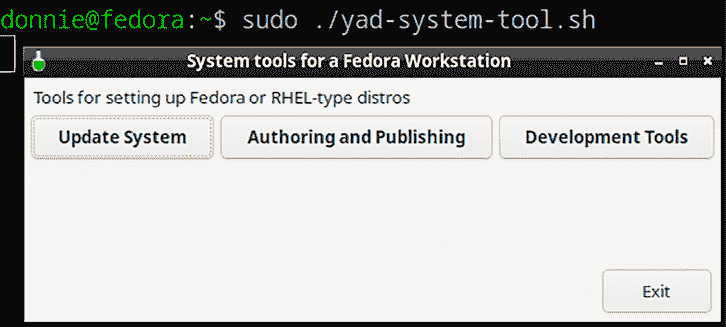

图 16.10：带有可编程按钮的 yad 表单

现在，只需点击一个按钮，看看会发生什么。

添加更多的软件安装选项很简单，只需添加更多的`--field`行。如果你想查看在 Fedora 上可用的软件包列表，只需执行：

```
donnie@fedora:~$ sudo dnf group list 
```

我知道，你可能认为这种任务用一组普通的文本模式脚本来完成会更简单。是的，你说得对。所以，只需把这个例子当作一个模板，供你根据自己的需要使用。

此外，我之前没有提到，你需要手动在每个你想用这个脚本管理的系统上安装`yad`。

这就是这个脚本的全部内容，让我们继续进行下一个。

## 关于 yad 的一些最终思考

`yad`是一个非常酷的程序，你可以用它做很多非常酷的事情。事实上，一个人可能会写一本关于`yad`的书。我现在不能这样做，但希望我已经给你足够的内容来引起你的兴趣。

`yad` 的主要问题是，无论出于什么原因，它的创建者从未为其编写过任何真正的文档，除了一个非常简略的 man 页面。幸运的是，很多其他人已经接过了这个挑战，创建了自己的文档和教程，这些资源可以在网络和 YouTube 上找到。（我将在 `进一步阅读` 部分链接到这些资源。）

接下来，让我们将注意力转向 `dialog` 和 `xdialog`，我们也可以使用它们为我们的脚本创建用户界面。

# 使用 dialog 和 xdialog 创建用户界面

`yad` 的另一个小问题是，你只能在安装了桌面环境的机器上使用它。但许多 Linux、Unix 和类 Unix 服务器配置为仅使用全文本模式环境，并且不必使用图形桌面。另一个小问题是，即使在桌面操作系统上，它也并不总是可以安装。然而，如果 `yad` 不可用，而你仍然需要一个 GUI 解决方案，你可能能够使用 `xdialog`，它更具普适性。让我们先看看 `dialog`，它可以在文本模式的机器上使用。

## 对话框基础

`dialog` 曾经是所有 Linux 系统的默认安装，但现在不再是了。然而，它几乎可以在所有 Linux 发行版中安装。所以，你可以通过你发行版的常规包管理器安装它。在大多数 Unix 和类 Unix 系统中，如 OpenIndiana 和 FreeBSD，它仍然是默认安装的。

基本的 `dialog` 构建块被称为 **小部件**。每个小部件都有一组参数，你在使用时需要指定。例如，打开 `dialog` 的 man 页面，滚动到 `--msgbox` 段落，你将看到如下内容：

```
--msgbox text height width 
```

所以，这个小部件需要你指定三个参数。（与 `yad` 不同，指定 `dialog` 框的尺寸不是可选项。）让我们看看在 `dialog-hello.sh 脚本` 中是如何实现的：

```
#!/bin/bash
dialog --title "Dialog message box" \
        --msgbox "\n Howdy folks!" 6 25 
```

正如你在 `yad` 部分之前看到的，我使用了反斜杠将命令分成两行，这样让内容更易读。在 `--msgbox` 行中，我们可以看到消息文本、由框中的行数定义的高度，以及由一行中可容纳的字符数定义的宽度。

运行脚本的效果如下所示：

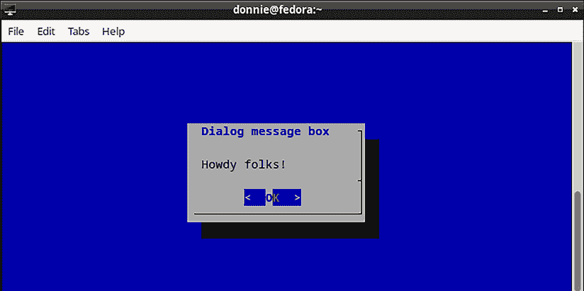

图 16.11：运行 dialog-hello.sh 脚本

要关闭窗口，只需按 **Enter** 键，这会默认激活 **OK** 按钮。（在桌面机器上，你也可以选择用鼠标点击 **OK** 按钮。）一旦窗口关闭，运行 `clear` 命令即可去除终端中的蓝色背景。

默认情况下，`dialog` 窗口总是出现在终端的中央，蓝色背景不会自动清除，直到你手动清除它。幸运的是，你可以改变这两种行为。下面是我们稍作修改后的脚本，它将窗口放置在终端的左上角：

```
#!/bin/bash
dialog --title "Dialog message box" \
        --begin 2 2 \
        --msgbox "\nHowdy folks!" 6 25
clear 
```

这看起来是这样的：

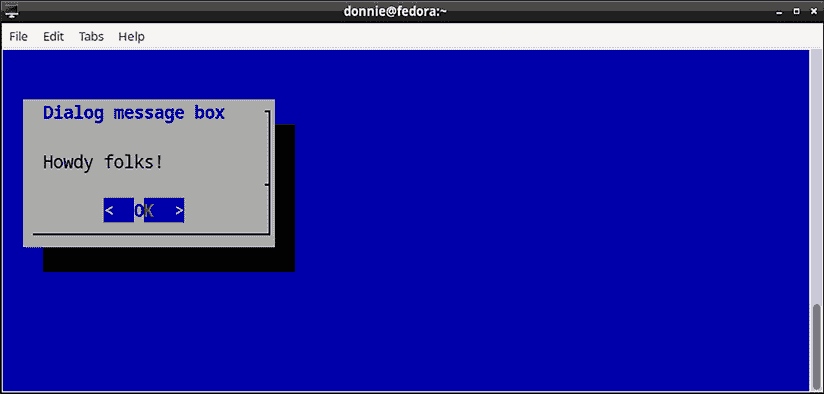

图 16.12：将对话框放置在左上角

`--begin`选项接受两个参数。第一个表示框的垂直位置，第二个表示水平位置。例如，通过将该行改为`--begin 15 2`，框将出现在左下角。要将其放置到右上角，可以更改为`--begin 2 50`。当你按下**OK**按钮时，`clear`命令会清除蓝色背景。

当然，这个脚本本身并不是很有用，但没关系。稍后我会展示一些更有用的概念。首先，请允许我说几句关于`xdialog`的话。

## xdialog 基础

如果你需要一个 GUI 类型的用户界面，而你的桌面系统没有`yad`，那么`xdialog`可能是一个不错的替代方案。（我说“可能”，因为`yad`和`xdialog`都没有在 OpenIndiana 中提供。）它应该在你的 Linux 或类似 Unix 的发行版的标准软件库中，因此只需使用你常用的软件包管理器安装它。我之所以能够在同一节中讨论`dialog`和`xdialog`，是因为大多数为`dialog`编写的代码也可以在`xdialog`上运行。

有一件事需要注意，可能会让你困惑。出于某种奇怪的原因，包的名称是`xdialog`，全小写字母。但安装后，你需要通过输入`Xdialog`来调用该程序，其中`X`是大写字母。（我安装后，花了一段时间才弄明白为什么它不起作用。）

在大多数情况下，将`dialog`脚本改为以 GUI 类型的程序运行，只需将所有`dialog`实例替换为`Xdialog`，就像你在这里看到的那样：

```
#!/bin/bash
Xdialog --title "Dialog message box" \
        --begin 2 50 \
        --msgbox "\nHowdy folks!" 6 25
clear 
```

在桌面系统上运行该脚本会得到如下效果：

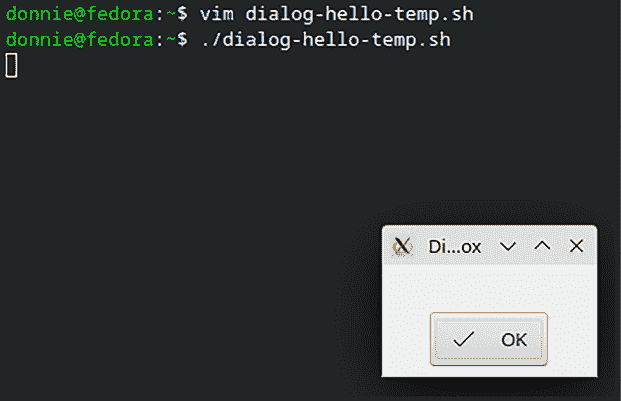

图 16.13：使用 xdialog 运行脚本

首先需要注意的是，`xdialog`会忽略`--begin`选项，并将对话框放置在终端的中央。还有一个事实是，`xdialog`通常要求你创建更大的框，以便你能看到所有内容。因此，让我们在最终的`xdialog-hello.sh`脚本中做如下更改：

```
#!/bin/bash
Xdialog --title "Dialog message box" \
        --begin 2 2 \
        --msgbox "\nHowdy folks!" 15 50
clear 
```

正如你在这里看到的，这样看起来好多了：

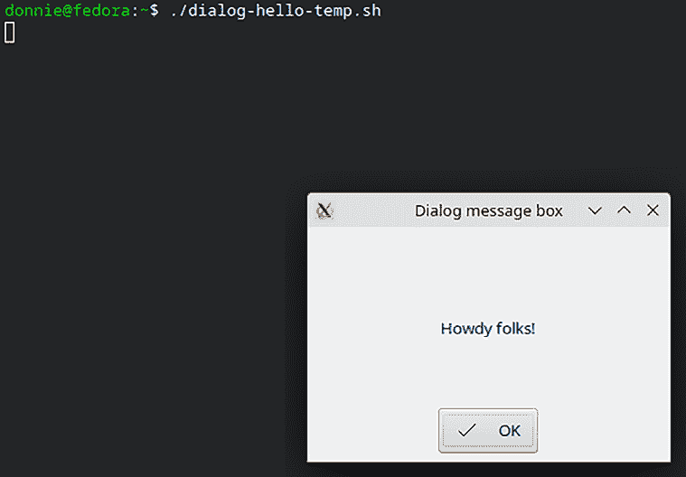

图 16.14：改进后的 xdialog 脚本

使用`xdialog`时，脚本末尾的`clear`命令不再必要，但留下它不会造成任何问题。事实上，我们将需要它来进行下一个演示。

## 自动选择`dialog`或`xdialog`

现在，这里有一个非常酷的东西。只需再添加几行代码，你就可以让脚本自动检测它是运行在桌面系统还是文本模式机器上，以及`xdialog`是否已安装。以下是`xdialog-hello2.sh`脚本，展示它如何工作：

```
#!/bin/bash
command -v Xdialog
if [[ $? == 0 ]] && [[ -n $DISPLAY ]]; then
        diag=Xdialog
else
        diag=dialog
fi
$diag --title "Dialog message box" \
        --begin 2 2 \
        --msgbox "\nHowdy folks!" 15 50
clear 
```

有几种方法可以检测程序是否已安装。在*第十二章，通过 here 文档和 expect 自动化脚本*中，我在`system_info.sh`脚本中向你展示了这种方法：

```
if [[ -f /usr/local/bin/pandoc ]] || [[ -f /usr/bin/pandoc ]]; then
        pandoc -o sysinfo.pdf sysinfo.html
        rm sysinfo.html
fi 
```

我们需要的`pandoc`可执行文件在 FreeBSD 的`/usr/local/bin/`目录中，而在其他系统上则位于`/usr/bin/`目录。因此，我设置了这个`if..then`结构来检测可执行文件是否位于这两个位置之一。这样有效，但我现在想展示一个更简单的方法。

在`xdialog-hello2.sh`脚本中，`command -v Xdialog`命令会检测`Xdialog`可执行文件是否存在，而不管它在哪个目录中。如果存在，命令将返回退出码 0。如果不存在，命令将返回退出码 1。要查看这个是如何工作的，请在命令行上运行这个命令。如果未检测到`Xdialog`可执行文件，效果如下：

```
donnie@ubuntu2204:~$ command -v Xdialog
donnie@ubuntu2204:~$ echo $?
1
donnie@ubuntu2204:~$ 
```

下面是如果检测到它时的效果：

```
donnie@fedora:~$ command -v Xdialog
donnie@fedora:~$ echo $?
0
donnie@fedora:~$ 
```

在下一行，你可以看到一个`if..then`结构，它检查两个条件。首先，它检查`command`命令的退出码，然后检查是否安装了图形桌面环境。如果`DISPLAY`环境变量的值是非零长度，那么说明已安装桌面环境。你可以通过运行`echo $DISPLAY`命令来查看这个是如何工作的。这是桌面机器上的显示效果：

```
donnie@fedora:~$ echo $DISPLAY
:0
donnie@fedora:~$ 
```

在文本模式机器上，你将完全没有输出，就像在这个 Ubuntu Server 虚拟机上看到的那样：

```
donnie@ubuntu2204:~$ echo $DISPLAY
donnie@ubuntu2204:~$ 
```

对于我们的目的，我们可以说，在这个文本模式机器上，`DISPLAY`的值是零个字符长。

现在，让我们再看看我们的`if..then`语句：

```
if [[ $? == 0 ]] && [[ -n $DISPLAY ]]; then
        diag=Xdialog
else
        diag=dialog
fi 
```

这意味着，如果`command -v Xdialog`命令的退出码为 0，并且`DISPLAY`环境变量的值非零长度，那么`diag`变量的值将变为`Xdialog`。如果`Xdialog`可执行文件缺失或`DISPLAY`的值*不是*非零长度，则`diag`的值将变为`dialog`。更酷的是，这在所有 Linux、Unix 或类 Unix 系统上都能正常工作。我已经在 FreeBSD、GhostBSD、DragonflyBSD、OpenIndiana 以及 Linux 的桌面和文本模式实现上测试过这个脚本。在所有这些系统上，脚本都能正确检测到它应该检测的内容，并正确选择是运行`dialog`还是`Xdialog`。

这有一件事让我有点困惑。我无意中发现，你检查某些内容的顺序有时很重要。在这个脚本的`if..then`结构中，我最初先检查了`DISPLAY`的值，然后检查了`command`命令的退出码。这样脚本无法正确运行，因为对`DISPLAY`值的检查会将退出码设置为 0。当我将检查顺序反过来时，一切开始正常工作。

你可以尝试在各种系统上运行这个脚本，看看会发生什么。

接下来，让我们在已有的基础上添加另一个小部件。

## 添加小部件

你可以通过添加更多的小部件来增加更多功能。例如，`dialog-hello2.sh` 脚本，你可以从 GitHub 仓库中下载。由于格式限制，我不能一次性展示整个文件，所以我会分段展示给你。这里是顶部部分：

```
#!/bin/bash
command -v Xdialog
if [[ $? == 0 ]] && [[ -n $DISPLAY ]]; then
        diag=Xdialog
else
        diag=dialog
fi 
```

我们在之前的脚本中已经看到过这个内容，我也已经做过解释。所以，接下来我们继续。这里是下一部分：

```
$diag --title "Dialog message box" \
        --begin 2 2 \
        --msgbox "\n Hello world!" 20 50
$diag --begin 4 4 --yesno "Do you believe in magic?" 0 0 
```

第一行 `$diag` 创建了一个初始消息框，位于左上角，位置由 `--begin 2 2` 选项指定。第二行 `$diag` 创建了一个带有两个按钮的框，按钮标记为 **是** 和 **否**。`--begin 4 4` 选项将 `yesno` 框略微放置在初始消息框的下方和右侧。`--yesno` 后面是我们希望框显示的文本和高度、宽度参数。（将高度和宽度设置为 0 和 0 会使框自动调整大小。）

接下来，我们有一个 `case..esac` 结构，将命令分配给两个按钮。记住，当点击时，**是**按钮返回退出代码 0，**否**按钮返回退出代码 1。按下 **Esc** 键时，返回退出代码 255。我们可以利用这些退出代码来触发所需的命令，如你在这里看到的：

```
case $? in
        0)
                clear
                echo "Cool!  I'm glad that you do." ;;
        1)
                clear
                echo "I'm sorry that you live such a dull life." ;;
        255)
                clear
                echo "You pressed the ESC key." ;;
esac 
```

好吧，这个脚本的作用就是当你按下按钮时显示一个消息。但它确实展示了这个概念，所以一切都很好。

你已经看过初始消息框，所以我不会再展示它了。相反，我会展示接下来的 `yesno` 框：

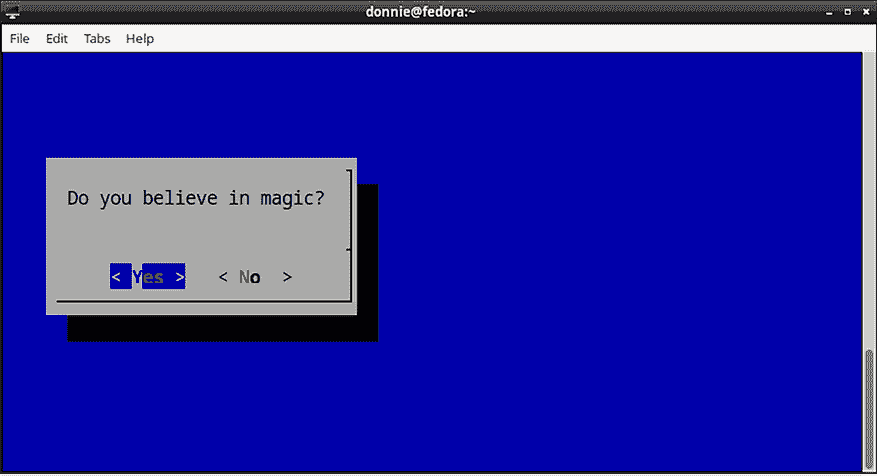

图 16.15：yesno 框

当我点击 **是** 按钮时，我会看到相应的消息，如你在这里看到的：

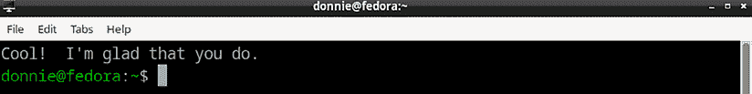

图 16.16：点击 **是** 按钮后

当然，这个脚本在支持 `xdialog` 的机器上也能同样运行。

接下来，让我们创建一些真正能为我们做有用工作的东西。

## 创建 SSH 登录界面

假设你有一组 Linux、Unix 或类 Unix 服务器，需要通过 SSH 远程管理。试图跟踪服务器的 IP 地址是件非常混乱的事情，因此你决定简化操作。你决定创建 `xdialog-menu-test.sh` 来帮助你。这个脚本也太长，不能在这里一次性展示，所以我会将它分段展示。这里是顶部部分：

```
#!/bin/bash
command -v Xdialog
if [[ $? == 0 ]] && [[ -n $DISPLAY ]]; then
        diag=Xdialog
else
        diag=dialog
fi 
```

这与之前的脚本相同，所以你已经了解了它。接下来是下一部分：

```
cmd=($diag --keep-tite --menu "Select options:" 22 76 16)
options=(1 "Remote SSH to Debian miner"
         2 "Remote SSH to Fedora miner"
         3 "Remote SSH to Fedora Workstation"
         4 "Remote SFTP to Fedora Workstation")
choices=$("${cmd[@]}" "${options[@]}" 2>&1 >/dev/tty) 
```

`cmd=` 行在一对括号内创建一个命令，然后将该命令分配给 `cmd` 变量数组。这个命令将在脚本的最后一行被调用，构建一个 `dialog` 或 `xdialog` 菜单窗口。根据 `dialog` 手册页，当在桌面机器的图形终端模拟器中运行脚本时，`--keep-tite` 选项是推荐使用的，因为它可以防止脚本在图形终端和底层 shell 终端之间来回切换。在 `--menu` 选项之后，我们会看到要显示的文本、菜单框的高度和宽度，然后是一次显示的最大菜单项数。（在这个例子中，用户需要向下滚动才能看到前 16 个菜单项之外的内容。）菜单项将通过标签和项字符串来指定。例如，我们看到的第一个菜单项标签为 **1**，项为 **Remote SSH to Debian miner**。

接下来是 `options` 语句，它将所有菜单项插入到一个数组中。`choices=` 行使用 `2>&1>` 重定向操作符将数组的内容输出到终端屏幕 (`/dev/tty`) 上。`${options[@]}` 中的 `@` 是一种变量扩展方式，因为它允许根据用户选择的菜单项执行相应的操作。`@` 代表数组项的索引号，该索引对应用户所选的菜单项。

在 *第八章，基本 Shell 脚本构建* 中，我向你展示了如何用 `*` 或 `@` 替代特定的索引号，以显示数组中的所有元素。在 `cmd=` 行中，`$diag --keep-tite --menu "Select options:" 22 76 16` 命令中的每个组件都是 `cmd` 数组的一个独立元素。因此，我们需要在 `choices=` 行的底部使用 `*` 或 `@` 作为 `cmd` 数组的索引，以便整个命令被调用。对于分配给 `options` 数组的选项列表也同样如此，稍后你将看到。

现在我们有了一个菜单，接下来需要让它执行一些操作。这将在下一个部分中完成，如下所示：

```
for choice in $choices
do
    case $choice in
        1)
            ssh donnie@192.168.0.3
            ;;
        2)
            ssh donnie@192.168.0.12
            ;;
        3)
            ssh donnie@192.168.0.16
            ;;
        4)
            sftp donnie@192.168.0.16
            ;;
    esac
done 
```

这不是你没见过的东西。这只是一个正常的 `for` 循环，执行一个 `case..esac` 结构。有一点不同的是，`choices` 变量的值是与所选菜单项对应的数组项的索引号。`options` 数组中列出的每个选项都由一个数字和一个完整的短语组成，如 `1 "Remote SSH to Debian miner"`。在这个例子中，数字 1 代表 `options` 数组的第 0 个元素，短语中的其余部分代表第 1 至第 5 个元素。为了使选项正确显示在菜单中，你需要用 `*` 或 `@` 替代索引号来调用数组。下面是这一操作发生的完整行：

```
choices=$("${cmd[@]}" "${options[@]}" 2>&1 >/dev/tty) 
```

由于只有一个索引值被赋给 `choices`，所以 `for` 循环在第一次运行后就退出了。

现在一切都构建好了，让我们来看看它是否能正常工作。以下是使用 `xdialog` 在 GhostBSD 上，Mate 桌面环境下的效果：

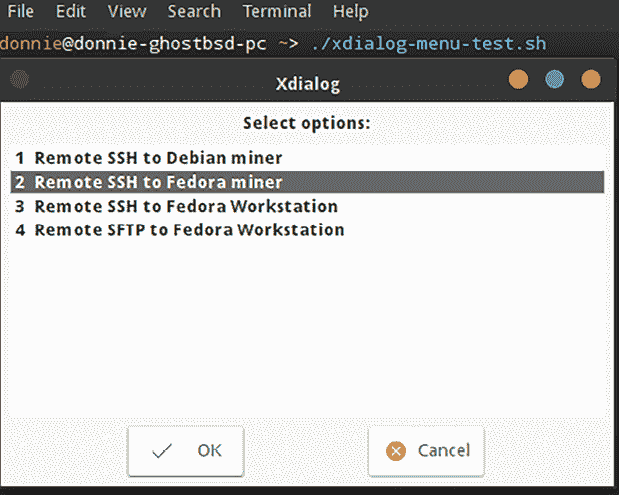

图 16.17：在 GhostBSD 上使用 xdialog 的 xdialog-menu-test.sh 脚本

这是同样的脚本，在 Fedora 上使用 `dialog` 的效果：

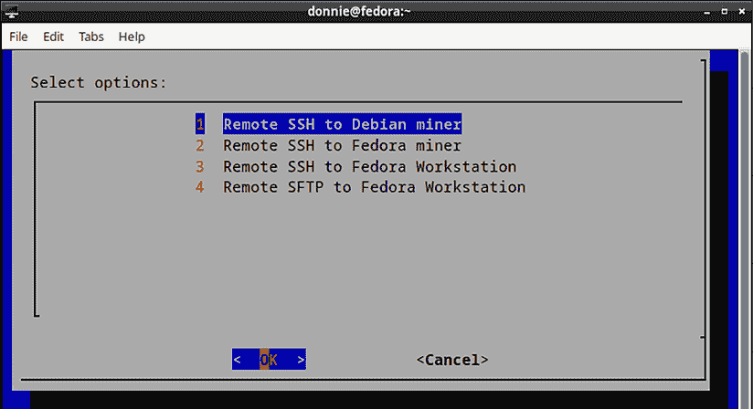

图 16.18：在 Fedora 上使用 dialog 的 xdialog-menu-test.sh 脚本

当你选择一个菜单项时，脚本会在终端中打开一个远程登录提示，然后退出。这没问题，因为如果你希望同时连接多个远程服务器，你无论如何都需要打开其他终端。

当然，你可以将这个脚本装饰得更漂亮，使它更加实用。例如，你可以配置 SSH 客户端，使用不同的配置文件或加密密钥来连接不同的服务器会话，并相应地修改菜单中的命令。或者，你可以将其作为其他用途的模板。正如我一直说的，让你的想象力飞翔吧！

好吧，我觉得关于 `yad`、`dialog` 和 `xdialog` 的部分差不多了。让我们总结一下，继续前进吧。

# 总结

正如往常一样，我们在这一章中涵盖了很多内容，看到了一些很酷的东西。我们从讨论 `yad` 开始，了解了如何使用它为 shell 脚本创建图形用户界面。然后，我们看了如何使用 `dialog` 为文本模式环境创建用户界面，如何使用 `xdialog` 为图形环境创建用户界面。作为额外的奖励，你还看到了如何创建脚本，使其在支持 `xdialog` 的机器上运行，在不支持的机器上运行 `dialog`。

这些其实并不是你可以用来为脚本创建用户界面的唯一三种工具。其他选择还包括 `whiptail`、`cdialog` 和 `zenity`。好消息是，一旦你学会了其中一种，切换到另一种是相对容易的。

现在，你可以用这些工具做比我在这里展示的更多的事情。另一方面，这些工具都不适合创建非常复杂的东西。要做到这一点，你需要学习一种更复杂的编程语言。无论如何，如果你所需的仅仅是一个简单的界面，以便让你自己或你的用户操作更轻松，这些工具完全能够胜任。

在下一章中，我们将探讨如何使用选项开关运行 shell 脚本。我在那儿等你。

# 问题

1.  你想为一个将在各种 Linux、Unix 和类 Unix 操作系统上运行的 shell 脚本创建图形用户界面。以下哪个工具可以提供最佳的可用性？

    1.  `zenity`

    1.  `cdialog`

    1.  `xdialog`

    1.  `yad`

1.  以下关于这个代码片段的哪个说法是正确的？

```
command -v Xdialog
if [[ -n $DISPLAY ]] && [[ $? == 0 ]]; then
        diag=Xdialog
else
        diag=dialog
fi 
```

1.  这是很好的代码，能够正常工作。

1.  它无法工作，因为它使用了错误的方法来检测 `Xdialog` 可执行文件是否存在。

1.  它无法工作，因为无法检测某个可执行文件是否存在。

1.  它无法正常工作，因为首先进行`[[ -n $DISPLAY ]]`测试确保`$?`总是返回 0 的值。

# 进一步阅读

+   用 YAD 装饰 Bash 脚本：[`www.linux-magazine.com/Online/Blogs/Productivity-Sauce/Dress-Up-Bash-Scripts-with-YAD`](https://www.linux-magazine.com/Online/Blogs/Productivity-Sauce/Dress-Up-Bash-Scripts-with-YAD)

+   YAD 指南：[`yad-guide.ingk.se/`](https://yad-guide.ingk.se/)

+   如何在 Linux 上的 Shell 脚本中使用 ncurses 小部件：[`linuxconfig.org/how-to-use-ncurses-widgets-in-shell-scripts-on-linux`](https://linuxconfig.org/how-to-use-ncurses-widgets-in-shell-scripts-on-linux)

+   使用 dialog/Xdialog 设计简单的前端：[`linuxgazette.net/101/sunil.html`](https://linuxgazette.net/101/sunil.html)

+   向 Shell 脚本中添加对话框：[`www.linux-magazine.com/Issues/2019/228/Let-s-Dialog`](https://www.linux-magazine.com/Issues/2019/228/Let-s-Dialog)

+   菜单驱动的 Shell 脚本 - 使用对话框工具：[`web.archive.org/web/20120318060251/http://www.bashguru.com/2011/01/menu-driven-shell-script-using-dialog.html`](http://web.archive.org/web/20120318060251/http://www.bashguru.com/2011/01/menu-driven-shell-script-using-dialog.html)

+   Xdialog 文档：[`web.mit.edu/outland/share/doc/Xdialog-2.1.2/`](http://web.mit.edu/outland/share/doc/Xdialog-2.1.2/)

# 答案

1.  c

1.  d

# 加入我们的 Discord 社区！

与其他用户、Linux 专家以及作者一起阅读本书。

提出问题，提供解决方案，和作者通过“问我任何问题”环节交流，还有更多内容。扫描二维码或访问链接加入社区。

[`packt.link/SecNet`](https://packt.link/SecNet)


