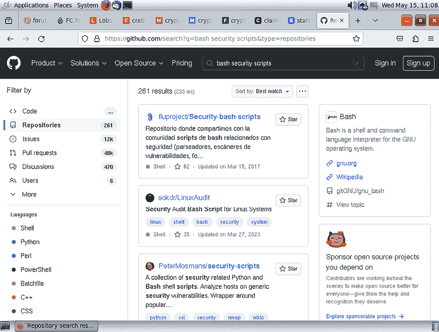

# 安全专业人士的 Shell 脚本编写

在本章中，我们将做一些不同的事情。与其向你展示新的脚本概念，不如教你如何利用你已经学到的概念来执行一些安全专业可能需要做的工作。

当然，你也可以用更复杂的程序如`nmap`来完成许多这些任务。但是，有时这些工具可能对你不可用。在本章中，我将向你展示一些简单的脚本，可以完成一些这样的工作。

本章的主题包括：

+   简单的审计脚本

+   创建简单的防火墙脚本

+   搜索现有的与安全相关的脚本

+   好了，我知道你迫不及待地想要开始了。所以，让我们开始吧。

# 技术要求

对于本章中的 Linux 演示，我将使用一个 Fedora Server 虚拟机。这是因为这些演示将使用红帽类型的独特功能和实用程序，如 Fedora。但是，如果你愿意，你也可以很容易地将它们适配到其他 Linux 发行版，如 Ubuntu 或 Debian。

我还将在 OpenIndiana 和 FreeBSD 上向你展示一些东西。在你的 FreeBSD 虚拟机上，我假设你已经安装了`bash`，并设置了一个具有完整`sudo`权限的普通用户帐户，就像我在*第十二章，使用 here 文档和 expect 自动化脚本*中展示的那样。

正如以往一样，你可以通过运行以下命令从 Github 获取这些脚本：

```
git clone https://github.com/PacktPublishing/The-Ultimate-Linux-Shell-Scripting-Guide.git 
```

# 简单的审计脚本

如果你习惯使用`nmap`，你肯定知道它有多棒。你可以用它来进行许多类型的审计和网络安全任务，如扫描端口或识别远程机器上的操作系统。但是，如果你发现自己处于`nmap`不可用的情况下，你也可以通过一些简单的 Shell 脚本完成部分`nmap`的工作。让我们从简单的事情开始。

## 识别操作系统

你可以通过 ping 另一台机器并查看响应中的**Time-to-Live**（**TTL**）字段来大致了解它运行的操作系统。这是它的工作原理：

+   `64`：如果 ping 响应的 TTL 为 64，则目标机器的操作系统是 Linux、某种 BSD 或 macOS。

+   `128`：128 的 TTL 表示目标机器正在运行 Windows。

+   `255`：这表示目标机器正在运行 Solaris 或 Solaris 克隆，如 OpenIndiana。

这是普通 ping 命令的输出。（请注意，我使用了`-c1`选项，这意味着我只发送一个 ping 数据包。）这显示了 TTL 字段：

```
donnie@fedora:~$ ping -c1 192.168.0.18
PING 192.168.0.18 (192.168.0.18) 56(84) bytes of data.
64 bytes from 192.168.0.18: icmp_seq=1 ttl=128 time=5.09 ms
--- 192.168.0.18 ping statistics ---
1 packets transmitted, 1 received, 0% packet loss, time 0ms
rtt min/avg/max/mdev = 5.086/5.086/5.086/0.000 ms
donnie@fedora:~$ 
```

在输出的第二行中，你看到`ttl=128`，这表明我刚刚 ping 了一台 Windows 机器。现在，这是`os-detect.sh`脚本，它可以自动解释 TTL 字段：

```
#!/bin/bash
ttl=$(ping -c1 $1 | head -2 | tail -1 | cut -d= -f3 | cut -d" " -f1)
echo "The TTL value is $ttl."
if [[ $ttl == 64 ]]; then
         echo "A TTL of $ttl indicates either a Linux, BSD, or macOS operating system."
elif [[ $ttl == 128 ]]; then
        echo "A TTL of $ttl indicates a Windows operating system."
elif [[ $ttl == 255 ]] ; then
        echo "A TTL of $ttl indicates a Solaris/OpenIndiana operating system."
else
        echo "There was no recognized TTL value."
fi 
```

在第二行中，我使用`$1`位置参数来表示目标机器的 IP 地址。我还将`ping`输出通过管道传送到`head`，然后是`tail`，以便隔离出第二行输出，其中包含 TTL 字段。接着，我将第二行传递给`cut`，使用`=`作为字段分隔符来隔离出第三个字段，在这个例子中，Windows 的第三个字段是`128 time`。最后，我将这个第三个字段的值传递给`cut`，以便仅提取 TTL 数字。这个 TTL 数字将作为`ttl`变量的值。

最后，我们有`if. .elif. .else`结构来识别目标机器的操作系统。现在，看看这个脚本的运行效果：

```
donnie@fedora:~$ ./os-detect.sh 192.168.0.18
The TTL value is 128.
A TTL of 128 indicates a Windows operating system.
donnie@fedora:~$ ./os-detect.sh 192.168.0.20
The TTL value is 64.
A TTL of 64 indicates either a Linux, BSD, or macOS operating system.
donnie@fedora:~$ ./os-detect.sh 192.168.0.19
The TTL value is 255.
A TTL of 255 indicates a Solaris/OpenIndiana operating system.
donnie@fedora:~$ 
```

记录一下，第一台机器运行的是 Windows 10，第二台机器运行的是 FreeBSD，第三台机器运行的是 OpenIndiana。这样很简单，对吧？不过，稍等一下，我确实需要指出几个注意事项。

首先，显而易见的是，这个脚本无法提供目标机器操作系统的详细信息。事实上，它甚至无法区分 Linux、BSD 或 macOS 操作系统。第二个注意事项是，你只能使用这个脚本扫描本地网络中的机器，因为跨网络边界发送 ping 数据包会改变 TTL 值。第三，你可以在 Linux 或 BSD 机器上运行这个脚本，但不能在 Solaris/OpenIndiana 机器上运行。因为 Solaris 和 OpenIndiana 使用不同实现的`ping`工具，这些工具除了显示目标机器是否在线外不会显示任何其他信息。最后，如果目标机器有防火墙配置来阻止 ping 数据包，那么这个脚本根本无法工作。

所以，即使这个脚本可能是一个快速分析你本地网络中机器的有用工具，你仍然需要使用`nmap`或其他等效工具来获取更详细的信息，扫描另一个网络上的机器，或者扫描那些阻止 ping 数据包的防火墙机器。例如，使用`nmap`的`-A`选项可以使`nmap`相对准确地检测目标机器的操作系统。下面是当我扫描一台 FreeBSD 14 机器时的结果：

```
donnie@fedora:~$ sudo nmap -A 192.168.0.20
. . .
. . .
Device type: general purpose
Running: FreeBSD 12.X|13.X
OS CPE: cpe:/o:freebsd:freebsd:12 cpe:/o:freebsd:freebsd:13
OS details: FreeBSD 12.0-RELEASE - 13.0-CURRENT
Network Distance: 1 hop
Service Info: OS: FreeBSD; CPE: cpe:/o:freebsd:freebsd
Okay, that's cool. Let's now scan some ports.
. . .
. . .
donnie@fedora:~$ 
```

好吧，你看到了我说的`nmap`的操作系统检测是*有些*准确的意思。扫描结果显示我正在扫描的是 FreeBSD 12 或 FreeBSD 13 机器，尽管它实际上是 FreeBSD 14 机器。但是，FreeBSD 14 还很新，因此很可能它的指纹尚未添加到`nmap`数据库中。好的一面是，至少它准确地告诉我们这是某种 FreeBSD 机器，而不是仅仅告诉我们它可能是 FreeBSD、Linux 或 macOS。

另一方面，你可能会发现我们的简单脚本在某些情况下效果更好。例如，看看当我在 OpenIndiana 机器上执行`nmap -A`扫描时发生了什么：

```
donnie@fedora:~$ sudo nmap -A 192.168.0.19
. . .
. . .
No exact OS matches for host (If you know what OS is running on it, see https://nmap.org/submit/ ).
. . .
. . .
donnie@fedora:~$ 
```

正如你之前看到的，我们的脚本正确地将这台机器识别为 Solaris 或 OpenIndiana 机器。但是，`nmap`完全无法识别它。

## 一个简单的端口扫描脚本

这是一个很酷的小脚本，你可以用它扫描本地或远程机器上的开放网络端口。如果你是网络扫描的新手，网络端口可以处于三种状态中的任何一种。以下是这些状态的相关定义：

+   `open`：开放端口是指有一个关联的网络服务正在运行，并且没有被防火墙阻止的端口。例如，你会期待在运行安全外壳（SSH）服务的服务器上找到 22 端口是开放的，在使用加密连接的 Web 服务器上找到 443 端口是开放的。通过观察远程机器上哪些端口开放，你可以知道该机器上正在运行哪些网络服务。

+   `closed`：关闭端口是指没有关联服务在运行，并且没有被防火墙阻止的端口。

+   `filtered`：过滤端口是指该端口已被防火墙阻止。

这个脚本通过使用 GNU 版`bash`内建的网络功能来工作，这些功能存在于 Linux 和较新版本的 macOS 上。它通过使用 Linux 系统上的`/dev/tcp`或`/dev/udp`设备来工作。奇怪的是，你不会在`/dev/`目录下找到这些设备文件，因为它们是硬编码在`bash`可执行文件中的。你可以使用`strings`工具来验证这一点，正如你在这里看到的：

```
donnie@fedora:~$ strings /bin/bash | grep tcp
/dev/tcp/*/*
donnie@fedora:~$ strings /bin/bash | grep udp
/dev/udp/*/*
donnie@fedora:~$ 
```

如果你在想，`strings` 允许你查看嵌入到二进制可执行文件中的文本字符串。另外，要注意，这种网络功能仅在 GNU 版的`bash`中内建，这意味着你可以在 Linux 或较新版本的 macOS 上运行这些命令，但不能在其他 Unix/类 Unix 发行版（如 FreeBSD 或 OpenIndiana）上运行。

最简单的说明方式是手动查询一个会提供反馈的端口。在这里，我查询了一个远程网络时间服务器的 13 端口：

```
donnie@fedora:~$ cat < /dev/tcp/time.nist.gov/13
60372 24-03-03 21:04:44 58 0 0 544.5 UTC(NIST) *
donnie@fedora:~$ 
```

你还会收到来自 22 端口（SSH 端口）的反馈，正如你在这里看到的：

```
donnie@fedora:~$ cat < /dev/tcp/192.168.0.20/22
SSH-2.0-OpenSSH_9.3 FreeBSD-20230719
donnie@fedora:~$ 
```

这个过程完成起来稍微需要一些时间，因为目标机器上的身份验证计时器需要一段时间才能超时。

在这两个示例中，请注意我如何使用输入重定向符号（`<`）从`/dev/tcp`设备获取输入。然后，在`/dev/tcp/`部分之后，我放入目标机器的 IP 地址，最后是我想要扫描的端口。

大多数端口不会向你提供任何反馈。但你仍然可以通过命令执行的速度判断端口是否开放。例如，如果你查询 DNS 服务器上的 53 端口，你应该看到命令立即完成执行，就像你在这里看到的 Google DNS 服务器一样：

```
donnie@fedora:~$ cat < /dev/tcp/8.8.8.8/53
donnie@fedora:~$ 
```

所以，我知道 53 端口是开放的。但是，如果我查询一个未开放的端口，比如在这个例子中的 54 端口，命令提示符返回错误信息会非常迟，正如你在这里看到的：

```
donnie@fedora:~$ cat < /dev/tcp/8.8.8.8/54
bash: connect: Connection timed out
bash: /dev/tcp/8.8.8.8/54: Connection timed out
donnie@fedora:~$ 
```

现在，让我们利用这些知识，通过创建`bash-portscan1.sh`脚本来实现，像这样：

```
#!/bin/bash
host=$1
startport=$2
stopport=$3
ping=$(ping -c 1 $host | grep bytes | wc -l)
if [ "$ping" -gt 1 ]; then
  echo "$host is up";
else
  echo "$host is down. Quitting";
  exit
fi
for ((counter=$startport; counter<=$stopport; counter++)); do
          (echo >/dev/tcp/$host/$counter) > /dev/null 2>&1 && echo "Port $counter open"
done 
```

这个脚本比较长，我会分成几个部分。这里是上半部分：

```
#!/bin/bash
host=$1
startport=$2
stopport=$3 
```

要运行这个脚本，你需要指定目标机器的主机名或 IP 地址，以及你想要扫描的端口范围。到目前为止，这很简单，对吧？接下来，我们要验证目标机器是否真的在线，并创建一个变量赋值，方便我们在下一步使用。它看起来是这样的：

```
ping=$(ping -c 1 $host | grep bytes | wc -l) 
```

如果目标机器在线并且可访问，`ping`变量的值将大于 1，通常为 2。如果目标机器无法访问，则值将为 1。要查看这如何工作，可以在命令行中运行此命令，去掉`wc -l`部分，如下所示：

```
donnie@fedora:~$ ping -c1 192.168.0.20 | grep bytes
PING 192.168.0.20 (192.168.0.20) 56(84) bytes of data.
64 bytes from 192.168.0.20: icmp_seq=1 ttl=64 time=0.506 ms
donnie@fedora:~$ ping -c1 192.168.0.200 | grep bytes
PING 192.168.0.200 (192.168.0.200) 56(84) bytes of data.
donnie@fedora:~$ 
```

我首先对一个在线的机器进行了 ping 操作，并得到了两行输出。然后，我对一个虚拟机器进行了 ping 操作，只收到了一个输出行。`wc -l`命令将计算这些行并将适当的值赋给`ping`变量。

接下来，我们有一个`if...else`块，它会在目标机器不可用时使脚本退出。它看起来是这样的：

```
if [ "$ping" -gt 1 ]; then
  echo "$host is up";
else
  echo "$host is down. Quitting";
  exit
fi 
```

注意我必须用一对双引号将`$ping`括起来。这是因为`ping`的值可能包含空格、非字母数字字符，并且可能包含多行内容。如果没有双引号，`bash`将无法正确解析`ping`的值。

最后，我们有了执行实际端口扫描的`for`循环。它看起来是这样的：

```
for ((counter=$startport; counter<=$stopport; counter++)); do
          (echo >/dev/tcp/$host/$counter) > /dev/null 2>&1 && echo "Port $counter open"
done 
```

这从将`startport`变量的值赋给`counter`变量开始。只要`counter`的值小于或等于`stopport`的值，循环就会继续。

现在，这是我运行脚本时的效果：

```
donnie@fedora:~$ ./bash-portscan1.sh 192.168.0.20 20 22
192.168.0.20 is up
Port 22 open
donnie@fedora:~$ ./bash-portscan1.sh 8.8.8.8 53 53
8.8.8.8 is up
Port 53 open
donnie@fedora:~$ 
```

在第一次扫描中，我扫描了一个端口范围，从端口 20 开始，到端口 22 结束。然后，我只扫描了 Google DNS 服务器上的端口 53。

所以你看到，这对于本地或远程目标都能正常工作。

到目前为止，我们只扫描了 TCP 端口。但是，你也可以通过简单的修改来扫描 UDP 端口，就像我在`bash-portscan2.sh`脚本中所做的那样。在`for`循环中，只需将`tcp`改为`udp`，它看起来就像这样：

```
for ((counter=$startport; counter<=$stopport; counter++)); do
          (echo >/dev/udp/$host/$counter) > /dev/null 2>&1 && echo "Port $counter open"
done 
```

当然，如果你喜欢的话，你可以让事情看起来更加复杂。例如，你可以将 TCP 和 UDP 扫描功能合并到一个脚本中，并添加一个菜单，允许你选择要执行的操作。甚至，你还可以加上`yad`、`dialog`或`xdialog`界面。（所有这些技巧，我在*第十六章，使用 yad、dialog 和 xdialog 创建用户界面*中已经向你展示过了。）

现在，你可以使用`nmap`进行扫描，从而获取目标的更详细信息，类似这样：

```
donnie@fedora:~$ sudo nmap -sS 192.168.0.20
Starting Nmap 7.93 ( https://nmap.org ) at 2024-03-03 17:12 EST
Nmap scan report for 192.168.0.20
Host is up (0.00044s latency).
Not shown: 999 closed tcp ports (reset)
PORT   STATE SERVICE
22/tcp open  ssh
MAC Address: 08:00:27:45:A4:75 (Oracle VirtualBox virtual NIC)
Nmap done: 1 IP address (1 host up) scanned in 6.01 seconds
donnie@fedora:~$ 
```

这种`-sS`类型的扫描，称为 SYN 包扫描，需要`sudo`权限。然而，你也可以进行`-sT`类型的扫描，这种扫描不需要`sudo`权限。使用我们自制的脚本扫描开放端口几乎是瞬间完成的。但扫描关闭或被过滤的端口，使用`nmap`可能会更快（但并不总是如此）。不过，使用我们脚本的一个潜在优势是，某些类型的`nmap`扫描可以通过向目标机器的防火墙添加几条规则来阻止。因此，如果你尝试对某台机器运行`nmap`扫描却没有结果，你可以尝试改用脚本。不过，使用脚本扫描开放端口的隐蔽性稍差，因为它会在目标机器的系统日志文件中留下明显的痕迹。例如，下面是使用脚本扫描 AlmaLinux 9 机器上的端口 22 时产生的消息：

```
Mar  6 13:25:20 localhost sshd[1601]: error: kex_exchange_identification: client sent invalid protocol identifier ""
Mar  6 13:25:20 localhost sshd[1601]: error: send_error: write: Broken pipe
Mar  6 13:25:20 localhost sshd[1601]: banner exchange: Connection from 192.168.0.16 port 38680: invalid format 
```

使用脚本扫描其他开放端口时，会生成类似的消息，而扫描关闭端口则不会生成任何消息。如果你使用脚本扫描一个开放的 web 服务器端口，如端口 80 或端口 443，你将在 web 服务器的`access_log`文件中看到类似这样的消息：

```
192.168.0.16 - - [06/Mar/2024:13:38:49 -0500] "\n" 400 226 "-" "-" 
```

但是，`nmap`不会生成这些消息，除非目标机器的防火墙配置为记录来自`nmap`扫描的包。因此，两种方法各有优缺点。

在 Red Hat 系列的机器上，如 AlmaLinux、Rocky Linux 和 RHEL，这些消息将出现在`/var/log/secure`文件中。在其他发行版中，这些消息可能会出现在`/var/log/messages`文件或`/var/log/syslog`文件中。一些 Linux 发行版（如 Debian）默认不再创建这些文件。对于这些系统，你需要使用`sudo journalctl`命令来查看消息，或者从正常的发行版仓库安装`rsyslog`包，以便你能拥有正常的文本模式日志文件。

现在，让我们做一些更复杂的操作。

## 审计 root 用户账户

由于我是一名安全极客，我一直倡导在设置 Linux 和 Unix 系统时禁用 root 用户账户。在许多现代 Linux 系统上，这很容易做到，因为你可以在系统安装程序中正确配置。事实上，Ubuntu 安装程序甚至不会让你启用 root 用户账户，而是会自动将你创建的账户添加到`sudo`组中。（你可以在安装操作系统后启用 root 用户账户，尽管这不是推荐的做法。）对于其他 Linux 发行版，如 Debian、Fedora 或 RHEL 家族的成员，在安装过程中启用 root 用户账户是可选的。在大多数类 Unix 系统（如 FreeBSD 和 OpenIndiana）上，安装程序会为 root 用户账户分配一个密码。在 FreeBSD 上，安装完成后，你需要手动安装`sudo`，设置一个普通用户账户来使用它，然后禁用 root 用户账户。在 OpenIndiana 上，你在安装操作系统时创建的普通用户将自动配置为具有完全的`sudo`权限，且 root 账户也会被启用。

现在，你想要一种简单的方法来审计你的系统，看看它们的 root 用户是否已启用。我们从设置一个在 Linux 或 OpenIndiana 系统上都能很好工作的脚本开始。

### 为 Linux 和 OpenIndiana 创建 root 账户审计脚本

我们将从`rootlock_1.sh`脚本开始，你可以从 Github 仓库下载该脚本。这是另一个太长无法在这里完整展示的脚本。没关系，因为如果我将其分解成几个部分来解释，会更容易理解。

我首先要做的是初始化一些变量，如下所示：

```
#!/bin/bash
os=$(uname)
quantity=$(cut -f3 -d: /etc/passwd | grep -w 0 | wc -l) 
```

OpenIndiana 和大多数 Linux 系统默认都安装了`bash`，并且两者使用相同的影子文件系统。因此，完全相同的脚本适用于这两者。不过，最终我可能会想对其进行修改，使其可以在一些 BSD 类型的操作系统上运行，因为这些系统的设置方式不同。为此，我将使用`uname`命令的输出作为`os`变量的值，以确保每个操作系统上总是运行正确的代码。我还想知道有多少个用户账户的 UID 值为 0，因此我将创建`quantity`变量来追踪这一点。为了获取该值，我需要使用`cut -f3 -d:`命令查看每个`passwd`文件条目的第三字段，然后将其通过管道传输给`grep -w 0`命令，只查找该字段中仅包含 0 的行。最后，我使用`wc -l`命令来计算匹配此标准的行数。

请记住，UID 为 0 的值赋予用户账户完全的根用户权限。在大多数操作系统中，你不应该看到多个 UID 为 0 的用户账户。在某些 BSD 类型的系统中，你会看到两个或三个 UID 0 的账户。其中一个是 root 账户，可能将 `csh` 或 `sh` 设置为默认 shell。第二个是 toor 账户，默认 shell 为 `sh`。DragonflyBSD 有一个第三个 UID 0 账户，名为 installer。因此，如果你想编写一个适用于所有这些不同操作系统的脚本，你需要编写能够处理每个系统拥有不同数量 UID 0 账户的代码。（稍后我们会在本节中详细讨论这些内容。）

接下来，我创建了 `linux_sunos` 函数，它包含了大部分工作代码。它是这样的：

```
linux_sunos() {
        if [ $quantity -gt 1 ] ; then
                echo "CRITICAL.  There are $quantity accounts with UID 0."
        else
                echo "OKAY.  There is only one account with UID 0."
        fi 
        echo
        echo
        rootlock=$(awk 'BEGIN {FS=":"}; /root/ {print $2}' /etc/shadow | cut -c1)
        if [ "$rootlock" == $ ] ; then
                echo "CRITICAL!!  The root account is not locked out."
        else
                echo "The root account is locked out, as it should be."
        fi 
} 
```

顶部部分很简单。它只是一个 `if...then...else` 结构，如果 `/etc/passwd` 文件中有多个 UID 0 账户，则会提醒你。

接下来，我使用 `awk` 命令，将其输出通过管道传输到 `cut -c1`，以查找 `/etc/shadow` 文件中根用户账户的行，并隔离该行第二个字段的第一个字符的值。这个值将被分配给 `rootlock` 变量。那么，这个字符有什么重要性呢？好吧，事情是这样的。

在 Linux、Unix 及类 Unix 系统中，用户账户的列表保存在 `/etc/passwd` 文件中。该文件必须始终对所有用户可读，以便用户在登录时可以访问他们的账户信息。许多年前，当我年轻时，仍然满头黑发，用户密码也保存在这个 `passwd` 文件中。最终，有人意识到将密码保存在一个全局可读的文件中是一个安全问题，并发明了 **shadow 文件系统**。现在，所有用户密码的哈希值都保存在 Linux 和 Solaris/OpenIndiana 系统的 `/etc/shadow` 文件中，读取该文件需要根用户权限。（在 BSD 类型的系统中有些不同，稍后我会向你展示。）例如，以下是我自己在 Fedora Server 虚拟机上的用户账户条目：

```
donnie:$y$j9T$PfB847h88/LNURBaDxBbWdYI$bRXbrMUrTM7JwWifuDfjt6oFl0FFdYEzcwJHF5r/kG5::0:99999:7::: 
```

（请注意，这是一行很长的内容，在打印页面上会换行。同时注意，我改变了几个字符，以防泄露真实的哈希值。）

我希望你注意到这个哈希值的前缀，即 `$y$`。前导的 `$` 表示该账户已启用，而整个 `$y$` 表示密码是通过 **yescrypt** 哈希算法加密的。

由于 Fedora 是一个前沿的、稍微实验性的 Linux 发行版，你可以期待它使用一些还未广泛应用于其他 Linux 生态系统中的新技术。这里就是 Fedora 使用 yescrypt 的例子。在大多数现代 Linux 发行版中，你会在密码哈希的前面看到`$6$`，这表示它们使用的是 SHA512 哈希算法。虽然 SHA512 哈希很难破解，但 yescrypt 哈希据说更难破解，从而增强了密码安全性。

对于我们当前的目的，使用什么哈希算法并不重要。我们关心的只是前导的 `$`，因为它告诉我们该账户已启用。如果该位置的字符不是 `$`，则账户已禁用。为了获得最佳安全性，你希望在 `/etc/shadow` 文件中看到类似以下三行的内容：

```
root:!::0:99999:7:::
root:*::0:99999:7:::
root:*LK*::0:99999:7::: 
```

现在，以下是你不想看到的情况：

```
root:$y$j9T$TZqIDctm8w7ESbopARa5f1$RKjMWhZ9zS4KZ5dPvSODo2nAIH4s8GwZTA4TJNnoh3B:19 844:0:99999:7::: 
```

在这台虚拟机上，根账户已启用，如前导符号 `$` 所示。这将我们带回到脚本中的 `linux_sunos` 函数。让我们再看看创建 `rootlock` 变量的那一行：

```
rootlock=$(awk 'BEGIN {FS=":"}; /root/ {print $2}' /etc/shadow | cut -c1) 
```

如我之前所指出的，这个 `awk` 命令提取了根用户条目的第二个字段，即密码字段。将 `awk` 输出通过管道传输到 `cut -c1` 命令，会提取该字段的第一个字符。该字符的值随后被赋值给 `rootlock` 变量。

接下来是决定根用户账户是否被锁定的代码：

```
if [ "$rootlock" == '$' ] ; then
                echo "CRITICAL!!  The root account is not locked out."
        else
                echo "The root account is locked out, as it should be."
        fi 
```

这表示，如果根用户条目的第二个字段的第一个字符是`$`，那么该账户未被锁定。如果第一个字符是其他任何字符，则该账户被锁定，一切正常。

请注意，在这个 `if...then...else` 结构中，我必须用一对双引号将 `$rootlock` 包围起来。这是因为在某些 Linux 发行版中，如 Ubuntu，你可能会在根用户的 `shadow` 文件条目的密码字段中看到一个 `*`。如果没有双引号，Shell 会将 `*` 解释为通配符，这会导致 `$rootlock` 返回当前工作目录中的文件列表。使用双引号可以确保 `$` 正常工作，同时强制 Shell 以字面意义解释 `*`。

为了确保准确，我还用一对单引号将 `$` 包围，以确保 Shell 能正确解释它。（实际上，在我测试时，即使没有单引号也能正常工作，但为了安全起见，最好加上。）

现在，在脚本的最后部分，在函数之后，你会看到以下内容：

```
if [ $os == Linux ] || [ $os == SunOS ] ; then
        linux_sunos
else
        echo "I don't know this operating system."
fi 
```

`os` 变量的值应该在 Linux 系统上为 `Linux`，在 OpenIndiana 系统上为 `SunOS`。无论哪种情况，`linux_sunos` 函数都会运行。如果 `os` 的值为其他任何值，用户将看到错误消息。

最后，让我们测试一下这个脚本，看看会发生什么。以下是在我用来编写本文的 Fedora 工作站上的显示效果：

```
donnie@fedora:~$ sudo ./rootlock_1.sh
[sudo] password for donnie:
OKAY.  There is only one account with UID 0.
The root account is locked out, as it should be.
donnie@fedora:~$ 
```

非常酷，一切看起来不错。

为了查看启用 root 账户后的样子，我启动了我的 Fedora Server 虚拟机，该虚拟机从未启用过 root 账户。我像这样启用了 root 账户：

```
donnie@fedora-server:~$ sudo passwd root
Changing password for user root.
New password:
Retype new password:
passwd: all authentication tokens updated successfully.
donnie@fedora-server:~$ 
```

很简单，对吧？我只需要为 root 用户账户分配一个密码。现在，让我们运行脚本：

```
donnie@fedora-server:~$ sudo ./rootlock_1.sh
OKAY.  There is only one account with UID 0.
CRITICAL!!  The root account is not locked out.
donnie@fedora-server:~$ 
```

现在，让我们在 `rootlock_2.sh` 脚本中添加禁用 root 账户的选项。我们将通过在已经存在的 `if...then...else` 结构中嵌入另一个结构来做到这一点。它的样子是这样的：

```
if [ $rootlock == $ ] ; then
                echo "CRITICAL!!  The root account is not locked out."
                echo "Do you want to disable the root account? (y/n)"
                read answer
                if [ $answer == y ] ; then
                        passwd -l root
                else
                        exit
                fi
        else
                echo "The root account is locked out, as it should be."
        fi 
```

运行修改后的脚本是这样的：

```
donnie@fedora-server:~$ sudo ./rootlock_2.sh
OKAY.  There is only one account with UID 0.
CRITICAL!!  The root account is not locked out.
Do you want to disable the root account? (y/n)
y
Locking password for user root.
passwd: Success
donnie@fedora-server:~$ 
```

要禁用一个账户，`passwd -l` 命令会在密码哈希前加上一对感叹号，像这样：

```
root:!!$y$j9T$ckYOQzoMU0mr9gQkjqz/K0$QDNV0unG1XAfBwViY.7a6JR8VaMpIGObGzXIN0vxGQA:19847:0:99999:7::: 
```

密码哈希仍然存在，但操作系统无法再读取它。这将允许你通过运行以下命令解锁账户：

```
donnie@fedora-server:~$ sudo passwd -u root
[sudo] password for donnie:
Unlocking password for user root.
passwd: Success
donnie@fedora-server:~$ 
```

要删除密码并禁用账户，将 `passwd -d root` 命令放在 `passwd -l root` 命令之前，这样构造将变成这样：

```
if [ $rootlock == $ ] ; then
                echo "CRITICAL!!  The root account is not locked out."
                echo "Do you want to disable the root account? (y/n)"
                read answer
                if [ $answer == y ] ; then
                        passwd -d root
                        passwd -l root
                else
                        exit
                fi
        else
                echo "The root account is locked out, as it should be."
        fi 
```

注意，你不能在一个命令中同时使用 `-l` 和 `-d` 选项。要使用这两个选项，你需要分别运行两个命令。还需要注意的是，如果你只使用 `-d` 选项，虽然会删除密码哈希，但账户仍然被视为启用状态。在运行 `passwd -d` 后，如果再运行 `passwd -l`，将既删除密码哈希，又禁用账户。

虽然你可能已经知道这一点，但我还是告诉你。在禁用 root 用户账户之前，一定要确保你是以具有完整 `sudo` 权限的普通用户身份登录，而不是以 root 用户身份登录。这样，才不会意外地禁用没有其他管理员权限的机器上的 root 账户。

现在重新启用 root 账户的唯一方法就是创建一个新密码，正如你已经看到的那样。

这涵盖了 Linux 和 OpenIndiana。现在让我们看看能否在 FreeBSD 上使其工作。

### 修改 root 账户审计脚本以在 FreeBSD 上使用

在 BSD 类型操作系统（如 FreeBSD）中，使用的是 `/etc/master.passwd` 文件，而不是 `/etc/shadow` 文件。除了 `/etc/passwd` 文件中的 UID 0 的 root 用户账户外，还有一个 UID 0 的 toor 用户账户。因此，我们需要添加一个 `freebsd` 功能来处理这些差异。

在 FreeBSD 13 之前，root 用户账户的默认 shell 是 `csh`，而 toor 账户的默认 shell 是 `sh`。但在 FreeBSD 14 中，这两个 UID 0 的账户默认 shell 都是 `sh`。

最简单的做法是添加一个新功能，我将其命名为 `freebsd`。（实际上，还能叫什么呢？）你可以在 Github 仓库中的 `rootlock_3.sh` 脚本中找到这个新功能。让我们将这个新功能分解成几个部分来看它包含了什么。这里是顶部部分：

```
freebsd() {
        if [ $quantity -gt 2 ]
        then
                echo "CRITICAL.  There are $quantity accounts in the passwd file with UID 0."
        else
                echo "OKAY.  There are only two accounts in the passwd file with UID 0."
                echo
                echo
        fi 
```

这与我们刚刚查看的`linux_sunos`函数相同，只是现在它检查`passwd`文件中超过两个 UID 0 账户。这里是接下来的部分：

```
rootlock=$(awk 'BEGIN {FS=":"}; $1 ~ /root/ {print $2}' /etc/master.passwd | cut -c1)
        if [ "$rootlock" == '$' ] ; then
                echo "CRITICAL!!  The root account is not locked out."
                echo "Do you want to disable the root account? (y/n)"
                read answer
                if [ $answer == y ] ; then
                        pw mod user root -w no
                fi
        else
                echo "The root account is locked out, as it should be."
        fi 
```

我不得不修改`awk`命令，以便它只在一行的第一个字段中找到“root”，就像你在这里看到的那样，使用了`$1 ~ /root/`部分：

```
rootlock=$(awk 'BEGIN {FS=":"}; $1 ~ /root/ {print $2}' /etc/master.passwd | cut -c1) 
```

这是因为，与 Linux 和 OpenIndiana 的`shadow`文件不同，FreeBSD 的`master.passwd`文件列出了用户的默认主目录。正如你在这里看到的，前三个用户的默认主目录设置为`/root/`目录：

```
root:*:0:0::0:0:Charlie &:/root:/bin/csh
toor:*:0:0::0:0:Bourne-again Superuser:/root:
daemon:*:1:1::0:0:Owner of many system processes:/root:/usr/sbin/nologin 
```

在`awk`命令中使用`/root/`而不是`$1 ~ /root/`导致脚本读取了所有这三行，而不仅仅是用于 root 用户的第一行。这会阻止脚本正确检测 root 用户帐户是否已启用。因为如果脚本在 root 行的字段 2 中看到`$`，然后在 toor 和 daemon 行的字段 2 中看到`*`，它将把`*`作为`rootlock`的最终值。因此，即使 root 帐户没有被锁定，脚本也会始终显示 root 帐户被锁定。

我还不得不更改锁定 root 和 toor 帐户的命令，因为 FreeBSD 版本的`passwd`没有适当的选项开关来执行此操作。因此，我用以下两个`passwd`命令替换了它们：

```
pw mod user root -w no 
```

这个方便的命令同时删除密码并锁定帐户。

由于 FreeBSD 还有 UID 0 的 toor 帐户，我添加了另一部分来检查它：

```
toorlock=$(awk 'BEGIN {FS=":"}; /toor/ {print $2}' /etc/master.passwd | cut -c1)
        if [ "$toorlock" == '$' ] ; then
                echo "CRITICAL!!  The toor account is not locked out."
                echo "Do you want to disable the toor account? (y/n)"
                read answer
                if [ $answer == y ] ; then
                        pw mod user toor -w no
                fi
        else
                echo "The toor account is locked out, as it should be."
        fi
} 
```

在`master.passwd`文件中只有一行包含单词“toor”，所以我不需要告诉`awk`只在第一个字段中查找`/toor/`模式。除此之外，它与我刚刚为 root 用户展示的内容相同。（当然，因为这是函数的结尾，我在末尾包含了闭合的大括号。）

最后，我修改了脚本的最后部分，以便它将自动选择要运行的功能：

```
if [ $os == Linux ] || [ $os == SunOS ] ; then
        linux_sunos
elif [ $os == FreeBSD ] ; then
        freebsd
else
        echo "I don't know this operating system."
fi 
```

你在之前的章节中已经见过这种情况，所以你可能已经知道这里正在发生什么。

再次阅读你的思维。你正在考虑这个脚本有多酷，以及你想在一个混合的 Linux、Unix 和类 Unix 服务器群上使用它。然而问题在于，这个脚本是为`bash`编写的，并使用了一些`bash`的高级特性，这些特性在许多传统的`sh` shell 上不起作用。如果你能在所有的 Unix 和类 Unix 服务器上安装`bash`，那就太好了，但这可能不是一个选择。另外，如果你在使用运行轻量级 Linux 的物联网设备，可能也无法在它们上安装`bash`。那么，你该怎么办？好吧，稍等，因为我将在*第十九章，Shell 脚本可移植性*中解释这一切。

我认为这差不多涵盖了`rootlock`脚本。在结束本节之前，让我们再看一个审计脚本。

## 创建一个用户活动监控脚本

在这种情况下，你希望查看其他用户何时登录到系统，以及他们如何使用自己的`sudo`权限。为此，让我们创建`user_activity_1.sh`脚本。以下是脚本的顶部部分：

```
#!/bin/bash
if [[ $1 == "" ]] ; then
        echo "You must specify a user name."
        echo "Usage: sudo ./user_activity_1.sh username "
        exit
fi 
```

这告诉你，在调用此脚本时必须提供用户名。如果没有指定用户名，你将看到此消息，并且脚本会退出。接下来是这部分内容：

```
if [[ -f /var/log/secure ]] ; then
        logfile=/var/log/secure
elif [[ -f /var/log/auth.log ]] ; then
        logfile=/var/log/auth.log
elif [[ -n $(awk /suse/ /etc/os-release) ]] ; then
        logfile=/var/log/messages
else
        echo "I don't know this operating system."
        exit
fi 
```

大多数 Linux 和一些 Unix/类 Unix 发行版会将用户认证消息存储在`/var/log/secure`文件或`/var/log/auth.log`文件中。SUSE 和 openSUSE 是这一规则的显著例外，因为它们将这些信息存储在`/var/log/messages`文件中。

我假设你正在使用一个安装了`rsyslog`或`syslog`的发行版。如果你只有`journald`，那么这个脚本是无法工作的。

最后，这部分才是实际执行工作的部分。

```
username=$1
echo "=== User Account Activity ===" > user_activity_for_"$username"_$(date +"%F_%H-%M").txt
# Check user activity in system logs
echo "=== Recent Logins ===" >> user_activity_for_"$username"_$(date +"%F_%H-%M").txt
last | grep $username >> user_activity_for_"$username"_$(date +"%F_%I-%M").txt
# Check sudo command usage
echo "=== Sudo Command Usage ===" >> user_activity_for_"$username"_$(date +"%F_%H-%M").txt
grep sudo "$logfile" | grep $username >> user_activity_for_"$username"_$(date +"%F_%H-%M").txt 
```

好吧，很简单。它只是创建一个包含用户名和时间戳的报告文件，文件名中带有时间戳。`last`命令会生成用户登录的记录，`grep`命令会在指定的文件中搜索所有包含*sudo*字符串的行。然后，它将这些输出通过管道传输给`grep`，继续搜索包含指定用户名的所有行。

现在，让我们运行脚本，看看 Donnie 这个角色在做什么：

```
donnie@fedora-server:~$ sudo ./user_activity_1.sh donnie
[sudo] password for donnie:
donnie@fedora-server:~$ ls -l user_activity_*
-rwxr--r--. 1 donnie donnie    921 May 14 18:11 user_activity_1.sh
-rw-r--r--. 1 root   root   276170 May 14 18:11 user_activity_for_donnie_2024-05-14_18-11.txt
donnie@fedora-server:~$ 
```

非常酷。你看到脚本创建了一个报告文件，文件名中包含了我的用户名和当前的日期与时间。这是你在报告文件中会看到的一部分内容：

```
=== User Account Activity ===
=== Recent Logins ===
donnie   pts/1        192.168.0.16     Tue May 14 15:30 - 16:41  (01:11)
donnie   pts/0        192.168.0.16     Tue May 14 15:22   still logged in
donnie   tty1                          Mon May 13 17:33 - 17:44  (00:11)
donnie   pts/0        192.168.0.16     Mon May 13 14:43 - 17:44  (03:01)
=== Sudo Command Usage ===
Dec  8 14:17:32 localhost sudo[993]:  donnie : TTY=tty1 ; PWD=/home/donnie ; USER=root ; COMMAND=/usr/bin/dnf install openscap-scanner scap-security-guide
Dec  8 14:17:32 localhost sudo[993]: pam_unix(sudo:session): session opened for user root(uid=0) by donnie(uid=1000)
Jan 30 13:02:43 localhost sudo[955]:  donnie : TTY=tty1 ; PWD=/home/donnie ; USER=root ; COMMAND=/usr/bin/dnf -y upgrade 
```

我已经在 Fedora Server、Ubuntu Server、openSUSE、FreeBSD 和 OpenBSD 上测试了这个脚本。（请注意，我在这两个 BSD 发行版上都安装了`bash`。）

好的，我想审计脚本差不多就是这样了。让我们看看可以用防火墙脚本做些什么。

# 创建简单的防火墙脚本

在这种情况下，你需要创建一个文本文件，列出你想要封锁的 IP 地址。然后，你需要创建一个 shell 脚本，读取这些 IP 地址，并创建封锁它们的防火墙规则。你可以通过两种方式来实现这一点。首先是较难的方式，然后是简单的方式。

难的方法是将 IP 地址列表读入一个变量数组，然后创建一个`for`循环，为数组中的每个 IP 地址创建一个封锁规则。好吧，这并不是非常困难，但比我们希望的稍微难一点。（在我展示了难的方法后，我会给你展示简单的方法。这样，你会更加感激简单的方法。）

## 为 Red Hat 发行版创建 IP 地址封锁脚本

Red Hat 类型的发行版，如 Fedora、AlmaLinux、Rocky Linux、Oracle Linux，以及当然还有 Red Hat Enterprise Linux，使用`firewalld`作为其防火墙管理工具，并且使用`nftables`作为实际的防火墙引擎。根据我所知，唯一默认安装这个设置的非 Red Hat Linux 发行版是 SUSE 和 openSUSE。

`firewall-cmd` 工具是管理 `firewalld` 规则、策略和配置的主要方式。为了了解它是如何工作的，让我们做几个动手实验。

### 动手实验：使用数组和 for 循环创建脚本

在这个实验中，你将创建一个脚本，通过读取 `ip-address_blacklist.txt` 文件中的 IP 地址列表来构建一个变量数组。然后，你将使用 `for` 循环为列表中的每个 IP 地址创建一个防火墙规则。

1\. 在 Fedora Server 虚拟机上，创建 `ip-address_blacklist.txt` 文件，每行一个 IP 地址。它应该像这样：

```
donnie@fedora-server:~$ cat ip-address_blacklist.txt
192.168.0.14
192.168.0.84
192.168.0.7
192.168.0.12
192.168.0.39
donnie@fedora-server:~$ 
```

2\. 现在，创建 `firewall-blacklist_array.sh` 脚本，使用一个变量数组和一个 `for` 循环。它应该像这样：

```
#!/bin/bash
declare -a badips
badips=( $(cat ip-address_blacklist.txt) )
for ip in ${badips[*]}
do
        firewall-cmd --permanent --add-rich-rule="rule family="ipv4" source address="$ip" drop"
done
firewall-cmd --reload 
```

我们在这里做的第一件事是声明并构建 `badips` 数组，就像我在 *第八章 基本 Shell 脚本构建* 中展示的那样。这个数组从我们刚刚创建的 `ip-address_blacklist.txt` 文件中获取其值。在 `for` 循环中，你会看到 `firewall-cmd` 命令，它为每个我们加载到 `badips` 数组中的 IP 地址创建一个防火墙规则。每当你使用 `--permanent` 选项时，`firewall-cmd` 命令会将新规则写入相应的配置文件。但它不会将新规则加载到正在运行的防火墙中。最后的 `firewall-cmd --reload` 命令会加载新规则，使其生效。

3\. 在你的 Fedora 虚拟机上运行此脚本。你应该会收到每个 IP 地址的一个成功消息，并在重载命令后收到一个最终的成功消息。它看起来是这样的：

```
donnie@fedora-server:~$ sudo ./firewall-blacklist_array.sh
success
success
success
success
success
success
donnie@fedora-server:~$ 
```

4\. 要验证规则是否生效，使用 `nft list ruleset` 命令，然后向上滚动查看新规则。它看起来是这样的：

```
donnie@fedora-server:~$ sudo nft list ruleset
. . .
. . .
chain filter_IN_FedoraServer_deny {
		ip saddr 192.168.0.14 drop
		ip saddr 192.168.0.84 drop
		ip saddr 192.168.0.7 drop
		ip saddr 192.168.0.12 drop
		ip saddr 192.168.0.39 drop
	}
. . .
. . .
donnie@fedora-server:~$ 
```

5\. 要查看规则是否已永久添加，请查看 `/etc/firewalld/zones/` 目录中的相应配置文件，像这样：

```
donnie@fedora-server:~$ sudo cat /etc/firewalld/zones/FedoraServer.xml
. . .
. . .
<rule family="ipv4">
    <source address="192.168.0.14"/>
    <drop/>
  </rule>
  <rule family="ipv4">
    <source address="192.168.0.84"/>
    <drop/>
  </rule>
 . . .
. . .
donnie@fedora-server:~$ 
```

请注意，这个配置文件的名称在其他发行版中会有所不同，比如 AlmaLinux、Rocky Linux、Red Hat Enterprise Linux 或 SUSE/openSUSE。

另外，请注意，不同的 Linux 发行版可能配有不同的防火墙管理工具。例如，Ubuntu 配备 **简单防火墙** (`ufw`) 防火墙管理工具，其他发行版可能仅让你使用简单的 `nftables`，而没有管理工具。一旦你知道适用于你特定发行版的防火墙管理命令，修改这个脚本以使其适应就非常简单了。（如果你需要更多了解 Linux 防火墙的内容，可能会想看看我的另一本书，《精通 Linux 安全与加固》，这本书可以在亚马逊以及 Packt 出版社直接购买。）

实验结束。

好了，这还不算太难，对吧？不过，稍等一下。让我们用 `xargs` 让这个变得更简单。

### 动手实验：使用 xargs 创建脚本

在*第七章，文本流过滤器–第二部分*中，我介绍了`xargs`工具。我向你展示了在文本流过滤器的上下文中如何使用它的一些例子，并且我还承诺稍后会向你展示更多的使用例子。通过使用`xargs`而不是变量数组和`for`循环，你可以大大简化这种类型的脚本。像之前一样，我会向你展示如何在 Red Hat 家族系统中进行操作。

1\. 创建`firewall-blacklist_xargs.sh`脚本，像这样：

```
#!/bin/bash
xargs -i firewall-cmd --permanent --add-rich-rule="rule family="ipv4" source 
address={} drop" < ip-address_blacklist.txt
firewall-cmd --reload 
```

（注意，`xargs`这一行是很长的，可能会在打印页面上换行。）

和之前一样，第一个命令是一个普通的`firewall-cmd`命令，用于创建阻止规则。在这个例子中，我们在命令前加上了`xargs -i`，这样它就会从`ip-address_blacklist.txt`文件中逐个读取 IP 地址。在普通的`firewall-cmd`命令中，你会在`source address=`后面放入一个 IP 地址或 IP 地址范围。但这次我们放置了一对大括号。`xargs`工具会使得`firewall-cmd`命令针对`ip-address_blacklist.txt`文件中找到的每个 IP 地址执行一次。每次执行时，列表中的下一个 IP 地址将被放入大括号内。`firewall-cmd`命令中的`--permanent`选项会将新的规则保存到正确的规则文件中。使用`--permanent`选项时，需要运行`firewall-cmd --reload`命令才能使新规则生效。

2\. 编辑`ip-address_blacklist.txt`文件，添加一些更多的 IP 地址。然后运行脚本。输出应该类似于这样：

```
donnie@fedora-server:~$ sudo ./firewall-blacklist_xargs.sh
Warning: ALREADY_ENABLED: rule family=ipv4 source address=192.168.0.14 drop
success
Warning: ALREADY_ENABLED: rule family=ipv4 source address=192.168.0.84 drop
success
Warning: ALREADY_ENABLED: rule family=ipv4 source address=192.168.0.7 drop
success
Warning: ALREADY_ENABLED: rule family=ipv4 source address=192.168.0.12 drop
success
Warning: ALREADY_ENABLED: rule family=ipv4 source address=192.168.0.39 drop
success
success
success
success
donnie@fedora-server:~$ 
```

3\. 验证新规则是否生效：

```
donnie@fedora-server:~$ sudo nft list ruleset
. . .
. . .
chain filter_IN_FedoraServer_deny {
		ip saddr 192.168.0.14 drop
		ip saddr 192.168.0.84 drop
		ip saddr 192.168.0.7 drop
		ip saddr 192.168.0.12 drop
		ip saddr 192.168.0.39 drop
		ip saddr 212.12.3.12 drop
		ip saddr 172.10.0.0/16 drop
	}
. . .
. . .
donnie@fedora-server:~$ 
```

请注意，在最后一条规则中，我选择阻止整个 IP 地址子网。这个功能如果你需要阻止一个国家访问你的服务器时可能会派上用场。

如果你确实需要阻止一个整个国家的 IP 地址，可以在这里找到各种国家的 IP 地址范围列表：

[`lite.ip2location.com/ip-address-ranges-by-country`](https://lite.ip2location.com/ip-address-ranges-by-country)

4\. 打开`/etc/firewalld/zones/FedoraServer.xml`文件，在文本编辑器中删除你刚才创建的规则。

5\. 最后，通过以下操作清除正在运行的防火墙中的规则：

```
donnie@fedora-server:~$ sudo firewall-cmd --reload
success
donnie@fedora-server:~$ 
```

实验结束。

现在，这是不是很酷？我的意思是，通过使用`xargs`而不是变量数组和`for`循环，你大大简化了这个脚本。而且，使用`xargs`让你的脚本更加便于移植。因为你几乎可以在任何类型的 Linux、Unix 或类 Unix 的 shell 中使用`xargs`。另一方面，虽然你可以在`bash`中使用变量数组，但在某些`sh`变体中却不能使用。（关于移植性，我会在*第十九章，Shell 脚本的移植性*中详细讲解。）所以，真的，把`xargs`放入我们的工具箱中，算得上是双赢！

接下来，让我们看看是否能节省一些工作。

# 搜索现有的与安全相关的脚本

计算机编程的一个基本原则是尽可能重用代码。否则，世界上每个程序员都会浪费大量时间试图重新发明那个“轮子”。因此，如果你需要一个脚本而又不知道如何编写，你可以通过使用你最喜欢的搜索引擎或在 Github 上搜索来找到它。

使用搜索引擎的唯一问题是，你可能需要尝试几个不同的搜索词才能找到你需要的东西。例如，我在 DuckDuckGo 上尝试了以下搜索词：

+   用于安全审计的 bash 脚本

+   用于渗透测试员的 bash 脚本

+   用于安全管理员的 bash 脚本

+   用于网络安全的 bash 脚本

需要完全披露的是，大多数这些搜索结果都是针对需要付费的课程和书籍。如果那正是你需要或想要的，那很好。但是，在这些结果中，你也许能找到一些对你当前问题有帮助的“宝藏”，或者为你自己的脚本提供一些不错的想法。

为了获得更简洁和有用的搜索结果，你可以考虑在 Github 上搜索脚本。例如，我搜索了*bash 安全脚本*：



图 18.1：在 Github 上搜索 bash 安全脚本

你会找到很多来自不同作者的代码库。大多数，甚至是所有这些脚本，都发布在“自由软件许可”下，因此你可以下载并按照自己的需要使用。当然，在将它们投入生产使用之前，你需要先审查和测试这些脚本。它们中的一些在你的系统上可以直接使用，而有些则不行。所以，仅仅因为你能找到别人已经编写的脚本，并不意味着你可以在不具备任何 shell 脚本知识的情况下轻松应对。

好的，我想这大致涵盖了内容。让我们总结一下，然后进入下一章。

# 总结

在本章中，我没有像通常那样介绍很多新的脚本概念。相反，我向你展示了如何利用你已经掌握的概念来创建可能对注重安全的管理员有用的脚本。你已经看到了如何创建可以执行简单端口扫描或操作系统识别的 shell 脚本。然后，你看到了如何创建审计脚本，这些脚本可以显示 root 用户账户是否启用，普通用户何时登录系统，以及普通用户在使用`sudo`权限时做了什么。之后，我展示了一个脚本，它可以读取 IP 地址列表，并自动创建防火墙规则来阻止这些地址。最后，我向你展示了一些如何查找和使用别人已经创建的脚本的技巧。

在下一章中，我们将讨论一些关于 shell 脚本可移植性的内容。我在下一章见。

# 问题

1.  当你对远程机器进行端口扫描并发现某些端口处于关闭状态时，这意味着什么？

    1.  端口被防火墙阻止。

    1.  端口未被防火墙阻止，并且与这些端口相关的服务未运行。

    1.  端口未被防火墙阻止，并且与这些端口相关的服务正在运行。

    1.  远程机器无法通过您的端口扫描器访问。

1.  您在 FreeBSD 系统上寻找`/etc/shadow`文件，但找不到它。可能是什么问题？

    1.  FreeBSD 将其账户密码保存在`/etc/passwd`文件中。

    1.  FreeBSD 将其账户密码保存在`/var/lib/`目录中。

    1.  FreeBSD 使用`/etc/master.passwd`文件，而不是`/etc/shadow`文件。

    1.  FreeBSD 不需要密码。

1.  以下哪项陈述是正确的？

    1.  在您的脚本中使用`xargs`没有任何优势。

    1.  使用`xargs`可以让您的脚本更易创建、更易阅读，并能提高脚本的可移植性。

    1.  使用`xarg`使您的脚本更加复杂，且更难理解。

# 深入阅读

+   网络安全入门-Bash 使用简介：`medium.com/@aardvarkinfinity/introduction-to-bash-for-cybersecurity-56792984bcc0`

+   Shell 脚本与安全：[`www.linuxjournal.com/content/shell-scripting-and-security`](https://www.linuxjournal.com/content/shell-scripting-and-security)

+   HackSploit 博客-Bash 脚本：[`hackersploit.org/bash-scripting/`](https://hackersploit.org/bash-scripting/)

+   Bash 是网络安全专家的秘密武器吗？：[`cyberinsight.co/is-bash-used-in-cyber-security/`](https://cyberinsight.co/is-bash-used-in-cyber-security/)

+   安全脚本：在 Linux 上使用 Bash 进行密码自动化的分步指南：`medium.com/@GeorgeBaidooJr/secure-scripting-a-step-by-step-guide-to-password-automation-in-linux-with-bash-12aa6b980acf`

# 答案

1.  b

1.  c

1.  b

# 加入我们的 Discord 社区！

与其他用户、Linux 专家以及作者本人一起阅读本书。

提问、为其他读者提供解决方案、通过“问我任何问题”环节与作者互动，等等。扫描二维码或访问链接加入社区。

[`packt.link/SecNet`](https://packt.link/SecNet)


# 留下您的评论！

感谢您从 Packt 出版社购买本书——我们希望您喜欢它！您的反馈对我们非常宝贵，帮助我们不断改进和成长。阅读完本书后，请花一点时间在亚马逊上留下评价；这只需要一分钟，但对像您这样的读者来说，意义重大。

扫描下面的二维码以接收您选择的免费电子书。

[`packt.link/NzOWQ`](https://packt.link/NzOWQ)


