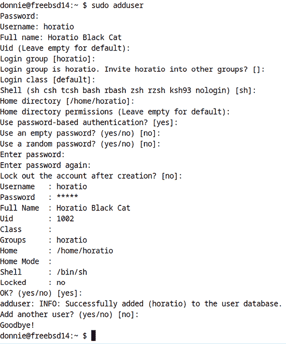
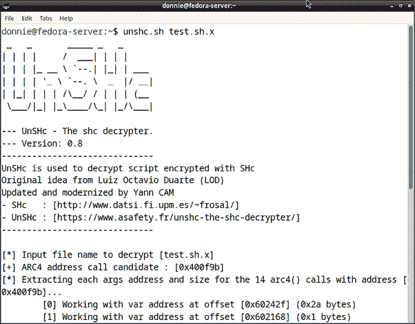

# 第二十章：Shell 脚本安全性

到目前为止，我们还没有讨论很多关于 Shell 脚本安全性的话题。坦白说，这是因为它可能是你从来不需要担心的事情。我的意思是，很多时候你编写的脚本只是供自己使用，你可能只是从自己本地机器的主目录运行它们。即使你是一个需要创建执行某些管理任务的脚本的管理员，你也可能只需要在自己的主目录中运行它们，或者与其他*受信任*的管理员共享他们并从各自的主目录中运行它们。在这些情况下，Shell 脚本安全性不一定是一个大问题。

然而，有时你可能需要与其他用户或管理员共享你的脚本，而你并不完全信任他们。在这种情况下，Shell 脚本安全性是*极其重要*的，并且应该成为你脚本编写的主要关注点。例如，你可能有一些管理脚本，需要将其放入一个只有有限权限的管理员才能访问的目录。在这些情况下，你还需要确保没有人可以修改它，并且只有某些指定的管理员可以执行它。你还需要设计脚本，以防止恶意用户利用它进行命令注入攻击。

本章的主题包括：

+   控制对脚本的访问

+   理解 SUID 和 SGID 的注意事项

+   避免敏感数据泄露

+   理解 `eval` 的命令注入

+   理解路径安全

如果你准备好了，我们就开始吧。

# 技术要求

我将主要使用 Fedora Server 和 Ubuntu Server 虚拟机进行工作。不过，我展示的技巧应该适用于几乎任何 Linux 发行版。我还会在 FreeBSD 14 虚拟机和 OpenIndiana 虚拟机上展示一些内容。

和往常一样，你可以通过以下方式获取脚本：

```
git clone https://github.com/PacktPublishing/The-Ultimate-Linux-Shell-Scripting-Guide.git 
```

# 控制对脚本的访问

你创建的大多数脚本可能仅供自己或同事使用。或者，它们可能是公开分发的。在所有这些情况下，你可能不需要担心对脚本设置任何访问控制。

但是，有时你可能需要创建只能由特定人员访问的脚本。你可以使用的这些方法包括：

+   分配`sudo`权限

+   分配访问控制列表

+   混淆明文脚本

我们将首先使用`sudo`进行查看。

## 分配 sudo 权限

`sudo`是一个便捷的安全功能，默认安装在 macOS、OpenIndiana 和大多数 Linux 发行版中。它也可以安装在大多数 BSD 类型的发行版上，或任何未默认安装它的 Linux 发行版中。使用`sudo`的最常见方式是允许非特权用户以 root 用户权限运行程序。（你也可以使用`sudo`让用户以其他非 root 用户的权限运行程序，比如数据库用户。不过我现在不打算讲这些内容，因为我想保持简单。）

现在，看看是什么让`sudo`如此酷。假设你想让某个特定的用户以 root 用户权限运行一个特定的程序。使用`sudo`，你无需给该用户 root 用户的密码。相反，你只需为该程序配置该用户的`sudo`权限，然后让该用户在运行程序时输入自己的密码。我们来看一下是如何实现的。

### 实践实验 – 配置 sudo

在本实验中，你将创建一个简单的脚本，并配置`sudo`，使得只有指定的用户能够运行它。

1.  创建`sudo_demo1.sh`脚本，如下所示：

    ```
    #!/bin/bash
    echo "This is a demo of sudo privileges." 
    ```

1.  将脚本复制到`/usr/local/sbin/`目录：

    ```
    donnie@ubuntu2404:~$ sudo cp sudo_demo1.sh /usr/local/sbin/
    donnie@ubuntu2404:~$ ls -l /usr/local/sbin/sudo_demo1.sh
    -rw-r--r-- 1 root root 55 Jul  6 19:24 /usr/local/sbin/sudo_demo1.sh
    donnie@ubuntu2404:~$ 
    ```

如你所见，将该脚本复制到`/user/local/sbin/`后，文件的所有权会自动更改为 root 用户。

1.  设置`sudo_demo1.sh`文件的权限，使得只有 root 用户能够访问它：

    ```
    donnie@ubuntu2404:~$ cd /usr/local/sbin/
    donnie@ubuntu2404:/usr/local/sbin$ sudo chmod 700 sudo_demo1.sh
    donnie@ubuntu2404:/usr/local/sbin$ ls -l sudo_demo1.sh
    -rwx------ 1 root root 55 Jul  6 19:24 sudo_demo1.sh
    donnie@ubuntu2404:/usr/local/sbin$ 
    ```

注意，在`chmod 700`命令中，7 为 root 用户分配了读取、写入和执行权限。两个 0 则从*组*和*其他*用户那里移除了所有权限。但，如何在*用户*位置获得 7 的值呢？下面是它的详细解释：

*读取*权限的值为 4。

*写入*权限的值为 2。

*执行*权限的值为 1。

在这种情况下，我们希望用户具有完全的读取、写入和执行权限。将这三种权限的值相加得到的值为 7\。

（我知道这是一个相当简略的解释，但现在请你耐心点。）

1.  为 Horatio 创建一个非特权用户帐户。

在 Debian/Ubuntu 中，执行：

```
sudo adduser horatio 
```

在 Fedora 和其他 Red Hat 类型的发行版中：

```
sudo useradd horatio
sudo passwd horatio 
```

1.  开始配置`sudo`，请输入以下命令：

    ```
    sudo visudo 
    ```

该命令将在`nano`、`vi`或`vim`中打开`/etc/sudoers`文件，具体取决于你所使用的操作系统。除此之外，操作步骤是一样的。

1.  向下滚动，直到看到以下这一行：

    ```
    root    ALL=(ALL:ALL) ALL 
    ```

在那一行的正下方，加入以下这一行：

```
horatio ALL=(ALL:ALL) /usr/local/sbin/sudo_demo1.sh 
```

使用普通文本编辑器保存文件。

我知道`ALL=(ALL:ALL)`这一行看起来很困惑，但实际上它非常简单。下面是它的简要解释：

ON_HOSTS=(AS_USER:AS_GROUP_MEMBER) ALLOWED_COMMANDS

现在，以下是更具体的说明：

第一个`ALL`表示指定用户可以在本地网络上的所有机器上运行此命令。你也可以选择将这个`ALL`替换为特定机器或机器组的主机名，来限制此用户仅能在这些机器上运行该命令。

第二个`ALL`表示指定用户可以作为所有用户运行此命令，包括 root 用户。

第三个`ALL`表示 Horatio 可以作为所有组的成员运行此命令，包括 root 用户的组。（请注意，这是可选的。你也可以省略该组，并将其设置为`ALL=(ALL)`。）

在`root`行中，最后的`ALL`表示 root 用户可以运行所有特权命令。在`horatio`行中，最后的`ALL`被替换为我们希望 Horatio 运行的特定命令。

1.  在主机机器上打开另一个终端窗口，并使用 Horatio 的账户登录到虚拟机。

1.  让 Horatio 通过首先尝试在没有`sudo`的情况下运行脚本，然后再使用`sudo`，像这样测试：

    ```
    horatio@ubuntu2404:~$ sudo_demo1.sh
    -bash: /usr/local/sbin/sudo_demo1.sh: Permission denied
    horatio@ubuntu2404:~$ sudo sudo_demo1.sh
    [sudo] password for horatio:
    This is a demo of sudo privileges.
    horatio@ubuntu2404:~$ 
    ```

你会看到 Horatio 可以使用他的`sudo`权限运行该脚本。

1.  让 Horatio 尝试查看脚本的源代码，像这样：

    ```
    horatio@ubuntu2404:~$ cd /usr/local/sbin
    horatio@ubuntu2404:/usr/local/sbin$ less sudo_demo1.sh
    sudo_demo1.sh: Permission denied
    horatio@ubuntu2404:/usr/local/sbin$ sudo less sudo_demo1.sh
    Sorry, user horatio is not allowed to execute '/usr/bin/less sudo_demo1.sh' as root on ubuntu2404.
    horatio@ubuntu2404:/usr/local/sbin$ 
    ```

Horatio 无法查看或编辑源代码，因为他没有适当的`sudo`权限来执行此操作。他仅拥有作为 root 用户的`sudo`权限，这个权限仅限于执行`sudo_demo1.sh`脚本。

这就是我们介绍`sudo`的内容。接下来，让我们继续介绍另一种控制脚本访问的方法。

## 使用访问控制列表（ACL）

如果你曾是 Windows 管理员，你可能知道 Windows 上的 NTFS 文件系统允许你对文件和目录设置非常细粒度的权限。遗憾的是，Linux、Unix 和类 Unix 系统上的文件系统并没有内建如此细粒度的访问控制。但我们可以通过使用**访问控制列表**（**ACL**）在一定程度上弥补这一缺陷。让我们看看如何在这个实践实验中做到这一点。

### 实践实验——在 Linux 上为 Horatio 设置 ACL

在这个实验中，我们将创建另一个脚本，只有 Horatio 有权限运行。为了简化操作，直接使用你之前用于实验的虚拟机，这样你就无需再创建另一个用户账户。

1.  你会发现你在 Fedora 虚拟机上设置 ACL 所需的一切已经安装好。如果你使用的是 Debian/Ubuntu 类型的机器，你可能需要通过以下方式安装`acl`软件包：

    ```
    sudo apt install acl 
    ```

1.  登录到你自己的普通用户账户，并创建`acl_demo.sh`脚本，像这样：

    ```
    #!/bin/bash
    echo "This is a demo of ACLs." 
    ```

1.  将脚本复制到`/usr/local/sbin/`目录，并注意所有权如何自动更改为 root 用户：

    ```
    donnie@ubuntu2404:~$ vim acl_demo.sh
    donnie@ubuntu2404:~$ sudo cp acl_demo.sh /usr/local/sbin/
    [sudo] password for donnie:
    donnie@ubuntu2404:~$ cd /usr/local/sbin/
    donnie@ubuntu2404:/usr/local/sbin$ ls -l acl_demo.sh
    -rw-r--r-- 1 root root 44 Jul 24 20:56 acl_demo.sh
    donnie@ubuntu2404:/usr/local/sbin$ 
    ```

1.  为了使 ACL 生效，你需要从组和其他用户中移除所有权限，像这样：

    ```
    donnie@ubuntu2404:/usr/local/sbin$ sudo chmod 700 acl_demo.sh
    donnie@ubuntu2404:/usr/local/sbin$ ls -l acl_demo.sh
    -rwx------ 1 root root 44 Jul 24 20:56 acl_demo.sh
    donnie@ubuntu2404:/usr/local/sbin$ 
    ```

这是因为使用 ACL 的关键在于防止那些没有被设置 ACL 的用户访问文件。

1.  使用`getfacl`验证是否设置了 ACL：

    ```
    donnie@ubuntu2404:/usr/local/sbin$ getfacl acl_demo.sh
    # file: acl_demo.sh
    # owner: root
    # group: root
    user::rwx
    group::---
    other::---
    donnie@ubuntu2404:/usr/local/sbin$ 
    ```

1.  在另一个终端窗口中，登录 Horatio 的帐户，并尝试运行`acl_demo.sh`脚本，如下所示：

    ```
    horatio@ubuntu2404:~$ acl_demo.sh
    -bash: /usr/local/sbin/acl_demo.sh: Permission denied
    horatio@ubuntu2404:~$ 
    ```

你看到 Horatio 已被拒绝访问。

1.  回到你自己的终端窗口。创建一个 ACL，使 Horatio 在`acl_demo.sh`脚本上拥有读取和执行权限，如下所示：

    ```
    donnie@ubuntu2404:/usr/local/sbin$ sudo setfacl -m u:horatio:rx acl_demo.sh
    donnie@ubuntu2404:/usr/local/sbin$ ls -l acl_demo.sh
    -rwxr-x---+ 1 root root 44 Jul 24 20:56 acl_demo.sh
    donnie@ubuntu2404:/usr/local/sbin$ 
    ```

以下是命令的详细解释：

+   `-m`：这意味着修改现有的 ACL。如果尚未创建 ACL，它还会创建一个。

+   `u:horatio`：这表示我们正在为用户`horatio`创建一个 ACL。

+   `rx`：这意味着我们为指定用户授予该文件的读取和执行权限。

+   注意文件权限设置末尾的`+`。这表示已经创建了一个 ACL。

1.  使用`getfacl`验证 ACL 是否已正确创建：

    ```
     donnie@ubuntu2404:/usr/local/sbin$ getfacl acl_demo.sh
    # file: acl_demo.sh
    # owner: root
    # group: root
    user::rwx
    user:horatio:r-x
    group::---
    mask::r-x
    other::---
    donnie@ubuntu2404:/usr/local/sbin$ 
    ```

`user:horatio:r-x`行表示已为 Horatio 创建了 ACL。

1.  回到 Horatio 的终端窗口，让他尝试运行脚本：

    ```
    horatio@ubuntu2404:~$ acl_demo.sh
    This is a demo of ACLs.
    horatio@ubuntu2404:~$ 
    ```

这次，Horatio 达到了酷炫的境界。

1.  使用 ACL 而不是`sudo`有一个缺点。即，`sudo`会自动假设用户需要读取一个 Shell 脚本才能执行它。因此，`sudo`允许用户在没有明确设置读取权限的情况下执行脚本。这意味着用户无法使用任何实用工具（如`cat`或`less`）查看脚本文件的内容。而使用 ACL 时，必须显式地为脚本设置读取权限和执行权限，才能让某人执行它。所以，使用 ACL 时，你不能防止用户查看文件内容。你可以通过让 Horatio 查看文件来证明这一点，如下所示：

    ```
    horatio@ubuntu2404:~$ cat /usr/local/sbin/acl_demo.sh
    #!/bin/bash
    echo "This is a demo of ACLs."
    horatio@ubuntu2404:~$ 
    ```

这里的结论是，如果你想防止用户查看脚本内容，可以设置适当的`sudo`权限，而不是使用 ACL。另一方面，如果你不介意用户查看脚本的源代码，那么使用 ACL 肯定是一个可行的选项。

本章篇幅有限，无法详细介绍权限设置、`sudo`和 ACL 的内容。如果你需要更多信息，我在我的《精通 Linux 安全与加固》书中有专门的章节介绍每个主题。

这就是`sudo`和 Linux 上的 ACL 的全部内容。现在让我们看看如何在 FreeBSD 14 上实现。

### 实操实验 – 在 FreeBSD 14 上为 Horatio 设置 ACL

在 FreeBSD 14 上，你会发现所有用于创建 ACL 的工具已经安装好了。我们开始吧。

1.  通过以下操作创建 Horatio 的用户帐户：

    ```
    donnie@freebsd14:~ $ sudo adduser 
    ```

FreeBSD 的`adduser`命令是交互式的，类似于 Debian 和 Ubuntu 上的`adduser`命令。调用它之后，你只需按照提示输入 Horatio 的信息。以下是操作界面的样子：



图 20.1：向 FreeBSD 添加用户帐户

如果你对**全名**字段感到好奇，那只是因为 Horatio 真的是一只最近经常光顾我的黑猫。

1.  使用你在 Linux 实验中使用的相同的`acl_demo.sh`脚本。将它复制到`/usr/local/sbin/`目录，并验证其所有权已更改为 root 用户：

    ```
    donnie@freebsd14:~ $ sudo cp acl_demo.sh /usr/local/sbin/
    Password:
    donnie@freebsd14:~ $ cd /usr/local/sbin/
    donnie@freebsd14:/usr/local/sbin $ ls -l acl_demo.sh
    -rw-r--r--  1 root wheel 44 Jul 29 15:42 acl_demo.sh
    donnie@freebsd14:/usr/local/sbin $ 
    ```

1.  为 `acl_demo.sh` 应用 700 权限设置。这将意味着 root 用户将具有读、写和执行权限，而 *组* 和 *其他用户* 没有权限。

    ```
    donnie@freebsd14:/usr/local/sbin $ sudo chmod 700 acl_demo.sh
    donnie@freebsd14:/usr/local/sbin $ ls -l acl_demo.sh
    -rwx------  1 root wheel 44 Jul 29 15:42 acl_demo.sh
    donnie@freebsd14:/usr/local/sbin $ 
    ```

1.  在另一个终端窗口中，登录到 FreeBSD 机器上 Horatio 的用户账户。然后，让他尝试运行 `acl_demo.sh` 脚本。

    ```
    horatio@freebsd14:~ $ acl_demo.sh
    -sh: acl_demo.sh: Permission denied
    horatio@freebsd14:~ $ sudo acl_demo.sh
    Password:
    horatio is not in the sudoers file.
    This incident has been reported to the administrator.
    horatio@freebsd14:~ $ 
    ```

1.  返回到你自己的终端窗口，并像这样为 Horatio 设置 ACL：

    ```
    donnie@freebsd14:/usr/local/sbin $ sudo setfacl -m u:horatio:rx:allow acl_demo.sh
    Password:
    donnie@freebsd14:/usr/local/sbin $ 
    ```

    请注意，这次命令略有不同，因为 Linux 使用 **网络文件系统版本 4** (**NFSv4**) 样式的 ACL，而 FreeBSD 使用 POSIX 样式的 ACL。不过，这并不是一个大差异。只是 FreeBSD 需要在 `setfacl` 命令中添加 `allow`。

1.  验证 ACL 是否已正确设置：

    ```
    donnie@freebsd14:/usr/local/sbin $ getfacl acl_demo.sh
    # file: acl_demo.sh
    # owner: root
    # group: wheel
          user:horatio:r-x-----------:-------:allow
                owner@:rwxp--aARWcCos:-------:allow
                group@:------a-R-c--s:-------:allow
             everyone@:------a-R-c--s:-------:allow
    donnie@freebsd14:/usr/local/sbin $ 
    ```

你可以看到，Horatio 确实对这个脚本拥有读和执行权限。

1.  返回到 Horatio 的终端，让他尝试运行 `acl_demo.sh` 命令：

    ```
    horatio@freebsd14:~ $ acl_demo.sh
    This is a demo of ACLs.
    horatio@freebsd14:~ $ 
    ```

它有效，这意味着 Horatio 现在在 FreeBSD 上实现了酷炫。

接下来，让我们在 OpenIndiana 上试试看。

### 实验操作 – 在 OpenIndiana 上为 Horatio 设置 ACL

在 OpenIndiana 上执行此操作会大不相同，因为它不使用 `setfacl` 或 `getfacl` 来管理 ACL。相反，它使用 `chmod` 来管理正常的权限设置和 ACL。你将再次使用你在之前实验中使用的相同的 `acl_demo.sh` 脚本。

1.  创建 Horatio 的用户账户，如下所示：

    ```
    donnie@openindiana:~$ sudo useradd -m horatio
    donnie@openindiana:~$ sudo passwd horatio
    donnie@openindiana:~$ 
    ```

`-m` 选项告诉 `useradd` 创建新用户的主目录。在 OpenIndiana 版本的 `useradd` 中，通常这是你唯一需要的选项开关。

1.  OpenIndiana 上没有 `/usr/local/` 目录，因此只需将 `acl_demo.sh` 脚本复制到 `/usr/sbin/` 目录。然后，验证所有权已更改为 root 用户。

    ```
    donnie@openindiana:~$ sudo cp acl_demo.sh /usr/sbin/
    donnie@openindiana:~$ cd /usr/sbin/
    donnie@openindiana:/usr/sbin$ ls -l acl_demo.sh
    -rw-r--r--   1 root     root          44 Jul 29 16:14 acl_demo.sh
    donnie@openindiana:/usr/sbin$ 
    ```

1.  将 `acl_demo.sh` 文件的权限设置更改为 700，如你在之前的实验中所做的：

    ```
    donnie@openindiana:/usr/sbin$ sudo chmod 700 acl_demo.sh
    donnie@openindiana:/usr/sbin$ ls -l acl_demo.sh
    -rwx------   1 root     root          44 Jul 29 16:14 acl_demo.sh
    donnie@openindiana:/usr/sbin$ 
    ```

1.  在另一个终端窗口中，登录到 Horatio 的账户。让他尝试运行 `acl_demo.sh` 脚本：

    ```
    horatio@openindiana:~$ acl_demo.sh
    -bash: /usr/sbin/acl_demo.sh: Permission denied
    horatio@openindiana:~$ sudo acl_demo.sh
    Password:
    horatio is not in the sudoers file.
    This incident has been reported to the administrator.
    horatio@openindiana:~$ 
    ```

1.  现在，为 Horatio 应用一个 ACL，授予他对 `acl_demo.sh` 脚本的读和执行权限：

    ```
    donnie@openindiana:/usr/sbin$ sudo chmod A+user:horatio:rx:allow acl_demo.sh
    Password:
    donnie@openindiana:/usr/sbin$ 
    ```

请注意，不同于使用 `setfacl -m u:horatio`，OpenIndiana 使用 `chmod A+user:horatio`。这里的 `A+` 仅表示我们正在添加一个 ACL。

1.  返回到 Horatio 的终端，让他尝试运行脚本：

    ```
    horatio@openindiana:~$ acl_demo.sh
    This is a demo of ACLs.
    horatio@openindiana:~$ 
    ```

是的，确实如此。即使在 OpenIndiana 上，Horatio 也实现了酷炫。

如果你需要了解 OpenIndiana 的管理，你会发现 OpenIndiana 网站上的官方文档相当缺乏。幸运的是，OpenIndiana 是 Oracle 的 Solaris 操作系统的一个分支，这意味着你可以使用官方的 Solaris 文档。 (我已经在 *进一步阅读* 部分提供了相关页面的链接。)

我认为这大致涵盖了 ACLs。让我们继续探讨另一种控制对脚本访问权限的方法。

## 混淆明文脚本

您还可以使用`shc`实用程序隐藏 shell 脚本的内容，防止任何人篡改它们，将您的脚本转换为混淆的可执行二进制文件。而且，您可以通过`shc`做一些使用`sudo`或 ACLs 无法做到的事情。具体来说，`shc`允许您：

+   创建一个只能在一台机器上运行的可执行文件。

+   为可执行文件设置过期日期。

+   创建无法使用诸如`strace`或`truss`等调试工具追踪的可执行文件。（稍后我会解释这些工具。）

让我们开始安装`shc`。

### 安装 shc

在 Linux、FreeBSD 和 macOS 上安装很简单。操作如下：

在 Fedora 上：

```
sudo dnf install shc gcc 
```

在 Debian/Ubuntu 上：

```
sudo apt install shc gcc 
```

注意，在 Linux 上，您还需要安装`gcc`包，以便具有可以与`shc`一起工作的 C 编译器。在 FreeBSD 上，C 编译器作为操作系统的一部分安装。

在 FreeBSD 上：

```
sudo pkg install shc 
```

在安装了 Homebrew 的 macOS 上：

```
brew install shc 
```

遗憾的是，`shc`在 OpenIndiana 上不可用。

### 实验室实践 – 使用 shc

在此实验中，您将在您的 Fedora 虚拟机上创建`supersecret.sh`脚本。另外，请启动您的 Debian/Ubuntu 虚拟机，以便可以在其上测试编译后的脚本。

1.  使用`shc`很简单。为了演示，让我们创建`supersecret.sh`脚本，就像这样：

    ```
    #!/bin/bash
    cat << secret
    This document contains secrets that could impact the entire world!
    Please don't let it fall into the wrong hands.
    secret 
    ```

这只是一个简单的*here document*，打印出一个消息，看起来像这样：

```
donnie@fedora:~$ ./supersecret.sh
This document contains secrets that could impact the entire world!
Please don't let it fall into the wrong hands.
donnie@fedora:~$ 
```

1.  下一个步骤是将 shell 脚本转换为混淆的二进制文件，如下所示：

    ```
    donnie@fedora:~$ shc -f supersecret.sh -o supersecret
    donnie@fedora:~$ 
    ```

正如您所见，我使用`-f`选项指向我要混淆的 shell 脚本，并使用`-o`选项将混淆后的二进制文件保存为指定的文件名。此操作还会创建一个 C 语言源文件，如您所见：

```
donnie@fedora:~$ ls -l supersecret*
-rwxrwxr-x. 1 donnie donnie 15984 Jul  1 16:55 supersecret
-rwxr--r--. 1 donnie donnie   149 Jul  1 16:47 supersecret.sh
-rw-r--r--. 1 donnie donnie 18485 Jul  1 16:55 supersecret.sh.x.c
donnie@fedora:~$ 
```

`shc`的工作方式首先是创建这个 C 源代码文件，然后调用 C 编译器将 C 源代码编译成二进制文件。您可以尝试使用`cat`打开二进制文件来证明这一点，如下所示：

```
donnie@fedora:~$ cat supersecret
@@@@@@@@@@

@@a
   a
      @ @dd-=@=@>>@88@8@@xx@x@DDStd88@8@@Ptd` ` @` @llQtdRtd-=@/lib64/ld-linux-x86-64.so.20GNUGNUu@W{gGNU0@ĉkĹ@9J<5Q.u n`XC{!D!DDg Dmallocgetpidstat__libc_start_mainfprintfputenvmemsetstrlenstrdupgetenvmemcmpsprintfexecvpstderrmemcpyato llstrerror__errno_locationexit__isoc99_sscanffwritecalloctime__environlibc.so.6GLIBC_2.7GLIBC_2.14GLIBC_2.33GLIBC_2.34GLIBuiart__ii?@?@
. . .
donnie@fedora:~$ 
```

如果您能读懂这些内容，那么您比我更强。

1.  尝试运行这个新的`supersecret`二进制文件，您会发现它的工作方式与脚本一样：

    ```
    donnie@fedora:~$ ./supersecret
    This document contains secrets that could impact the entire world!
    Please don't let it fall into the wrong hands.
    donnie@fedora:~$ 
    ```

好吧，让我们真实一点。您不会对一个只打印消息的简单脚本进行混淆。我的意思是，任何能执行这个二进制文件的人仍然可以看到消息。因此，让我们只是说您的脚本包含了很多额外的代码或数据，您希望将其隐藏，甚至包括脚本的授权用户在内。在这种情况下，`shc`绝对是一个有用的工具。

1.  默认情况下，`shc`创建的二进制文件只能在创建它们的机器上运行。例如，让我们看看我将在这台 Fedora 机器上创建的`supersecret`二进制文件转移到 Ubuntu 机器上会发生什么：

    ```
    donnie@ubuntu2404:~$ ./supersecret
    ./supersecret: 3(i'(qX5@ӣZBhas expired!
    Please contact your provider jahidulhamid@yahoo.com
    donnie@ubuntu2404:~$ 
    ```

这绝对是一个方便的安全特性，因为它允许你控制程序可以运行的地方。所以，如果恶意黑客不小心找到并下载了你的程序，他们将无法运行它。唯一的缺点是，我们会看到 `shc` 内置的默认消息 `Please contact your provider. . .`。

1.  默认的 `Please contact your provider. . .` 消息对我们来说没有意义，因为它提供了一个虚假的联系地址。在 Fedora 机器上，通过添加 `-m` 选项和自定义消息来解决这个问题，像这样：

    ```
    donnie@fedora:~$ shc -f supersecret.sh -m "You cannot run this program on this machine." -o supersecret
    donnie@fedora:~$ 
    ```

1.  将新的 `supersecret` 二进制文件传输到 Debian/Ubuntu 机器上，然后尝试运行它。你现在应该能看到你自定义的消息，像这样：

    ```
    donnie@ubuntu2404:~$ ./supersecret
    ./supersecret: ]b+    !(TR0#50fo_7has expired!
    You cannot run this program on this machine.
    donnie@ubuntu2404:~$ 
    ```

当然，如果你真的想要的话，你也可以添加你自己的联系地址。

1.  不过，有时你可能希望创建能够在任何与创建它们的机器相同操作系统上运行的二进制文件。为了做到这一点，只需使用 `-r` 选项稍微放宽一些安全性，像这样：

    ```
    donnie@fedora:~$ shc -rf supersecret.sh -o supersecret
    donnie@fedora:~$ 
    ```

当我将这个新的二进制文件传输到我的 Ubuntu 机器上时，它将正常运行，正如你在这里看到的：

```
donnie@ubuntu2404:~$ ./supersecret
This document contains secrets that could impact the entire world!
Please don't let it fall into the wrong hands.
donnie@ubuntu2404:~$ 
```

1.  另外，理解 `shc` 会创建只能在某种操作系统上运行的二进制文件。为了查看其工作原理，让我们将我在 Fedora 机器上创建的二进制文件传输到 FreeBSD 机器上。下面是当我尝试运行它时发生的情况：

    ```
    donnie@freebsd14:~ $ ./supersecret
    ELF binary type "0" not known.
    -sh: ./supersecret: Exec format error
    donnie@freebsd14:~ $ 
    ```

但是，如果你将原始脚本传输到 FreeBSD 机器上，然后在其上运行 `shc`，你会得到一个能在 FreeBSD 上运行的二进制文件。

好消息是，`shc` 在 FreeBSD 上的工作方式与在 Linux 上完全相同。所以，你甚至不需要修改你的 `shc` 命令。

1.  接下来的 `shc` 选项是 `-e` 选项，它允许你为程序设置过期日期。只需按日-月-年（dd/mm/yyyy）格式指定过期日期，像这样：

    ```
    donnie@fedora:~$ shc -e 02/07/2024 -rf supersecret.sh -m "This binary file has expired. Contact me at donnie@any.net if you really need to run it." -o supersecret
    donnie@fedora:~$ 
    ```

我现在是在 2024 年 7 月 1 日做这个，所以我得等到明天才能看到这个是否真的有效。那么现在先说再见，明天见。

1.  好的，现在是 2024 年 7 月 2 日，我回来了。让我们看看这个 `supersecret` 二进制文件是否还有效：

    ```
    donnie@fedora:~$ ./supersecret
    ./supersecret: has expired!
    This binary file has expired. Contact me at donnie@any.net if you really need to run it.
    donnie@fedora:~$ 
    ```

很棒，过期日期选项工作得非常好。

**记住**：即使你通过 `shc` 混淆了脚本，仍然需要使用 `sudo` 或 ACL 来控制谁可以在特定机器上执行它们。

现在，让我们来看看如何让我们的可执行文件无法被追踪。

### 实验室练习 – 创建无法追踪的可执行文件

正如你将在下一章看到的，我们有多种跟踪工具可以帮助程序员调试程序。这些工具包括适用于 Linux 系统的 `strace`，适用于 FreeBSD 的 `truss`，以及适用于 macOS 的 `dtrace` 或 `dtruss`。对于 Linux，还有 `ltrace`，它可以跟踪对编程库的调用。

`strace`、`dtrace`、`truss` 和 `dtruss` 工具可以追踪程序所执行的 **系统调用**。解释系统调用最简单的方式是，它们是程序用来与操作系统内核进行通信的机制。

对我们来说的问题是，恶意或非恶意的未授权人员也可以利用这些工具提供的信息来反向工程你编译的脚本。这可能让这些未授权方看到你不希望他们看到的秘密。

我们不希望未授权的人看到哪些信息？以下是两个例子：

**你的程序访问的敏感文件的名称和位置**：这些文件可能会泄露给未授权的人员重要信息。

**嵌入的密码**：即使你加密了密码，使用`strace`、`truss`、`dtrace`或`dtruss`在你编译的二进制文件上，也能泄露明文密码。（你很快会在*避免敏感数据泄漏*部分看到这一点。）

不用说，这两种情况都可能代表一个严重的安全问题。所以，为了确保安全，养成将你的`shc`二进制文件设为不可追踪的习惯，就像我接下来要展示的那样。

这是它的工作原理：

1.  在 Fedora 机器上，安装`strace`和`ltrace`，像这样：

    ```
    donnie@fedora:~$ sudo dnf install strace ltrace 
    ```

1.  在 Fedora 机器上，创建一个新的`supersecret`二进制文件，去除过期日期和自定义消息。

    ```
    donnie@fedora:~$ shc -f supersecret.sh -o supersecret
    donnie@fedora:~$ 
    ```

1.  创建一个包含`strace`数据的文件，关于`supersecret`二进制文件，像这样：

    ```
    donnie@fedora:~$ strace ./supersecret 2> supersecret1_trace.txt
    This document contains secrets that could impact the entire world!
    Please don't let it fall into the wrong hands.
    donnie@fedora:~$ 
    ```

请注意，`strace`的输出被发送到`stderr`，这就是为什么你需要使用`2>`重定向符号。

1.  使用`less`打开`supersecret1_trace.txt`文件。你会看到一堆乱七八糟的内容，看起来像这样：

    ```
    execve("./supersecret", ["./supersecret"], 0x7ffd6152bd00 /* 58 vars */) = 0
    brk(NULL)                               = 0x14345000
    arch_prctl(0x3001 /* ARCH_??? */, 0x7ffe27faa7c0) = -1 EINVAL (Invalid argument)
    access("/etc/ld.so.preload", R_OK)      = -1 ENOENT (No such file or directory)
    openat(AT_FDCWD, "/etc/ld.so.cache", O_RDONLY|O_CLOEXEC) = 3
    . . .
    . . . 
    ```

大部分情况下，你需要是 C 语言内核程序员，才能理解发生了什么。但是，正如我们即将看到的，如果你知道如何查找这些信息，你可能会发现一些非常重要的内容。

1.  计算`supersecret1_trace.txt`文件中的行数，像这样：

    ```
    donnie@fedora:~$ wc -l supersecret1_trace.txt
    297 supersecret1_trace.txt
    donnie@fedora:~$ 
    ```

所以，`supersecret1_trace.txt`文件中有 297 行输出。

请注意，对于所有这些例子，你在自己的机器上可能会得到不同数量的输出行。

1.  对`supersecret`二进制文件执行`ltrace`操作，并将输出保存到`supersecret1_ltrace.txt`文件中。然后，像这样计算`supersecret1_ltrace.txt`文件中的行数：

    ```
    donnie@fedora:~$ ltrace ./supersecret 2> supersecret1_ltrace.txt
    This document contains secrets that could impact the entire world!
    Please don't let it fall into the wrong hands.
    donnie@fedora:~$ wc -l supersecret1_ltrace.txt
    7270 supersecret1_ltrace.txt
    donnie@fedora:~$ 
    ```

你会看到`supersecret1_ltrace`文件中有 7270 行。

1.  创建一个新的`supersecret`二进制文件。不过这次，使用`-U`选项将该二进制文件设置为不可追踪。

    ```
    donnie@fedora:~$ shc -Uf supersecret.sh -o supersecret
    donnie@fedora:~$ 
    ```

在执行此操作之前，你不必删除原始二进制文件，因为此新命令会覆盖原始的二进制文件。

1.  再次在`supersecret`二进制文件上运行`strace`，将输出保存到`supersecret2_tract.txt`文件中。

    ```
    donnie@fedora:~$ strace ./supersecret 2> supersecret2_trace.txt
    Killed
    donnie@fedora:~$ 
    ```

这一次，`strace`被阻止执行其功能。

1.  即使使用了`-U`选项，你仍然会看到一些输出发送到输出文件。不过，这些输出会比没有使用`-U`时少得多。通过计算`supersecret2_trace.txt`文件中的行数来验证这一点。

    ```
    donnie@fedora:~$ wc -l supersecret2_trace.txt
    34 supersecret2_trace.txt
    donnie@fedora:~$ 
    ```

这次，输出只有 34 行，比我们在没有 `-U` 开关时的 297 行要少得多。所以，这进一步证明了 `-U` 选项可以防止 `strace` 操作成功。

1.  现在，对 `supersecret` 二进制文件进行 `ltrace`，并将输出保存到 `supersecret2_ltrace.txt` 文件中：

    ```
    donnie@fedora:~$ ltrace ./supersecret 2> supersecret2_ltrace.txt
    donnie@fedora:~$ 
    ```

1.  统计 `supersecret2_ltrace.txt` 文件中的行数：

    ```
    donnie@fedora:~$ wc -l supersecret2_ltrace.txt
    4 supersecret2_ltrace.txt
    donnie@fedora:~$ 
    ```

哇！这次输出文件只有四行。这与我们在没有 `-U` 选项时的 7270 行相差甚远。

在 FreeBSD 上，创建混淆二进制文件的 `shc` 命令和你在 Linux 上看到的一样。但是，要对 FreeBSD 二进制文件进行系统调用追踪，使用 `truss` 而不是 `strace`，像这样：

```
donnie@freebsd14:~ $ truss ./supersecret 2> supersecret1.truss.txt 
```

就我所知，FreeBSD 上并没有与 Linux `ltrace` 命令等效的命令。

在 macOS 上，你可以使用 `dtrace` 和 `dtruss` 命令。但是，要使用它们，你必须将机器启动到**恢复**模式并禁用**系统完整性保护**（**SIP**）。除非你绝对、一定需要这么做，否则我不建议这样操作。

你还会发现 `dtrace` 在 OpenIndiana 上是可用的。但是，由于 OpenIndiana 上没有 `shc`，我就不再讨论它了。

接下来，让我们看看能不能解密这个脚本。

### 解密 shc 二进制文件

很多年前，当我在第一次教授 shell 脚本课程时，我向学生们展示了 `shc`，那时要破解 `shc` 算法并将二进制文件转换回原始 shell 脚本是相对容易的。所以当时，`shc` 不是一个非常安全的选项。现在，由于 `shc` 开发者利用了现代操作系统内核的改进，破解 `shc` 要困难得多了。但是，还是有一些工具*应该*能破解 `shc`，或者至少它们的开发者是这么说的。

这可能有些剧透，但我还是决定分享。

正如你很快会看到的，`shc` 创建的二进制文件目前对这种类型的破解攻击是安全的。不过，总有可能有人会在未来开发出更强的破解工具。所以，把这一部分看作是一个框架，用来对未来可能出现的破解工具进行测试。

让我们快速了解一下这些工具，好吗？

#### 实验室实操：测试 UnSHc

这个实验室将帮助你熟悉 UnSHc 工具。我正在使用 Fedora Server 虚拟机，但你也可以使用其他 Linux 虚拟机或 FreeBSD 虚拟机，随你选择。

1.  通过以下命令从 Github 下载 UnSHc：

    ```
    donnie@fedora-server:~$ git clone https://github.com/yanncam/UnSHc.git 
    ```

1.  下载完成后，只需要几秒钟，`cd` 进入 `UnSHc/latest/` 目录，然后将 `unshc.sh` 脚本复制到 `/usr/local/bin/` 目录：

    ```
    donnie@fedora-server:~$ cd UnSHc/latest/
    donnie@fedora-server:~/UnSHc/latest$ ls
    unshc.sh
    donnie@fedora-server:~/UnSHc/latest$ sudo cp unshc.sh /usr/local/bin/
    donnie@fedora-server:~/UnSHc/latest$ 
    ```

1.  在 `UnSHc/sample/` 目录中，你会看到一个示例的 shell 脚本，并且有相应的 C 源代码文件和编译后的二进制文件。

请注意，这个 C 源代码文件和二进制文件是由非常旧版本的 `shc` 生成的。（我提到这一点的原因马上就会明了。）

将二进制文件 `test.sh.x` 复制到你的主目录：

```
donnie@fedora-server:~/UnSHc/sample$ ls
test.sh  test.sh.x  test.sh.x.c
donnie@fedora-server:~/UnSHc/sample$ cp test.sh.x ~
donnie@fedora-server:~/UnSHc/sample$ cd
donnie@fedora-server:~$ 
```

1.  尝试解密 `test.sh.x` 文件，如下所示：

    ```
    donnie@fedora-server:~$ unshc.sh test.sh.x 
    ```

输出应该类似于这样：



图 20.2：使用 UnSHc

1.  验证 `test.sh.x` 二进制文件是否已成功解密，如下所示：

    ```
    donnie@fedora-server:~$ ls -l test*
    -rw-r--r--. 1 donnie donnie   193 Jul  5 14:04 test.sh
    -rw-r--r--. 1 donnie donnie 11440 Jul  5 14:01 test.sh.x
    donnie@fedora-server:~$ cat test.sh
    #!/bin/bash
    # This script is very critical !
    echo "I'm a super critical and private script !"
    PASSWORDROOT="SuPeRrOoTpAsSwOrD"';
    myService --user=root --password=$PASSWORDROOT > /dev/null 2>&1
    donnie@fedora-server:~$ 
    ```

好的，这样就能正常工作了。

1.  接下来，尝试解密一个你用当前版本的 `shc` 创建的二进制文件。（你可以使用在 *使用 shc* 实验中创建的二进制文件，或者你也可以创建一个新的。）如下所示：

    ```
    donnie@fedora-server:~$ unshc.sh supersecret
    . . .
    . . .
    UnSHc is used to decrypt script encrypted with SHc
    Original idea from Luiz Octavio Duarte (LOD)
    Updated and modernized by Yann CAM
    - SHc   : [http://www.datsi.fi.upm.es/~frosal/]
    - UnSHc : [https://www.asafety.fr/unshc-the-shc-decrypter/]
    ------------------------------
    [*] Input file name to decrypt [supersecret]
    [-] Unable to define arc4() call address...
    donnie@fedora-server:~$ 
    ```

正如你看到的，这次操作失败了。所以，二进制文件没有被解密，原始的 shell 脚本也没有被重建。

1.  为了查看为什么这次操作失败，进入 `UnSHc/` 目录并打开 `README.md` 文件。在文件的顶部附近，你会看到这一段：

**由于自 `shc` 4.0.3 以来出现了许多问题，似乎需要进行澄清。在 `shc` 4.0.3 中，已经加入了许多结构性更改，使得 `shc` 现在利用了 Linux 内核本身提供的各种安全机制。因此，如果使用的是新版本的 `shc`，当前的 UnSHc 版本几乎不可能提取出原始的 shell 脚本。这需要一种更深入的方法，这意味着需要修改版的 `bash` 或修改过的 Linux 内核才能绕过这些安全措施。**

所以你可以看到，当前版本的 `shc` 比旧版本要安全得多。

我还在一台 FreeBSD 机器上测试了 UnSHc，结果一样。这告诉我，阻止你成功使用 UnSHc 的安全增强功能也在当前的 FreeBSD 内核中。

此外，我还测试了另一个名为 `deshc-deb` 的 `shc` 破解工具。如果你想试试，可以通过以下方式下载：

```
git clone https://github.com/Rem01Gaming/deshc-deb.git 
```

（剧透警告：`deshc-deb` 也不起作用。）

好吧，我知道，这个展示过程中做了很多工作来告诉你某些东西不起作用。但是，我觉得你可能想亲自看看，而不是仅仅接受我的说法。说真的，结论是，`shc` 是一种非常好的、安全的方式来混淆你的脚本，如果你真的需要这么做的话。而且，由于 Linux 和 FreeBSD 内核的改进，目前的解密工具已经不再有效。不过，你仍然需要采取预防措施，以避免敏感数据泄露，稍后你会在*避免敏感数据泄露*部分看到相关内容。接下来，让我们看一下可能会让你陷入困境的一对权限设置。

# 理解 SUID 和 SGID 的考虑因素

**SUID**和**SGID**，分别代表**设置用户身份**和**设置组身份**，是你可以为可执行文件设置的权限。这两种权限设置不仅非常实用，而且对于处理 Linux、Unix 及类 Unix 操作系统某些功能的特定可执行文件来说，是必需的。然而，如果你为自己创建的程序设置了 SUID 或 SGID，可能会给你的系统带来各种安全问题。在我解释为什么会这样之前，我需要解释一下 SUID 和 SGID 实际是如何工作的，以及为什么它们是必要的。

首先，我们进入`/bin/`目录，查看`rm`可执行文件的权限设置，如下所示：

```
donnie@fedora:/bin$ ls -l rm
-rwxr-xr-x. 1 root root 61976 Jan 17 19:00 rm
donnie@fedora:/bin$ 
```

下面是你所看到的内容的详细解释：

+   输出中的`root root`部分表示该文件属于根用户，并且与根用户的组相关联。

+   权限设置位于行的开头，分为三个部分。`rwx`设置适用于文件的*用户*，在这种情况下是根用户。（在 Linux/Unix 世界中，我们将文件的*所有者*称为文件的*用户*。）这里的`rwx`表示根用户对该文件具有读取、写入和执行权限。

+   下一组设置是`r-x`，适用于*组*，在这种情况下是根组。这意味着该组的成员，在这个例子中仅限于根用户，具有对该文件的读取和执行权限。

+   最后，我们有第三组设置，仍然是`r-x`。这组设置适用于*其他人*。这意味着不是根用户或根组成员的任何人都可以调用`rm`命令，即使`rm`可执行文件属于根用户。需要注意的是，普通的、没有特权的用户只能使用`rm`删除具有允许普通用户执行删除操作的权限设置的文件和目录。（通常，这意味着普通用户只能删除他或她自己的文件和目录。）删除任何其他文件和目录需要根权限。

有时，普通用户没有根用户或`sudo`权限，但需要做一些需要根权限的事情。最常见的任务是当普通用户需要更改自己的密码时。更改密码需要修改 Linux 和 OpenIndiana 系统上的`/etc/shadow`文件，以及 FreeBSD 和大多数其他 BSD 类型系统上的`/etc/master.passwd`文件。但是，看看我在 Fedora 工作站上`shadow`文件的权限设置：

```
donnie@fedora:/etc$ ls -l shadow
----------. 1 root root 1072 May 10 17:33 shadow
donnie@fedora:/etc$ 
```

好吧，这看起来很奇怪，因为这个文件对任何人都没有任何权限。实际上，root 用户确实具有对该文件的读写权限。只是像 Fedora 这样的 Red Hat 类型操作系统，使用另一种机制将这些权限授予 root 用户。（我不想深入探讨这个机制是什么，因为它超出了我们当前话题的范围。）

更典型的是你在这台 Debian 机器上看到的情况：

```
donnie@debian12:/etc$ ls -l shadow
-rw-r-----. 1 root shadow 1178 Mar 23 13:13 shadow
donnie@debian12:/etc$ 
```

在这里，我们看到只有 root 用户具有读写权限，而 shadow 组仅具有读权限。无论如何，普通用户如果需要更改自己的密码，必须修改这个文件，而不需要调用 root 或`sudo`权限。怎么实现这一点呢？当然是通过 SUID。

将 SUID 权限添加到可执行文件上，允许任何普通用户以该文件所有者的权限执行该文件。例如，查看`passwd`可执行文件的权限设置：

```
donnie@fedora:/bin$ ls -l passwd
-rwsr-xr-x. 1 root root 32416 Jul 19  2023 passwd
donnie@fedora:/bin$ 
```

这次，我们看到`rws`作为*用户*的权限设置，在这种情况下，用户是 root 用户。小写字母`s`表示已为 root 用户设置了可执行权限，并且 SUID 权限也已设置。在第三组权限中，你会看到`r-x`，这意味着普通的无权限用户也可以运行此程序。SUID 权限正是允许普通用户更改自己的密码，这需要修改`/etc/shadow`文件或`/etc/master.passwd`文件。所以现在，让我们看看没有 root 或`sudo`权限的 Frank 能否成功：

```
frank@debian12:~$ passwd
Changing password for frank.
Current password:
New password:
Retype new password:
passwd: password updated successfully
frank@debian12:~$ 
```

的确如此，这要归功于`passwd`可执行文件上的 SUID 设置。

我需要指出的是，`passwd`可执行文件上的 SUID 设置仅在用户设置自己的密码时有效。如果用户想要设置其他人的密码，仍然需要拥有适当的`sudo`权限。（至于操作系统开发人员是如何使 SUID 像这样有选择地工作，我也不清楚。）

可执行文件上的 SGID 设置以相同的方式工作，只不过是针对组。例如，查看`write`可执行文件的设置：

```
donnie@fedora:/bin$ ls -l write
-rwxr-sr-x. 1 root tty 24288 Apr  7 20:00 write
donnie@fedora:/bin$ 
```

在这种情况下，你会看到*组*权限中的`s`设置，这意味着任何执行此程序的用户都拥有与关联组相同的权限。在这种情况下，我们讨论的是 tty 组，它是一个系统组，允许其成员将输出发送到终端。这里的 SGID 权限允许普通用户使用`write`将消息发送给登录到另一个终端的用户，像这样：

```
donnie@fedora-server:~$ write frank
The server is shutting down in five minutes.
donnie@fedora-server:~$ 
```

输入`write frank`命令后，我按下了**Enter**。然后我输入了消息，并按下*Ctrl*-*d*实际发送消息。由于`write`上的 SGID 设置，我能够让这条消息显示在 Frank 的终端上，正如你在这里看到的：

```
frank@fedora-server:~$
Message from donnie@fedora-server on pts/1 at 17:01 ...
The server is shutting down in five minutes.
EOF 
```

那么，所有这些与 shell 脚本有什么关系呢？嗯，问题在于，尽管 SUID 和 SGID 在操作系统的某些可执行文件上是强制要求的，但如果你在自己创建的可执行文件上设置它们，它们可能会成为安全隐患。这样做，你可能会无意中让普通用户做他们本不应该做的事情，也可能让入侵者调用恶意代码，影响整个系统。

所以，一般规则是，绝对不要在你自己创建的程序上设置 SUID 或 SGID，除非你真的知道自己在做什么，并且能够避免安全问题。

顺便说一下，下面是如何设置文件的 SUID 权限：

```
donnie@fedora-server:~$ ls -l newscript.sh 
-rwxr--r--. 1 donnie donnie 0 Jun 25 17:13 newscript.shdonnie@fedora-server:~$ chmod u+s newscript.sh 
donnie@fedora-server:~$ ls -l newscript.sh 
-rwsr--r--. 1 donnie donnie 0 Jun 25 17:13 newscript.sh
donnie@fedora-server:~$ 
```

设置 SGID 看起来是这样的：

```
donnie@fedora-server:~$ ls -l newscript2.sh 
-rw-r--r--. 1 donnie donnie 0 Jun 25 17:15 newscript2.sh
donnie@fedora-server:~$ chmod g+s newscript2.sh 
donnie@fedora-server:~$ ls -l newscript2.sh 
-rw-r-Sr--. 1 donnie donnie 0 Jun 25 17:15 newscript2.sh
donnie@fedora-server:~$ 
```

但是，对于 shell 脚本编写者来说，有个好消息。也就是说，如果你在 shell 脚本上设置了 SUID 或 SGID，它们将完全没有任何效果。这是因为 Linux、Unix 和类 Unix 操作系统的内核包含代码，使得操作系统忽略包含 shebang 行的任何可执行脚本文件上的 SUID 和 SGID 设置。因此，与其他 shell 脚本教程中可能看到的内容相反，在你的脚本上设置这两种危险权限不是问题，因为它们将完全没有任何效果。然而，它们*可能*对你使用 `shc` 创建的任何二进制文件产生影响，所以要注意。

不幸的是，我还没有能够广泛测试 SUID 和 SGID 权限对你使用 `shc` 创建的二进制文件的影响。所以，只要知道你不想在这些二进制文件上看到这两种权限设置。

我还应该提到，可以使用 `nosuid` 选项挂载文件系统分区，这样会导致该分区内的任何文件上的 SUID 和 SGID 权限完全被忽略。事实上，许多现代 Linux 和 Unix 发行版已经默认使用 `nosuid` 选项挂载某些重要的分区，比如 `/tmp/` 文件系统。不幸的是，如何在你自己的分区上设置这个选项超出了本书的范围。实际上，我真的无法提供，因为不同的 Linux 和 Unix 发行版以及它们使用的不同文件系统格式都有不同的设置方式。如果你需要知道如何设置 `nosuid` 选项，最好的办法是查阅你特定发行版的文档。

好的，让我们谈谈数据泄露。

# 避免敏感数据泄露

作为系统管理员，你很可能最终需要处理某些敏感数据，如密码、财务信息或客户信息。你总是需要确保你的脚本不会无意中导致敏感数据泄露给未经授权的人。让我们看看可能发生这种情况的几种方式，以及如何防止它。

## 确保临时文件安全

到某个时候，你可能需要创建存储某种临时数据的脚本。你可能需要这样做的原因包括：

+   处理大量数据而不使用过多的系统内存。

+   存储某种复杂操作的中间结果。

+   存储用于记录调试信息的临时数据。

+   允许不同的进程或脚本相互通信。

由于 `/tmp/` 目录是存储临时文件的最常见地方，让我们从解释它开始这个话题。

### 理解 `/tmp/` 目录

正如我刚才所说，存储临时文件最常见的地方就是 `/tmp/` 目录。这个目录的优点是它是全世界可读和可写的，就像你在这里看到的：

```
donnie@fedora-server:~$ ls -ld /tmp
drwxrwxrwt. 17 root root 340 Jun 27 14:27 /tmp
donnie@fedora-server:~$ 
```

这很好，因为它提供了一个公共的、广为人知的地方，供不同的脚本和进程访问。实际上，这个目录不仅仅是你的 shell 脚本使用的，它也被各种操作系统进程使用。在 Fedora 虚拟机上，你可以看到它存储了来自各种`systemd`进程的临时数据：

```
donnie@fedora-server:/tmp$ ls -l
total 0
drwx------. 3 root root 60 Jun 27 13:44 systemd-private-d241f12536d0464393f30d8552359053-chronyd.service-RKt6x4
drwx------. 3 root root 60 Jun 27 13:44 systemd-private-d241f12536d0464393f30d8552359053-dbus-broker.service-plcC5i
drwx------. 3 root root 60 Jun 27 13:45 systemd-private-d241f12536d0464393f30d8552359053-httpd.service-SB6D6A
. . .
. . .
drwx------. 3 root root 60 Jun 27 13:44 systemd-private-d241f12536d0464393f30d8552359053-systemd-resolved.service-uBl3YB
donnie@fedora-server:/tmp$ 
```

正如你在这里看到的，每个在 `/tmp/` 中创建的文件或目录都设置了限制性权限，以便只有这些文件或目录的 *用户* 能够访问它们。另外，再看一下 `/tmp/` 目录本身的权限设置：

```
drwxrwxrwt. 17 root root 340 Jun 27 14:27 /tmp 
```

在权限字符串的末尾，你会看到一个 `t` 代替了 `x`。这意味着可执行权限被设置为 *其他人*，从这个意义上讲，它和 `x` 做的工作是一样的。所以，任何人都可以进入这个目录。但 `t`，也就是 **粘滞位**，还确保不同用户无法删除彼此的文件或目录，除非他们具有 root 权限。（即使这些文件和目录设置了全世界可写的权限，这一点依然成立。）

我知道这只是一个关于粘滞位的简要解释，但更详细的解释超出了本书的范围。在我的《*Linux 安全与硬化精通*》一书中，你会找到更多相关内容。

好的，现在你了解了 `/tmp/` 目录，让我们看看如何创建可以创建临时文件的脚本。但要理解的是，这有两种做法。首先是错误的做法，然后是正确的做法。

### 创建临时文件的错误方式

所以现在，假设你真的需要写一个创建临时文件的脚本。你会怎么做呢？它会带来什么安全问题？在我展示如何正确创建临时文件之前，让我先展示在这个 `tmp_file1.sh` 脚本中错误的做法：

```
#!/bin/bash
echo "This temporary file contains sensitive data." > /tmp/donnie_temp
cat /tmp/donnie_temp 
```

运行这个脚本，你将在 `/tmp/` 目录中看到这个：

```
donnie@fedora-server:~$ ls -l /tmp/donnie_temp
-rw-r--r--. 1 donnie donnie 45 Jun 27 16:02 /tmp/donnie_temp
donnie@fedora-server:~$ 
```

你可以看到，读取权限被设置为*用户*、*组*和*其他人*都有。写入权限只为*用户*设置。所以，我是唯一能写入这个文件的人，但每个登录到服务器的无特权用户都能读取它。如果你真正在处理敏感数据，那可不是你想要的。另一个问题是，这个脚本使用了一个可预测的临时文件命名约定，这使得攻击者容易进行**符号链接攻击**。

尝试解释**符号链接攻击**是超出了本书的范围。现在，我们只需要说它们可能导致不好的事情发生，比如：

敏感数据泄露。

注入虚假数据。

拒绝服务攻击。

如果你想了解更多关于符号链接攻击的信息，可以查看*进一步阅读*部分中的参考资料。

另外，请记住，安全威胁并不总是来自未经授权的入侵者。可以轻松访问`/tmp/`目录的授权系统用户也可能构成威胁。

既然你已经看到了错误的做法，那我们来看看正确的方法。

### 正确创建临时文件的方法

创建临时文件的最佳方法是使用`mktemp`工具。下面是如何在命令行中使用它：

```
donnie@fedora-server:~$ mktemp
/tmp/tmp.StfRN1YkBB
donnie@fedora-server:~$ ls -l /tmp/tmp.StfRN1YkBB
-rw-------. 1 donnie donnie 0 Jun 27 16:50 /tmp/tmp.StfRN1YkBB
donnie@fedora-server:~$ 
```

这很棒，因为它解决了我们在前面演示中的两个问题。首先，它自动设置了创建的文件的限制权限，这样除了创建者之外，其他人无法访问这些文件。其次，它创建了随机文件名的文件，这使得这些文件免受符号链接攻击。让我们看看在`tmp_file2.sh`脚本中这是如何工作的：

```
#!/bin/bash
temp_file=$(mktemp)
echo "This file contains sensitive data." > "$temp_file" 
```

在`temp_file=$(mktemp)`这一行，我使用了命令替换，将`mktemp`命令的输出赋值给`temp_file`变量。由于`mktemp`创建的是随机文件名的文件，因此每次运行脚本时，临时文件的名称都会不同。`echo`这一行只是将一些输出写入临时文件。无论如何，让我们看看运行这个脚本时会有什么结果：

```
donnie@fedora-server:~$ ./tmp_file2.sh
donnie@fedora-server:~$ cat /tmp/tmp.sggCBdUd1M
This file contains sensitive data.
donnie@fedora-server:~$ 
```

正如我们上面已经提到的，文件设置了限制权限，只有我能访问它：

```
donnie@fedora-server:~$ ls -l /tmp/tmp.sggCBdUd1M
-rw-------. 1 donnie donnie 35 Jun 27 17:00 /tmp/tmp.sggCBdUd1M
donnie@fedora-server:~$ 
```

好的，以上这些都挺好看，但我们仍然没有一个方法在不再需要临时文件时自动删除它们。我的意思是，尽管这些文件都设置了限制权限，但当它们不再需要时，你还是不希望它们被留在那里。现在，你可能会想直接在脚本的末尾加一个`rm`命令，就像你在`tmp_file3.sh`脚本中看到的那样：

```
#!/bin/bash
temp_file=$(mktemp)
echo "This file contains sensitive data." > "$temp_file"
rm "$temp_file" 
```

当然，这在像这样的简单脚本中有效。但如果你创建的是一个可能在执行过程中提前退出的复杂脚本，`rm`命令可能不会被执行。因此，最好的做法是使用**trap**命令，即使脚本提前退出，也能删除临时文件。下面是`tmp_file4.sh`脚本中如何工作的：

```
#!/bin/bash
trap 'rm -f "$temp_file"' EXIT
temp_file=$(mktemp)
echo "This file contains sensitive data." > "$temp_file"
ls -l /tmp/tmp*
cat "$temp_file" 
```

当你执行脚本时，它总是会在一个新的子 Shell 中打开。当脚本运行完毕或提前退出时，子 Shell 会关闭。脚本中的第二行，`trap` 行，指定了当该子 Shell 关闭时要运行的命令。在这种情况下，我们希望运行`rm -f`命令。（`-f`选项强制`rm`命令删除文件而不提示用户。）在`echo`行之后，向临时文件发送一些文本，我添加了两行代码来证明临时文件确实被创建了。无论如何，以下是我运行脚本时发生的情况：

```
donnie@fedora-server:~$ ./tmp_file4.sh
-rw-------. 1 donnie donnie 35 Jun 28 15:07 /tmp/tmp.6t5Qqx5WqZ
This file contains sensitive data.
donnie@fedora-server:~$ ls -l /tmp/tmp*
ls: cannot access '/tmp/tmp*': No such file or directory
donnie@fedora-server:~$ 
```

所以，当我运行脚本时，它按我预期的那样显示了文件，并且显示了它的内容。但当我之后运行`ls -l /tmp/tmp*`命令时，它显示没有`tmp`文件。这证明了脚本中的`trap`命令确实删除了临时文件。

尽管这些看起来都很好，但我还是想向你展示在`tmp_file5.sh`脚本中做的最后一个修改，如下所示：

```
#!/bin/bash
trap 'rm -f "$temp_file"' EXIT
temp_file=$(mktemp) || exit 1
echo "This file contains sensitive data." > "$temp_file"
ls -l /tmp/tmp*
cat "$temp_file" 
```

我在这里所做的唯一修改是将`|| exit 1`添加到`temp_file`那一行。这样，如果由于某些奇怪的原因，`mktemp`命令无法创建临时文件，脚本将优雅地退出，并返回退出码 1。实际上，这里可能不需要这么做，因为几乎可以确定`mktemp`能够创建临时文件。但是，提供一个优雅的退出机制被认为是良好的编程实践，拥有它肯定不会有坏处。

请注意，您还可以通过使用`mktemp`并加上`-d`选项切换，在`/tmp/`目录中创建临时目录。

好的，你现在知道如何以安全的方式处理临时文件了。接下来，让我们处理另一个可能会成为麻烦的事情，那就是如何在脚本中安全地使用密码。

## 在 Shell 脚本中使用密码

本节中的信息可以帮助你应对两种不同的情况：

+   你需要创建一个脚本，供某个管理员或管理员组使用，并将其放置在他们都可以访问的地方。这些管理员都只有有限的权限，他们需要做的事情需要某个远程服务器的密码。但是，你不希望他们知道这个密码，因为你不想让他们实际登录到那个服务器。你只希望他们做一项特定的工作，例如将文件复制到该服务器。

+   你需要为自己的使用创建一个需要远程服务器密码的脚本。你希望设置脚本，使其在定期安排的时间自动运行，无论是作为`cron`作业还是`systemd`定时器作业。如果脚本需要提示你输入密码，作业将会被中断，无法完成。

在这两种情况下，你都需要将密码嵌入到脚本中。但这有可能使你的密码泄露给未经授权的人员。自然，你希望防止这种情况发生。那么，接下来我们来看看如何避免。

### 实践实验 – 加密密码

对于这个场景，我将展示一个我从*How-to Geek*网站借来的解决方案。就它所涵盖的范围而言，这是一个不错的解决方案，但它只是一个部分解决方案，正如你很快会看到的。首先，我们加密一个密码并创建一个使用它的脚本。然后，我会展示完整的解决方案。

我已经在*进一步阅读*部分中提供了原始*How-to Geek*文章的链接。此外，为了避免重新发明轮子，我不会重复这篇文章的作者已经提供的详细解释。

1.  首先，你需要一个系统，其中已安装`openssl`和`sshpass`包。`openssl`包通常会安装在几乎所有 Linux、Unix 或类 Unix 操作系统上，所以你不必担心这一点。你只需关注如何安装`sshpass`。

你将使用`openssl`来加密密码，并使用`sshpass`自动将密码传递给`ssh`客户端。

`sshpass`包在 Fedora、Debian/Ubuntu 和 FreeBSD 的常规软件库中都有。无论在哪个系统上，包名都是一样的，因此只需使用你常用的包管理器进行安装。

为了好玩，我将使用 FreeBSD 虚拟机来进行这个实验，但如果你愿意，也可以使用你的任一 Linux 虚拟机。（无论如何，步骤是相同的。）

1.  创建`.secret_vault.txt`文件，包含你要访问的远程服务器的加密密码，如下所示：

    ```
    donnie@freebsd14:~ $ echo 'Chicken&&Lips' | openssl enc -aes-256-cbc -md sha512
    -a -pbkdf2 -iter 100000 -salt -pass pass:'Turkey&&Lips' > .secret_vault.txt
    donnie@freebsd14:~ $ 
    ```

在这个命令中，`Chicken&&Lips`是你要访问的远程服务器的密码，`Turkey&&Lips`是你用来解密密码的密码。（你需要这个解密密码的原因稍后会解释。）`Chicken&&Lips`是你将要加密的密码。

1.  使用`chmod 600 .secret_vault.txt`命令为自己设置读写权限，并移除其他所有用户的权限：

    ```
    donnie@freebsd14:~ $ ls -l .secret_vault.txt
    -rw-r--r--  1 donnie donnie 45 Jul 31 16:31 .secret_vault.txt
    donnie@freebsd14:~ $ chmod 600 .secret_vault.txt
    donnie@freebsd14:~ $ ls -l .secret_vault.txt
    -rw-------  1 donnie donnie 45 Jul 31 16:31 .secret_vault.txt
    donnie@freebsd14:~ $ 
    ```

1.  查看`.secret_vault.txt`文件，你将看到远程服务器密码的`sha512`哈希值：

    ```
    donnie@freebsd14:~ $ cat .secret_vault.txt
    U2FsdGVkX18eeWfcaGbr0/4Fd70vTC3vIjVgymXwfCM=
    donnie@freebsd14:~ $ 
    ```

1.  创建`go-remote.sh`脚本，使用你自己的信息来填写`Remote_User`、`Remote_Password`和`Remote_Server`：

    ```
    #!/bin/bash
    # name of the remote account
    Remote_User=horatio
    # password for the remote account
    Remote_Password=$(openssl enc -aes-256-cbc -md sha512 -a -d -pbkdf2 -iter 100000 -salt -pass pass:'Turkey&&Lips' < .secret_vault.txt)
    # remote computer
    Remote_Server=192.168.0.20

    # connect to the remote computer and put a timestamp in a file called script.log
    sshpass -p $Remote_Password ssh -T $Remote_User@$Remote_Server << _remote_commands
    echo $USER "-" $(date) >> /home/$Remote_User/script.log
    _remote_commands 
    ```

正如你在原始*How-to Geek*文章中看到的那样，解密`Remote_Password`的密码必须以明文形式出现在脚本中。文章的作者并不认为这是个问题，因为`.secret_vault.txt`文件是一个所谓的隐藏文件，位于你自己的主目录中，并且文件的权限设置为只有文件所有者才能访问它。然而，这个解释只有在明文脚本位于任何人无法访问的位置时才有意义。（我稍后会详细解释这个问题。）

我没有将远程用户、远程服务器和远程服务器密码硬编码到脚本中，而是将这些信息的值分配给`Remote_User`、`Remote_Password`和`Remote_Server`变量。为了获取我需要分配给`Remote_Password`变量的解密密码，我使用`stdin`（`<`）重定向器将密码哈希从`.secret_vault.txt`文件读取到`openssl`命令中。

`sshpass -p`命令将 Horatio 的密码（来自`Remote_Password`变量）传递给`ssh`客户端。由于我们不需要 Horatio 打开远程终端，我们将通过`-T`选项禁用该功能。`_remote_commands`*here document*包含一个将在远程服务器上执行的命令。也就是说，它将创建一个包含时间戳的`script.log`文件，在 Horatio 的家目录中。

1.  为了让这个脚本工作，你需要在你的`.ssh/known_hosts`文件中拥有 Horatio 的远程服务器公钥。所以，在你尝试运行脚本之前，让 Horatio 以正常方式登录远程服务器，然后让他像这样退出：

    ```
    donnie@freebsd14:~ ssh horatio@192.168.0.20
    . . .
    . . .
    horatio@ubuntu2404:~$ exit
    donnie@freebsd14:~ 
    ```

1.  执行`go-remote.sh`脚本。你应该能看到来自远程服务器的登录信息，并且很快会返回到本地机器的命令提示符。

1.  登录到 Horatio 的远程服务器账户。你应该能看到一个包含时间戳的`script.log`文件。它看起来应该是这样的：

    ```
    horatio@ubuntu2404:~$ ls -l script.log
    -rw-rw-r-- 1 horatio horatio 38 Jul 31 21:34 script.log
    horatio@ubuntu2404:~$ cat script.log
    donnie - Wed Jul 31 17:34:44 EDT 2024
    horatio@ubuntu2404:~$ 
    ```

如果你在 Horatio 的家目录中看到了`script.log`文件，那么你已经实现了酷炫的效果。但这真的算是一个完整的解决方案吗？嗯，不完全是。让我们来看看这篇*How-to Geek*文章的作者没有提到的一些潜在问题。

#### 理解这个解决方案的问题

我再次问，刚才我展示的解决方案是一个好的方案吗？嗯，这取决于一些因素。我的意思是，如果你将脚本和加密密码放在你自己家目录中，并且只有你可以访问它，那么可能没问题。但是，这里有一个重要的考虑因素。一些操作系统，比如 FreeBSD 和旧版的 Linux 实现，默认情况下会将用户的家目录开放给其他用户。任何能够进入你家目录的人都可以读取你脚本中的明文加密密码，并看到包含加密密码的文件名。事实上，让我们来看看这个问题。

##### FreeBSD 上的家目录权限

这是 FreeBSD 上的样子：

```
donnie@freebsd14:~ $ cd ..
donnie@freebsd14:/home $ ls -l
total 17
drwxr-xr-x  9 donnie  donnie  68 Jul 31 17:52 donnie
drwxr-xr-x  2 horatio horatio 10 Jul 30 17:38 horatio
donnie@freebsd14:/home $ cd horatio/
donnie@freebsd14:/home/horatio $ ls
donnie@freebsd14:/home/horatio $ ls -a
.        .cshrc        .login_conf    .mailrc        .sh_history
..        .login        .mail_aliases    .profile    .shrc
donnie@freebsd14:/home/horatio $ 
```

如你所见，默认情况下，FreeBSD 会为用户的家目录设置*其他*用户的读取和执行权限。在这种情况下，这意味着 Horatio 可以查看我目录中的内容，我也可以查看他的目录内容，而不需要使用任何管理员权限。幸运的是，我可以很容易地为自己修复这个问题，像这样：

```
donnie@freebsd14:/home $ chmod 700 donnie/
donnie@freebsd14:/home $ ls -ld donnie/
drwx------  9 donnie donnie 68 Jul 31 18:01 donnie/
donnie@freebsd14:/home $ 
```

`chmod 700`命令保留了我对家目录的读取、写入和执行权限，同时移除了其他所有人的权限。为了确保任何未来的用户在 FreeBSD 上也能拥有这种限制性的权限设置，请按照以下方式创建`/etc/adduser.conf`文件：

```
donnie@freebsd14:~ $ sudo adduser -C 
```

这是一个交互式工具，它会提示你输入很多信息。除`Home directory permissions (Leave empty for default):`这一行外，其他选项都可以使用默认值。对于这一行，请输入`700`作为值。通过创建另一个用户账户来测试你的设置。你应该看到新用户的家目录会设置限制权限，就像我为 Vicky 刚创建的账户一样：

```
donnie@freebsd14:/home $ ls -ld vicky/
drwx------  2 vicky vicky 9 Jul 31 18:04 vicky/
donnie@freebsd14:/home $ 
```

另外，记住，当你安装 FreeBSD 时，安装程序为你创建的用户账户会为家目录设置较为开放的权限。因此，在安装完成后，一定要将家目录权限设置为更为限制的值。然后，运行`sudo adduser -C`命令来创建`/etc/adduser.conf`文件，就像我刚刚给你演示的那样。

##### Linux 上的家目录

在 Linux 上，家目录权限通常不是问题，因为许多现代 Linux 发行版默认创建具有限制权限的家目录。例如，以下是 Red Hat 类型系统（如 Fedora）和 Debian 12 上的家目录权限显示：

```
donnie@fedora:/home$ ls -l
total 0
drwx------. 1 donnie donnie 25094 Jul 31 13:46 donnie
donnie@fedora:/home$ 
```

另外，这就是它在 Ubuntu 22.04 及更新版本中的样子：

```
donnie@ubuntu2404:/home$ ls -l
total 12
drwxr-x--- 13 donnie  donnie  4096 Jul 31 22:22 donnie
drwxr-x---  3 horatio horatio 4096 Jul 31 21:34 horatio
drwxr-x---  2 vicky   vicky   4096 Jul  6 19:05 vicky
donnie@ubuntu2404:/home$ 
```

唯一的不同点是，Ubuntu 为用户的私有组设置了读取和执行权限，而 Red Hat 系列和 Debian 则没有。这没关系，因为无论如何，除了各自的所有者，其他人都无法访问家目录。

##### 其他 Linux 或 Unix 发行版上的家目录

其他 Linux 或 Unix 发行版可能会有不同的方式来管理用户的家目录。如果你使用其中任何一个，请务必检查家目录权限设置，并根据需要进行修改。

好了，家目录权限的部分就讲到这里。但如果你需要将脚本放到其他位置，以便其他管理员访问该脚本呢？让我们看看如何解决这个问题。

#### 实操实验：创建不可追踪的二进制文件

如果其他管理员需要访问需要嵌入密码的脚本，你可能需要将它和加密的密码文件放到其他目录，比如`/usr/local/bin/`或`/usr/local/sbin/`。在这种情况下，你需要确保没有人可以读取或修改该脚本，并且没有人可以追踪到它。这是因为任何能读取你的脚本（此处是`go-remote.sh`脚本）的人，都能看到你用来解密远程服务器密码的密码，以及包含该远程服务器密码的文件名。当然，任何能够编辑该文件的人，也可以添加额外的命令，可能在远程服务器上执行恶意操作。

幸运的是，你可以通过使用 `shc` 将脚本转换成可执行的二进制文件来轻松解决这个问题，就像我在 *控制脚本访问权限* 部分所展示的那样。但在执行此操作时，你一定*必须*使用 `shc` 的 `-U` 选项，以确保二进制文件不可追踪。

如果你不使你的二进制文件不可追踪，那么任何可以访问这些文件的人都可以使用调试工具，如 `strace`、`truss`、`dtrace` 或 `dtruss` 来获取明文密码，即使它已经被最强的加密算法加密。

1.  为了演示，回到你用来创建 `go-remote.sh` 脚本的虚拟机。使用没有 `-U` 选项的 `shc` 将脚本转换成可执行的二进制文件：

    ```
    donnie@freebsd14:~ $ shc -f go-remote.sh -o go-remote
    donnie@freebsd14:~ $ 
    ```

1.  在 FreeBSD 上使用 `truss` 或在 Linux 上使用 `strace`，创建 `go-remote` 可执行文件的 `trace1.txt` 跟踪文件。

在 FreeBSD 上：

```
donnie@freebsd14:~ $ truss ./go-remote 2> trace1.txt 
```

在 Linux 上：

```
donnie@fedora-server:~$ strace ./go-remote 2> trace1.txt 
```

1.  打开 `trace1.txt` 文件，向下滚动，直到看到 Horatio 的远程服务器密码。在我自己的文件中，它在第 191 行，内容如下：

    ```
    read(3,"Chicken&&Lips\n",4096)                   = 14 (0xe) 
    ```

的确，`Chicken&&Lips` 确实是 Horatio 用来登录远程服务器的密码。

1.  重新创建 `go-remote` 二进制文件，使用 `-U` 选项使其不可追踪：

    ```
    donnie@freebsd14:~ $ shc -Uf go-remote.sh -o go-remote
    donnie@freebsd14:~ $ 
    ```

1.  重复 *第 2 步*，不过这次将输出保存到 `trace2.txt` 文件：

1.  打开 `trace2.txt` 文件并搜索 Horatio 的密码。（剧透警告：这次你不会找到它。）

    现在，经过这一切，我需要告诉你一个小秘密。也就是，Horatio 的用户名和远程服务器的地址在 `truss` 或 `strace` 的输出中都不会出现。所以，任何追踪你的二进制文件的人都能获得密码，但不会有用户名或服务器地址。但是，别以为这样就万事大吉了。记住，你需要像恶意黑客一样思考。任何值得一提的恶意黑客早就会使用其他手段来映射你网络中的服务器，并找到列举可能用户名的方法。所以，尽管这个过程只给了黑客一个谜题的部分答案，但它仍然是一个重要的部分，可以与其他部分结合起来。

好的，我想我们差不多完成这个话题了。现在让我们快速看一下安全编码实践。

# 理解使用 eval 的命令注入

另一个关于 shell 脚本安全的主要问题是接受来自不信任用户或不信任来源的输入的脚本。如果脚本编码不正确，攻击者可能会利用它注入恶意命令作为脚本的输入。在我们查看这些示例之前，让我们先看一下 `eval` 命令，它便于将数据或命令传递给脚本。

## 在命令行上使用 eval

`eval` 命令是大多数 shell 中的内建命令。当正确使用时，它非常方便，但不当使用时却非常危险。在我们深入了解之前，让我们看看 `eval` 在命令行上的使用方法。

好的，`eval`是一个非常复杂的命令，完全理解它可能会很困难。所以，为了简化，我将在本节中展示一些非常简单的`eval`示例。虽然它们展示的内容在实际生活中可能不会做，但它们足以展示基本概念。

对于任何想要更深入了解`eval`的人，我将在*进一步阅读*部分中放入一些链接。

理解`eval`的最佳方式是，它可以用来动态处理那些通常会被 shell 视为无意义文本字符串的命令。例如，假设我们想要找到三周前的日期。我们可以使用带有`--date=`选项的`date`命令，如下所示：

```
donnie@fedora-server:~$ date
Wed Aug  7 02:48:23 PM EDT 2024
donnie@fedora-server:~$ date --date="3 weeks ago"
Wed Jul 17 02:48:25 PM EDT 2024
donnie@fedora-server:~$ 
```

如你所见，我只是使用了“`3 周前`”这个文本字符串作为`--date`选项的参数，它运行得很好。现在，让我们将这个日期命令分配给`threeweeksago`变量，并用`echo`输出结果，像这样：

```
donnie@fedora-server:~$ threeweeksago='date --date="3 weeks ago"'
donnie@fedora-server:~$ echo $threeweeksago
date --date="3 weeks ago"
donnie@fedora-server:~$ 
```

如你所见，`echo`命令只是返回了我分配给变量的文本字符串。为了展示真正的魔法，看看当我将`echo`替换为`eval`时会发生什么：

```
donnie@fedora-server:~$ eval $threeweeksago
Thu Jul 18 04:02:14 PM EDT 2024
donnie@fedora-server:~$ 
```

现在，让我们等几分钟，然后再运行一次。

```
donnie@fedora-server:~$ eval $threeweeksago
Thu Jul 18 04:05:10 PM EDT 2024
donnie@fedora-server:~$ 
```

仔细看，你会看到第二个`eval`命令更新了时间值。这样的做法在脚本中非常有用，因为它允许你将命令分配给一个变量，然后在脚本的其他部分中使用这个变量。这样，你就能在脚本的不同部分执行该命令，而不必多次输入整个命令。但正如我之前提到的，`eval`的使用既有安全的方法，也有危险的方法。让我们先看一下安全的用法。

## 安全使用 eval

让我们来看一下`eval-test1.sh`脚本，查看一个安全使用`eval`的简单示例：

```
#!/bin/bash
threeweeksago='date --date="3 weeks ago"'
eval $threeweeksago 
```

运行脚本的样子如下：

```
donnie@fedora-server:~$ ./eval-test1.sh
Thu Jul 18 04:19:25 PM EDT 2024
donnie@fedora-server:~$ 
```

之所以这样是安全的，是因为我们提供给`eval`的是来自脚本本身的文本字符串。只要你确保这个脚本的权限被锁定，没人能修改它，那么它完全是安全的。以这种方式使用`eval`，可以防止攻击者插入他们自己的恶意命令。

当然，这个脚本其实没什么实际意义，因为它完全没有做任何有用的事情。所以，让我们来看一个更实际的例子，位于`eval-test2.sh`脚本中：

```
#!/bin/bash
desiredDate='date --date="1 month ago"'
datestamp=$(eval "$desiredDate")
echo "I'm creating a report with the $datestamp timestamp in the filename." > 
somefile_"$datestamp".txt 
```

在这里，我使用`eval`在命令替换结构中创建`datestamp`变量的值。然后，我会使用这个`datestamp`变量，将时间戳插入到文本文件和文本文件名中。下面是运行脚本时的效果：

```
donnie@fedora-server:~$ ./eval-test2.sh
donnie@fedora-server:~$ ls -l somefile_Thu*
-rw-r--r--. 1 donnie donnie 90 Aug  8 16:42 'somefile_Thu Jul 18 04:42:31 PM EDT 2024.txt'
donnie@fedora-server:~$ cat "somefile_Thu Jul 18 04:42:31 PM EDT 2024.txt"
I'm creating a report with the Thu Jul 18 04:42:31 PM EDT 2024 timestamp in the filename.
donnie@fedora-server:~$ 
```

如你所见，它运行得很好。而且，如果我稍后再次运行这个命令，我会看到一个带有新时间戳的新文件。当然，如果我决定将`--date`值更改为其他内容，比如“`1 个月前`”，我只需在`desiredDate=`这一行进行更改，而不必在脚本的多个地方进行修改。

现在，既然我已经展示了使用 `eval` 的安全方法，我们来看一下危险的用法。

## 使用 `eval` 的危险性

`eval-test3.sh` 脚本展示了一个你*绝对*不想做的非常简单的例子：

```
#!/bin/bash
eval $1 
```

是的，我知道你在想什么。没人会创建一个如此简单的脚本，以这种方式使用 `eval`。不过没关系，因为它的目的是展示这个概念。让我们试试，看看会发生什么。

```
donnie@fedora-server:~$ ./eval-test3.sh 'date --date="1 day ago"'
Wed Aug  7 05:14:48 PM EDT 2024
donnie@fedora-server:~$ 
```

如你所见，`date` 命令被传递给 `eval` 作为位置参数 `$1`。这看起来足够安全，但真的安全吗？关键在于，任何运行这个脚本的人都可以插入任何他们想要执行的命令。例如，假设这个脚本位于 `/usr/local/bin/` 目录中。权限设置为无人能够修改它，但同时每个非特权用户都可以执行它。那么，恶意黑客能通过此做些什么呢？我们来看看。

```
donnie@fedora-server:~$ eval-test3.sh 'cat /etc/passwd'
root:x:0:0:root:/root:/bin/bash
bin:x:1:1:bin:/bin:/sbin/nologin
. . .
. . .
charlie:x:1009:1009::/home/charlie:/usr/bin/zsh
horatio:x:1010:1010::/home/horatio:/bin/bash
donnie@fedora-server:~$ 
```

这个例子看起来似乎没什么大不了的，因为 `passwd` 文件本来就是全世界可读的。但在某些情况下，这可能会变得非常严重。举个例子，假设你正在运行一个 Web 服务器，并且有一个 shell 脚本作为 CGI 脚本设置好。

**CGI** 代表 **公共网关接口**。你可以使用各种编程语言来创建 CGI 脚本，包括 shell 脚本。这些 CGI 脚本可以在 Web 服务器上执行各种功能，比如计数用户，甚至提供内容。

关于设置 Web 服务器以及如何攻击它的详细解释超出了本书的范围。现在我们就说，外面有一些聪明的黑客能找到并利用设计不当的 CGI 脚本，尤其是在 Web 服务器安全措施没有正确配置的情况下。

一个恶意黑客如果无法登录 Web 服务器，将无法查看 `passwd` 文件。但如果他或她发现这个设计不当的脚本正在执行某种 CGI 功能，那么他或她可能能够查看 `passwd` 文件，从而枚举服务器上的用户。（不过，也许不会。适当的 Web 服务器安全措施可能会防止这种情况发生，即使脚本本身存在安全漏洞。）

另一个可能性较高的例子是，假设你把 `eval-test3.sh` 脚本放在 `/usr/local/sbin/` 目录中，并将它设置为只有 root 用户有执行权限，如下所示：

```
donnie@fedora-server:/usr/local/sbin$ ls -l eval-test3.sh
-rwx------. 1 root root 21 Aug  8 17:20 eval-test3.sh
donnie@fedora-server:/usr/local/sbin$ 
```

然后你运行 `sudo visudo` 命令来设置 Charlie，使他仅具有运行 `eval-test3.sh` 脚本的 root 权限，而不能做其他操作。这里是实现这一点的那一行：

```
charlie ALL=(ALL)       /usr/local/sbin/eval-test3.sh 
```

让我们来看一下这是如何工作的。

```
charlie@fedora-server:~$ eval-test3.sh 'cat /etc/passwd'
bash: /usr/local/sbin/eval-test3.sh: Permission denied
charlie@fedora-server:~$ sudo eval-test3.sh 'cat /etc/passwd'
[sudo] password for charlie:
root:x:0:0:root:/root:/bin/bash
. . .
. . .
charlie:x:1009:1009::/home/charlie:/usr/bin/zsh
horatio:x:1010:1010::/home/horatio:/bin/bash
charlie@fedora-server:~$ 
```

这次 Charlie 没有造成任何危害，但下次呢？让我们看看：

```
charlie@fedora-server:~$ sudo eval-test3.sh 'systemctl stop httpd'
charlie@fedora-server:~$ 
```

这一次，Charlie 做了一些真正的破坏。他关闭了 Web 服务器，造成了拒绝服务攻击（Denial-of-Service）。通常情况下，Charlie 是没有这个权限的。但是，因为他有`sudo`权限来运行`eval-test3.sh`脚本，而该脚本包含了`eval $1`这一行，Charlie 现在可以运行任何他想要的命令，包括系统管理员命令。

正如我在本节开头所说的，我尽量让`eval`的解释保持简单。如果你想了解更复杂且更具现实意义的`eval`场景，我想推荐两篇我发现的非常好的文章。第一篇文章在 Medium.com 上，是我找到的最好的写作之一，详细讲述了如何利用写得不好的脚本中的`eval`进行实际攻击：

Bash eval 的危险：

[`medium.com/dot-debug/the-perils-of-bash-eval-cc5f9e309cae`](https://medium.com/dot-debug/the-perils-of-bash-eval-cc5f9e309cae)

第二篇文章位于 Earthly.dev 网站，展示了如何通过一个`eval`脚本进行**反向 Shell 攻击**。（如果你不知道什么是反向 Shell 攻击，你可以在文章中找到解释。）总之，你可以在这里找到这篇文章：

Bash eval：理解和（安全地）使用动态代码评估的威力：[`earthly.dev/blog/safely-using-bash-eval/`](https://earthly.dev/blog/safely-using-bash-eval/)

此外，至少有一次与真实世界 shell 脚本漏洞相关的事件，涉及了`eval`的错误使用。这是与 Gradle 的安装脚本有关，Gradle 是一个用于软件开发的自动化构建工具。你可以在这里阅读相关内容：

CVE-2021-32751:

[`cve.mitre.org/cgi-bin/cvename.cgi?name=CVE-2021-32751`](https://cve.mitre.org/cgi-bin/cvename.cgi?name=CVE-2021-32751)

现在你了解了`eval`的危险，我们来考虑一下是否真的需要使用它。

## 使用`eval`的替代方案

很多时候，你可以使用`eval`的安全替代方案。让我们看几个例子。

### 使用命令替换

在我在本节开头展示的`eval-test1.sh`脚本中，你本可以用命令替换构造来替代`eval`。

下面是在`eval-test1-alternative.sh`脚本中的实现：

```
#!/bin/bash
threeweeksago=$(date --date="3 weeks ago")
echo $threeweeksago 
```

运行脚本，你会发现它的行为与`eval`版本完全相同：

```
donnie@fedora-server:~$ ./eval-test1-alternative.sh
Mon Jul 22 04:36:14 PM EDT 2024
donnie@fedora-server:~$ ./eval-test1-alternative.sh
Mon Jul 22 04:37:23 PM EDT 2024
donnie@fedora-server:~$ 
```

事实上，在这种情况下，它并不重要，因为该脚本不接受外部输入。因此，使用`eval`是完全安全的。但是，如果你创建了一个接受外部输入的脚本，并且你有选择在`eval`和命令替换之间做决定，最好的选择是使用命令替换。

**记住**：始终为你的脚本选择最安全的选项。

### 评估是否有必要使用`eval`

在某些情况下，使用`eval`甚至不会做任何我们不可以在没有它的情况下做的事情。例如，看看`eval-test4.sh`脚本：

```
#!/bin/bash
a=$1
eval echo $(( a + 1 )) 
```

当你运行这个脚本时，你将传递一个数字作为位置参数`$1`。`eval`行中的算术运算符会将这个数字加 1，并显示结果。它的运行效果如下所示：

```
donnie@fedora-server:~$ ./eval-test4.sh 36
37
donnie@fedora-server:~$ 
```

现在，让我们移除`eval`命令，使得脚本变成这样：

```
#!/bin/bash
a=$1
echo $(( a + 1 )) 
```

不使用`eval`运行脚本时，结果是这样的：

```
donnie@fedora-server:~$ ./eval-test4.sh 36
37
donnie@fedora-server:~$ 
```

输出与我们使用`eval`时完全相同，这告诉我`eval`在这里根本不需要。因此，`eval`在这里唯一的作用就是增加一个我们绝对不需要的攻击向量。

**记住**：当没有必要时，不要使用`eval`。

类似的场景涉及将命令赋值给一个变量，正如我们在`eval-test5.sh`脚本中看到的那样：

```
#!/bin/bash
checkWebserver="systemctl status httpd"
eval $checkWebserver 
```

运行此脚本将显示我们网站服务器服务的状态：

```
donnie@fedora-server:~$ ./eval-test5.sh
● httpd.service - The Apache HTTP Server
. . .
. . . 
```

如前所述，我们可以在完全不使用`eval`的情况下完成相同的操作，正如你在`eval-test6.sh`脚本中看到的那样：

```
#!/bin/bash
checkWebserver="systemctl status httpd"
$checkWebserver 
```

运行这个脚本，结果将与使用`eval`时的结果相同。因此，`eval`并不需要。

另一个例子是我在*第十章—理解函数*中展示过的`value5.sh`脚本。为了帮助你回忆，下面是它的内容：

```
#!/bin/bash
valuepass() {
        local __internalvar=$1
        local myresult='Shell scripting is cool!'
        eval $__internalvar="'$myresult'"
}
valuepass result
echo $result 
```

我已经在*第十章*中解释过这个问题，所以现在我只想说，我在这里使用`eval`是作为一种机制，帮助在`valuepass`函数内部传递值。但如果你回顾*第十章*，你会看到这只是我向你展示的几种传递值进出函数的方法之一。在这里使用`eval`是完全安全的，因为这个脚本只是进行内部值的传递。但是，如果你需要创建一个接受来自脚本用户或外部文本文件的外部值的函数，那么你就需要使用其中一种替代方法。

我认为这就涵盖了`eval`的内容。让我们看看最后一个可能的编码问题，然后继续进入下一章节。

# 理解路径安全性

即使这种可能性非常渺小，也存在某人可能在你的系统上植入恶意版本的某个系统工具，并通过修改用户的`PATH`设置来调用该恶意工具，而不是调用真实的工具。这个恶意工具可能会做各种有害的事情，例如窃取敏感数据，或通过加密重要文件来进行勒索软件攻击。在我展示脚本之前，让我们先看看这在命令行上的表现。让我们先来看正常的`ls`命令的可执行文件所在的位置：

```
donnie@fedora-server:~$ which ls
alias ls='ls --color=auto'
    /usr/bin/ls
donnie@fedora-server:~$ 
```

我们看到它位于`/usr/bin/`目录中，这是应该的。现在，让我们创建一个假的`ls`脚本，并将其放入`/tmp/`目录中。下面是这个`ls`脚本：

```
#!/bin/bash
echo "This is a trojaned ls file. This command does something nasty."
/usr/bin/ls 
```

当然，`echo`命令是无害的，但一个真正的恶意黑客会用一些不无害的命令来替换它。运行恶意命令后，脚本会调用正常的`ls`命令。

接下来，让我们修改用户的`PATH`设置，使得这个脚本会被调用，而不是实际的`ls`。

```
donnie@fedora-server:~$ PATH=/tmp:$PATH
donnie@fedora-server:~$ 
```

最后，我们将调用`ls`：

```
donnie@fedora-server:~$ ls
This is a trojaned ls file. This command does something nasty.
 04:26:53             Jul
 18                 link.txt
. . .
. . .
 ip_addresses.csv         variables.txt
 ipaddress_list_2024-06-03.txt
donnie@fedora-server:~$ 
```

这次，伪造的`ls`被调用了，因为`/tmp/`目录是用户`PATH`设置中的第一个目录。

默认情况下，你创建的 shell 脚本会使用你正常的`PATH`设置来查找脚本中调用的工具和程序。例如，当你在脚本中想调用`ls`命令时，只需添加一行`ls`，而不是`/usr/bin/ls`。然而，采取这种方式后，任何能够操控用户`PATH`设置的攻击者都可能让脚本运行一个伪造的木马程序。你可以采取三种措施来防止这种情况发生。

+   **方法 1**：让脚本不可读且无法追踪，正如我在本章第一部分所展示的那样。这样，攻击者就无法看到脚本正在调用哪些工具，这意味着他们不知道应该替换哪些工具来植入木马。

+   **方法 2**：在脚本顶部显式设置新的`PATH`。以下是在`path-test1.sh`脚本中的实现方式：

    ```
    #!/bin/bash
    PATH=/bin:/sbin:/usr/local/bin:/usr/local/sbin
    ls -l 
    ```

+   **方法 3**：在脚本中为每个命令使用完整路径。例如，当你想调用`awk`时，应该让这一行写成`/bin/awk`，而不是仅仅写`awk`。

第三种方法的一个问题是，它可能会使你的脚本不那么可移植。这是因为某些操作系统（例如 FreeBSD）可能将某些工具的可执行文件存储在不同的目录中，而不是你习惯的目录。例如，FreeBSD 将许多工具的可执行文件存储在`/usr/local/bin/`目录中，而不是我们在 Linux 操作系统中习惯看到的`/usr/bin/`目录。所以，如果你希望确保脚本能在尽可能多的操作系统上运行，你最好的做法是放弃方法 3。使用方法 2 会更简单且同样有效。

现在，你可能在想攻击者是如何操控某人的`PATH`设置的。我可以想到两种可能的场景。

## 攻击场景 1：妥协用户账户

攻击者可能通过以下方式之一来操控用户的`PATH`设置：首先获得用户账户的访问权限。如果攻击者已经完成了这一点，那么无论如何，游戏就结束了，路径安全就不是用户最关心的问题。因此，你最好的做法是确保用户账户的配置是安全的，防止任何人入侵。

## 攻击场景 2：社会工程学

攻击者还可能使用社会工程学手段，欺骗用户运行一个程序，该程序会修改用户的 shell 配置文件。

在网络安全的世界里，**社会工程学**可以有多种形式。例如，它可以通过一封带有恶意文件链接的诈骗邮件来实现，或者通过面对面的接触来进行。在任何情况下，目标都是说服受害者执行某种可能导致安全漏洞的操作。

对于这个场景，我使用的是 Fedora Server 虚拟机。

1.  首先，让我们看一下`harmless-program.sh`脚本：

    ```
    #!/bin/bash
    echo "This program is harmless."
    echo "Trust me!"
    echo "PATH=/tmp:$PATH" >> /home/"$USER"/.bashrc
    echo "export PATH" >> /home/"$USER"/.bashrc 
    ```

1.  运行脚本，并注意到它在`.bashrc`文件的末尾添加了一个额外的`PATH`指令。这个额外的指令覆盖了文件顶部的`PATH`指令。这个新设置不会立即生效，但在用户下一次登录系统或打开新终端窗口时将生效。

1.  登出后，再重新登录。准备好当你尝试做目录列表时看到的惊人情况：

    ```
    donnie@fedora-server:~$ ls
    You've just been pwned!
    You really should learn to protect yourself
    against social engineering attacks.
     acl_demo.sh             link.txt
    . . .
    . . .
    ipaddress_count.sh         user_activity_original.sh
     ip_addresses.csv         user_agent.tsv
     ipaddress_list_2024-06-03.txt     variables.txt
    donnie@fedora-server:~$ 
    ```

当然，在现实生活中，脚本可能会做一些更为恶意的事情。而且，将这种恶意程序作为脚本分发会显得有些明显。

1.  所以，让我们使用`shc`将其转换为一个不可追踪的可执行二进制文件。同时，使用`-r`选项，这样该二进制文件将在其他 Linux 机器上执行。

    ```
    donnie@fedora-server:~$ shc -rUf harmless-program.sh -o harmless-program
    donnie@fedora-server:~$ 
    ```

1.  在尝试执行二进制文件之前，在文本编辑器中打开`.bashrc`文件，删除由脚本添加的那两行。

1.  登出后，再重新登录。

1.  执行新的`harmless-program`二进制文件。

1.  登出后，再重新登录。然后，执行`ls`命令。你应该会看到与步骤 3 中相同的结果。

1.  最后，在文本编辑器中打开`.bashrc`文件，删除由`harmless-program`程序添加的那两行。

如果你在网上搜索与 Shell 脚本安全相关的文章，你会发现有几篇讨论了路径安全攻击。然而，奇怪的是，我从未见过一篇文章解释有人如何执行这种攻击。

此外，这个场景提供了一个很好的例子，说明为什么所有使用计算机的人员都应该学会识别和避免社会工程攻击。

好的，我想这部分的内容已经覆盖得差不多了。接下来，我们就总结一下并继续前进。

# 总结

在本章中，我们讨论了对于关注安全的 Linux 或 Unix 管理员来说非常重要的主题。我们首先讨论了如何控制对重要脚本的访问，并展示了多种方法来实现这一点。接下来，我们关注了 SUID 和 SGID 权限设置的相关注意事项，然后探讨了几种防止脚本泄露敏感数据的方法。接着，我们讨论了在脚本中使用`eval`命令是多么危险，最后以路径安全的讨论作为总结。

在下一章中，我们将讨论如何调试有漏洞的脚本。到时见。

# 问题

1.  关于`eval`命令，以下哪项是正确的？

    1.  在脚本中使用`eval`总是很安全的。

    1.  在脚本中使用`eval`总是很危险的。

    1.  只有当`eval`仅从外部源获取输入时，才可以安全地在脚本中使用它。

    1.  只有当`eval`仅从脚本内部获取输入时，才可以安全地在脚本中使用它。

1.  关于`/tmp/`目录，以下哪两项陈述是正确的？（选择两项。）

    1.  它是完全安全的，因为只有管理员用户可以进入。

    1.  任何人都可以在其中创建文件。

    1.  任何人都可以读取`mktemp`在`/tmp/`目录中创建的文件。

    1.  `mktemp`在`/tmp/`目录中创建的任何文件只能由创建它们的用户读取。

1.  如何防止攻击者从你用`shc`创建的二进制文件中获取信息？

    1.  从`shc`二进制文件中获取信息永远是不可能的。

    1.  使用`shc`并带上`-U`选项。

    1.  使用`shc`并带上`-u`选项。

    1.  你无法做任何事情来防止这种情况发生。

1.  在为文件设置访问控制列表（ACL）之前，你需要做什么？

    1.  移除*组*和*其他*的所有权限。

    1.  你无需做任何事情。

    1.  确保*用户*、*组*和*其他*都具有读、写和执行权限。

    1.  将文件的所有权更改为 root 用户。

1.  确保脚本在`/tmp/`目录中创建的任何临时文件始终被删除的最佳方法是什么？

    1.  运行脚本后，进入`/tmp/`目录并手动删除临时文件。

    1.  在脚本结束时使用`rm`命令自动删除文件。

    1.  在脚本开始时使用`trap`命令自动删除文件。

    1.  不需要任何操作，因为脚本会始终自动删除其临时文件。

# 进一步阅读

+   在 ZFS 文件上设置和显示 ACL（以紧凑格式）—Oracle Solaris ZFS 管理指南：[`docs.oracle.com/cd/E23823_01/html/819-5461/gbchf.html#scrolltoc`](https://docs.oracle.com/cd/E23823_01/html/819-5461/gbchf.html#scrolltoc)

+   Shell 脚本与安全性：[`stackoverflow.com/questions/8935162/shell-scripts-and-security`](https://stackoverflow.com/questions/8935162/shell-scripts-and-security)

+   Shell 脚本安全性：[`developer.apple.com/library/archive/documentation/OpenSource/Conceptual/ShellScripting/ShellScriptSecurity/ShellScriptSecurity.html`](https://developer.apple.com/library/archive/documentation/OpenSource/Conceptual/ShellScripting/ShellScriptSecurity/ShellScriptSecurity.html)

+   如何在 Linux Shell 脚本中安全地处理临时文件：[`youtu.be/zxswimoojh4?si=ERfbJ04U2LJzQE60`](https://youtu.be/zxswimoojh4?si=ERfbJ04U2LJzQE60)

+   为什么 SUID 对 shell 脚本禁用但对二进制文件不禁用？：[`security.stackexchange.com/questions/194166/why-is-suid-disabled-for-shell-scripts-but-not-for-binaries`](https://security.stackexchange.com/questions/194166/why-is-suid-disabled-for-shell-scripts-but-not-for-binaries)

+   SUID shell 脚本的危险：[`www.drdobbs.com/dangers-of-suid-shell-scripts/199101190`](https://www.drdobbs.com/dangers-of-suid-shell-scripts/199101190)

+   使用 trap 内置命令捕获中断以实现 shell 中的优雅事件处理: [`www.shellscript.sh/trap.html`](https://www.shellscript.sh/trap.html)

+   Linux 中的逆向工程工具—strings, nm, ltrace, strace, LD_PRELOAD: [`www.thegeekstuff.com/2012/03/reverse-engineering-tools/`](https://www.thegeekstuff.com/2012/03/reverse-engineering-tools/)

+   使用 strace 进行逆向工程: [`function61.com/blog/2017/reverse-engineering-with-strace/`](https://function61.com/blog/2017/reverse-engineering-with-strace/)

+   如何在 Bash 脚本中使用加密密码: [`www.howtogeek.com/734838/how-to-use-encrypted-passwords-in-bash-scripts/`](https://www.howtogeek.com/734838/how-to-use-encrypted-passwords-in-bash-scripts/)

+   Linux 中 eval 命令的初学者指南: [`linuxtldr.com/eval-command/`](https://linuxtldr.com/eval-command/)

+   如何在 Linux Bash 脚本中使用 eval: [`www.howtogeek.com/818088/bash-eval/`](https://www.howtogeek.com/818088/bash-eval/)

+   Eval 命令和安全问题: [`mywiki.wooledge.org/BashFAQ/048`](http://mywiki.wooledge.org/BashFAQ/048)

+   代码注入: [`owasp.org/www-community/attacks/Code_Injection`](https://owasp.org/www-community/attacks/Code_Injection)

+   脚本安全: [`www.admin-magazine.com/Archive/2021/64/Best-practices-for-secure-script-programming`](https://www.admin-magazine.com/Archive/2021/64/Best-practices-for-secure-script-programming)

# 答案

1.  d

1.  b 和 d

1.  b

1.  a

1.  c

# 加入我们的 Discord 社区！

与其他用户、Linux 专家以及作者本人一起阅读这本书。

提问，向其他读者提供解决方案，参加与作者的问答互动，更多精彩内容。扫描二维码或访问链接加入社区。

[`packt.link/SecNet`](https://packt.link/SecNet)


