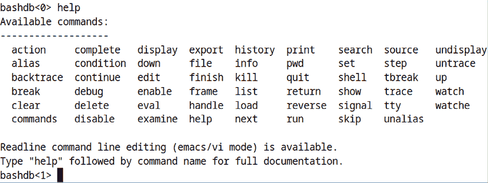
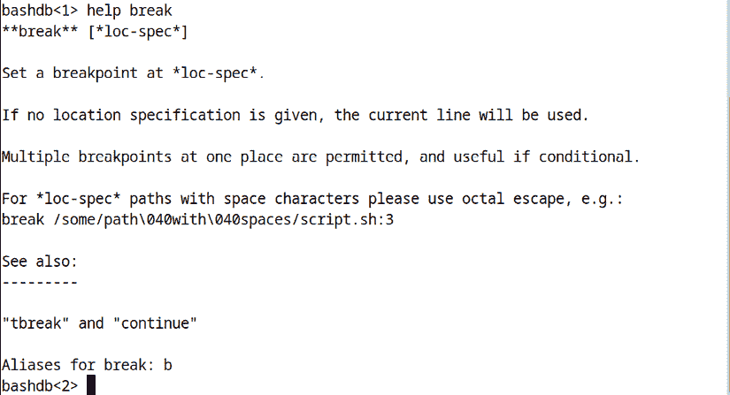

# 调试 Shell 脚本

如果你曾经写过一个看起来很漂亮的脚本，却在它无法正常工作时感到失望，不要觉得孤单。这种情况发生在我们所有人身上，甚至在我为这本书创建脚本时也发生了几次。（我知道，令人震惊吧？）

调试过程应该从你开始设计代码的那一刻起就开始。仔细思考设计，写代码时测试每个部分，并且——天哪——使用带有语法高亮显示的文本编辑器。（这种颜色高亮将帮助你避免大量的排版错误。）

本章中的主题包括：

+   理解常见的脚本错误

+   引号不够

+   创建无限循环

+   使用 shell 脚本调试工具和技术

+   使用 `echo` 语句

+   使用 `xtrace` 进行调试

+   检查未定义的变量

+   使用 `-e` 选项检查错误

+   使用 `bash` 调试器

+   使用 bashdb 调试脚本

+   使用 bashdb 获取帮助

如果你准备好了，我们就开始吧。

# 技术要求

对于这一章，我主要使用的是我用来创建这个 Word 文件的 Fedora 工作站。但是，你可以使用任何你喜欢的 Linux 虚拟机，只要它安装了桌面环境。（其中一个演示需要桌面环境。）

对于最后一个主题，我将展示如何在 Debian/Ubuntu、Fedora、FreeBSD 和 macOS 上安装和使用 `bashdb`。

一如既往，你可以通过以下命令获取脚本：

```
git clone https://github.com/PacktPublishing/The-Ultimate-Linux-Shell-Scripting-Guide.git 
```

# 理解常见的脚本错误

调试中最重要的步骤是理解可能导致脚本直接失败或返回错误结果的常见错误。让我们来看一些例子。

## 引号不够

如果你没有用引号将变量名包围起来，可能会遇到一些问题。这里有一些例子。

### 文件名中有空格

为了演示，我进入了一个空目录，以便将要创建的文件与我主目录中的文件区分开来。我想创建一些文件，文件名中包含时间戳。为此，我将使用 `date` 命令，不加任何选项。

首先，我将使用 `touch` 从命令行创建一个文件：

```
donnie@fedora:~/quoting_demo$ touch somefile_$(date).txt
donnie@fedora:~/quoting_demo$ 
```

好的，让我们来看看文件：

```
donnie@fedora:~/quoting_demo$ ls -l
total 0
-rw-r--r--. 1 donnie donnie 0 Aug 20 15:08 03:08:51
-rw-r--r--. 1 donnie donnie 0 Aug 20 15:08 20
-rw-r--r--. 1 donnie donnie 0 Aug 20 15:08 2024.txt
-rw-r--r--. 1 donnie donnie 0 Aug 20 15:08 Aug
-rw-r--r--. 1 donnie donnie 0 Aug 20 15:08 EDT
-rw-r--r--. 1 donnie donnie 0 Aug 20 15:08 PM
-rw-r--r--. 1 donnie donnie 0 Aug 20 15:08 somefile_Tue
donnie@fedora:~/quoting_demo$ 
```

哇，现在发生了什么？我没有得到一个文件，而是得到了七个。每个文件的文件名中都有当前日期的一部分。问题是，`date` 在没有任何选项的情况下，会生成带有空格的输出，就像这样：

```
donnie@fedora:~/quoting_demo$ date
Tue Aug 20 03:13:23 PM EDT 2024
donnie@fedora:~/quoting_demo$ 
```

所以当 shell 看到这些空格时，它认为我想要创建多个文件，而不是仅仅一个。让我们删除所有这些文件，再尝试加上一些引号：

```
donnie@fedora:~/quoting_demo$ touch somefile_"$(date)".txt
donnie@fedora:~/quoting_demo$ ls -l
total 0
-rw-r--r--. 1 donnie donnie 0 Aug 20 15:15 'somefile_Tue Aug 20 03:15:37 PM EDT 2024.txt'
donnie@fedora:~/quoting_demo$ 
```

你看到我如何用一对双引号将命令替换构造包围起来，这使得 shell 忽略了空格。现在，我只有一个文件，文件名是正确的。

### 未设置变量的问题

对于下一个场景，让我们来看一下 `quote_problem1.sh` 脚本：

```
#!/bin/bash
number=1
if [ $number = 1 ]; then
        echo "Number equals 1"
else
        echo "Number does not equal 1"
fi 
```

它只是告诉我们`number`的值是否为`1`。运行脚本的结果如下：

```
donnie@fedora:~$ ./quote_problem1.sh
Number equals 1
donnie@fedora:~$ 
```

好的，现在它运行正常。接下来，我会编辑文件，将`number`的值改为`2`，然后再次运行脚本。结果如下：

```
donnie@fedora:~$ ./quote_problem1.sh
Number does not equal 1
donnie@fedora:~$ 
```

现在，让我们尝试使用未设置的变量，就像你在`quote_problem2.sh`中看到的那样：

```
#!/bin/bash
number=
if [ $number = 1 ]; then
        echo "Number equals 1"
else
        echo "Number does not equal 1"
fi 
```

当我们说变量未设置时，实际上是指我们定义了该变量，但没有为它赋值。让我们看看在尝试运行这个脚本时会发生什么。

```
donnie@fedora:~$ ./quote_problem2.sh
./quote_problem2.sh: line 4: [: =: unary operator expected
Number does not equal 1
donnie@fedora:~$ 
```

问题在于，`if [ $number = 1 ]`测试在寻找某种`number`变量的值。但`number`没有值，这导致测试失败。幸运的是，这很容易修复。只需要将测试语句中的`$number`用一对双引号包围，就像你在`quote_problem3.sh`中看到的那样：

```
#!/bin/bash
number=
if [ "$number" = 1 ]; then
        echo "Number equals 1"
else
        echo "Number does not equal 1"
fi 
```

运行这个脚本会显示正确的结果：

```
donnie@fedora:~$ ./quote_problem3.sh
Number does not equal 1
donnie@fedora:~$ 
```

之所以有效，是因为与之前没有值的情况不同，`number`现在有效地拥有了一个空格值。空格不等于`1`，所以脚本能够正常运行。

通常，最好在创建变量时就为它们赋一个初始值，以避免这些问题。然而，有时需要使用未设置的变量。例如，你可能希望脚本在一个变量未设置时执行一件事，或者在该变量有值时执行另一件事。只要你知道如何使用引号来避免这些解析问题，这完全没问题。

为了让这个问题更现实一些，我们来制作`quote_problem4.sh`，使其能够接受用户定义的值：

```
#!/bin/bash
number=$1
if [ $number = 1 ]; then
        echo "Number equals 1"
else
        echo "Number does not equal 1"
fi 
```

让我们看看它在不同值下是如何工作的：

```
donnie@fedora:~$ ./quote_problem4.sh 1
Number equals 1
donnie@fedora:~$ ./quote_problem4.sh 5
Number does not equal 1
donnie@fedora:~$ ./quote_problem4.sh
./quote_problem4.sh: line 4: [: =: unary operator expected
Number does not equal 1
donnie@fedora:~$ 
```

这个方法在`1`或`5`作为值时运行良好，但当我没有提供值时，它就无法工作。所以，看起来是我忘记引用`$number`了。别担心，我会在`quote_problem5.sh`中修复这个问题：

```
#!/bin/bash
number=$1
if [ "$number" = 1 ]; then
        echo "Number equals 1"
else
        echo "Number does not equal 1"
fi 
```

让我们看看现在的情况：

```
donnie@fedora:~$ ./quote_problem5.sh 1
Number equals 1
donnie@fedora:~$ ./quote_problem5.sh 5
Number does not equal 1
donnie@fedora:~$ ./quote_problem5.sh
Number does not equal 1
donnie@fedora:~$ 
```

它运行得很顺利，这意味着我们再次取得了成功。

既然我们在进行测试，让我们看看当我们像在`space_problem1.sh`中那样省略空格会发生什么：

```
#!/bin/bash
number=$1
if ["$number" = 1 ]; then
        echo "Number equals 1"
else
        echo "Number does not equal 1"
fi 
```

这与`quote_problem5.sh`脚本相同，唯一的区别是我删除了`[`和`"$number"`之间的空格。运行它时，结果如下：

```
donnie@fedora:~$ ./space_problem1.sh
./space_problem1.sh: line 4: [: =: unary operator expected
Number does not equal 1
donnie@fedora:~$ 
```

令人惊讶的是，它给出了与我忘记引用`$number`变量时相同的错误信息。所以，这告诉我们两件事。首先，你需要小心在测试条件中放置空格。其次，你不能总是依赖于 shell 的错误信息来准确告诉你问题所在。在这个案例中，两个完全不同的错误却显示出了完全相同的信息。

等等！这里有一种解决问题的方式。我们只需要使用`-u` shell 选项来检查未初始化的变量，正如你在`quote_problem6.sh`脚本中看到的那样：

```
#!/bin/bash -u
number=$1
if [ $number = 1 ]; then
        echo "Number equals 1"
else
        echo "Number does not equal 1"
fi 
```

这个脚本与之前的唯一不同是我在 shebang 行的末尾添加了 `-u`。我们来看看如果不提供 `$1` 的值时会发生什么：

```
donnie@fedora:~$ ./quote_problem6.sh
./quote_problem6.sh: line 3: $1: unbound variable
donnie@fedora:~$ 
```

这很酷，因为它精确地告诉我们问题出在哪里，而不是只是显示一个通用的错误信息。如果你需要查看更详细的消息，只需添加 `v` 选项，像这样：

```
#!/bin/bash -uv 
```

现在运行脚本的样子是这样的：

```
donnie@fedora:~$ ./quote_problem6.sh
#!/bin/bash -uv
number=$1
./quote_problem6.sh: line 3: $1: unbound variable
donnie@fedora:~$ 
```

调试完成后，记得删除 `-u` 或 `-uv`，因为这可能会在生产脚本中引发问题。

我将在接下来的几页中向你展示更多关于使用 `-u` 选项的内容，具体在 *使用 Shell 脚本调试工具* 部分。

对于下一个问题，你需要系好安全带。因为事情会变得很疯狂。

## 创建一个疯狂的循环

当你创建某种循环时，很容易不小心创建一个会无限运行，直到你手动停止它。例如，看看 `wild_loop1.sh` 脚本：

```
#!/bin/bash
# while loop running wild
count=30
limit=25
while [ "$count" -gt "$limit" ];
do
        echo $count
        (( count = (count + 1)))
done 
```

这个循环从 `count` 值为 30 开始，每次迭代时 `count` 增加 1。它应该一直运行，直到 `count` 达到 25。好吧，我知道这次问题显而易见，但还是请你耐心一点。这种情况可能发生在某个程序员急于完成任务时，没有注意到这个问题。无论如何，试着运行这个脚本会输出一个不断增加的数字列表。无论你多快按下 *Ctrl-c*，输出会一直滚动到终端的顶部，所以你根本看不到输出的顶部部分。因此，我会通过将输出导入到文本文件中来修复这个问题。不过首先，我会打开第二个终端窗口，创建一个空白文本文件，如下所示：

```
donnie@fedora:~$ touch wild_loop.txt
donnie@fedora:~$ 
```

接下来，我仍然在那个窗口中，使用 `tail -f` 打开文件，这样可以看到文件的更新内容：

```
donnie@fedora:~$ tail -f wild_loop.txt 
```

现在我回到我的第一个终端窗口，并像这样运行 `wild_loop1.sh` 脚本：

```
donnie@fedora:~$ ./wild_loop1.sh > wild_loop.txt 
```

我在几秒钟后按下了 *Ctrl-c*。但正如你在第二个窗口中看到的，`count` 真的是乱了：


图 21.1：疯狂的循环正在疯狂运行！

使用 `less` 打开 `wild_loop.txt` 文件，你会看到脚本的输出确实是从 30 开始的。

```
30
31
32
33
. . .
. . . 
```

就像我之前说的，这个问题很明显。只是我不小心交换了 `count` 和 `limit` 的值。所以，我们来在 `wild_loop2.sh` 中修复这个问题：

```
#!/bin/bash
# while loop NOT running wild
count=25
limit=30
while [ "$limit" -gt "$count" ];
do
        echo $count
        (( count = (count + 1)))
done 
```

这次，`count` 设置为 25，`limit` 设置为 30。运行这个脚本应该效果更好。我们来看看：

```
donnie@fedora:~$ ./wild_loop2.sh
25
26
27
28
29
donnie@fedora:~$ 
```

哦，那个看起来好多了。

还有很多 Shell 脚本的陷阱我可以与大家分享。但是，为了避免重新发明轮子，我就在这里结束，并分享一些你可能觉得有用的优秀资源。

Shell 中的文件名和路径名：如何正确操作：

[`dwheeler.com/essays/filenames-in-shell.html`](https://dwheeler.com/essays/filenames-in-shell.html)

常见的 Shell 脚本错误：

[`www.pixelbeat.org/programming/shell_script_mistakes.html`](https://www.pixelbeat.org/programming/shell_script_mistakes.html)

BashPitfalls:

[`mywiki.wooledge.org/BashPitfalls`](http://mywiki.wooledge.org/BashPitfalls)

好的，让我们继续讨论调试工具。

# 使用 Shell 脚本调试工具和技术

我们可以使用几种不同的调试工具，其中包括`shellcheck`、`checkbashisms`和`shall`。我们在*第十九章—Shell 脚本的可移植性*中已经看过它们，所以这里不再重复讨论。相反，我将介绍一些我们还没有讨论过的工具和技术。

## 使用 echo 语句

有时，如果你遇到无法解决的 Shell 脚本问题，在合适的位置放置`echo`语句可以帮助你找到问题所在。

你可能会在其他参考资料中看到，有些人认为`echo`语句是穷人版的调试工具。这是因为`echo`总是可用的，如果你无法使用其他工具时，可以使用它。

在*第十六章，使用 yad、dialog 和 xdialog 创建用户界面*中，我展示了`xdialog-hello2.sh`脚本，它可以自动检测两件事。

+   它可以检测`Xdialog`工具是否存在。

+   它还可以检测你的机器是否安装了桌面环境。

如果同时检测到桌面环境和`Xdialog`工具，脚本将运行图形化的`Xdialog`工具。否则，脚本将运行基于 ncurses 的`dialog`工具。以下是脚本的样子：

```
#!/bin/bash
command -v Xdialog
if [[ $? == 0 ]] && [[ -n $DISPLAY ]]; then
        diag=Xdialog
else
        diag=dialog
fi
$diag --title "Dialog message box" \
        --begin 2 2 \
        --msgbox "\nHowdy folks!" 15 50
clear 
```

提醒一下，`DISPLAY`环境变量如果安装了桌面环境，将会分配一个非零长度的值，如果没有安装桌面环境，则没有分配值。`[[ -n $DISPLAY ]]`语句中的`-n`用于测试是否存在一个非零长度的分配值。（`-n`实际上代表*非零*。）因此，如果`[[ -n $DISPLAY ]]`测试返回值为 0，这意味着条件*为真*，那么桌面环境已被检测到。

然而，最初脚本看起来是这样的，正如你在`xdialog-hello2-broken.sh`脚本中看到的那样：

```
#!/bin/bash
command -v Xdialog
if [[ -n $DISPLAY ]] && [[ $? == 0 ]]; then
        diag=Xdialog
else
        diag=dialog
fi
$diag --title "Dialog message box" \
        --begin 2 2 \
        --msgbox "\nHowdy folks!" 15 50
clear 
```

正如你所看到的，两个脚本的唯一区别在于测试条件的顺序不同。正常工作的脚本首先进行`[[ $? == 0 ]]`测试，而损坏的脚本首先进行`[[ -n $DISPLAY ]]`条件测试。

当我尝试运行原始脚本时，脚本首先是`[[ -n $DISPLAY ]]`，结果就是无法运行。我的意思是，它在安装了`Xdialog`的桌面机器或运行在文本模式下的机器上能够正常工作。但在没有安装`Xdialog`的桌面机器上，它总是告诉我已经安装了该工具。当然，运行脚本时总是失败，因为它试图运行`Xdialog`。我无法理解这背后的原因，所以我不得不进行一些故障排除。

我从未在我的 Fedora 工作站上安装过`Xdialog`，所以我可以用它来展示我的故障排除步骤。当你尝试这个演示时，务必在一个没有安装`Xdialog`的桌面类型虚拟机上进行。

你可以通过在`command -v Xdialog`命令下方放置`echo $?`命令和`sleep 10`命令来开始故障排除。现在脚本看起来是这样的：

```
#!/bin/bash
command -v Xdialog
echo $?
sleep 10
if [[ -n $DISPLAY ]] && [[ $? == 0 ]]; then
        diag=Xdialog
else
        diag=dialog
fi
$diag --title "Dialog message box" \
        --begin 2 2 \
        --msgbox "\nHowdy folks!" 15 50
clear 
```

我想看看退出代码是 0 还是 1，并且`sleep 10`命令会暂停脚本足够长的时间，这样我就能看到`echo $?`的输出。

我插入了`sleep 10`命令，给自己十秒钟时间查看`echo $?`命令的输出。否则，末尾的`clear`命令会在我看到输出之前清除它。如果你愿意，你可以省略`sleep 10`命令，而改为注释掉`clear`命令。无论哪种方式都可以，所以选择权在你。

1 表示`Xdialog`未安装，而 0 表示已安装。将`echo`和`sleep`命令放在`command -v Xdialog`命令下方，可以让我看到脚本是否正确检测到软件包是否安装。现在运行脚本看起来是这样的：

```
donnie@fedora:~$ ./xdialog-hello2-broken.sh
1 
```

1 退出代码表示脚本正确地检测到`Xdialog`不存在。因此，脚本的这一部分正常工作。接下来，你可以注释掉整个`if...then...else`语句块，并在其上方放置`[[ -n $DISPLAY ]] && echo $?`语句和`sleep 10`语句，像这样：

```
#!/bin/bash
command -v Xdialog
[[ -n $DISPLAY ]] && echo $?
sleep 10
#if [[ -n $DISPLAY ]] && [[ $? == 0 ]]; then
 #       diag=Xdialog
#else
#        diag=dialog
#fi
$diag --title "Dialog message box" \
        --begin 2 2 \
        --msgbox "\nHowdy folks!" 15 50
clear 
```

运行带有此修改的脚本看起来是这样的：

```
donnie@fedora:~$ ./xdialog-hello2-broken.sh
0 
```

0 退出代码表示条件为真，这意味着确实安装了桌面环境。所以，这部分代码也正常工作。

这个时候我们需要开始进行逻辑思考。如果`[[ -n $DISPLAY ]]`返回 0 退出代码，这会如何影响`[[ $? == 0 ]]`部分呢？事实证明，第二个测试条件中的`$?`查看的是第一个测试条件返回的 0 退出代码，而不是`command -v Xdialog`命令的退出代码。因此，在桌面机器上，`$?`总是会查看 0 退出代码，无论`Xdialog`是否存在。解决这个问题的方法很简单，就是交换两个测试条件的顺序，如你在`xdialog-hello2.sh`脚本中看到的那样。

回想起来，解决这个问题应该是显而易见的。但由于某种原因，我当时陷入了思维障碍，无法看出这一点。这也表明，即使是最优秀的人，有时也会被简单的脚本错误难倒。

好的，让我们继续下一种调试工具。

## 使用 xtrace 进行调试

使用**xtrace**调试你的有问题的脚本，显示了脚本中命令的实际执行情况及其输出。这可以帮助你追踪问题的根源。

你可以通过三种不同的方式使用`xtrace`模式，分别是：

+   将`-x`追加到 shebang 行的末尾。这对我们一直在使用的所有 shell 都有效。例如，如果你正在编写一个`bash`脚本，那么 shebang 行将是`#!/bin/bash -x`。如果你正在创建一个需要可移植性的脚本，你可以使用`#!/bin/sh -x`。

+   将`set -x`命令放入脚本中，确保你想开启调试模式的地方。

+   在调用脚本之前，从命令行运行`set -x`命令。

为了演示这个问题，让我们看看`xdialog-hello2-broken2.sh`脚本，它和你在上一节看到的`xdialog-hello2-broken.sh`脚本有着相同的问题。

```
#!/bin/bash -x
command -v Xdialog
if [[ -n $DISPLAY ]] && [[ $? == 0 ]]; then
        diag=Xdialog
        sleep 10
else
        diag=dialog
        sleep 10
fi
$diag --title "Dialog message box" \
        --begin 2 2 \
        --msgbox "\nHowdy folks!" 15 50
clear 
```

在这里，我将`-x`放置在 shebang 行的末尾，然后在`diag=Xdialog`行和`diag=dialog`行之后放置了`sleep 10`行。现在，让我们运行它。

```
donnie@fedora:~$ ./xdialog-hello2-broken2.sh
+ command -v Xdialog
+ [[ -n :0 ]]
+ [[ 0 == 0 ]]
+ diag=Xdialog
+ sleep 10 
```

你可以立即看到，这比使用`echo`命令更有用。`[[ -n :0 ]]`这一行是`[[ -n $DISPLAY ]]`测试的扩展。它表明`DISPLAY`变量确实有一个分配的值（`:0`），这意味着已经安装了桌面环境。但是，这里真正的关键是`[[ 0 == 0 ]]`这一行，它是`[[ $? == 0 ]]`测试的扩展。从这个脚本中调用`Xdialog`要求`$?`等于 0，这就需要我们*两个*测试条件都返回 0。

这就要求`Xdialog`和桌面环境都必须存在。但是，即使`Xdialog`没有安装在这台机器上，这个脚本错误地显示它已经安装了，就像你在`diag=Xdialog`这一行看到的那样。所以，再次强调，唯一明显的答案是交换测试条件，就像之前一样，并重新测试。这样，`[[ $? == 0 ]]`将扩展为`[[ 1 == 0 ]]`，这是我们在这种情况下希望看到的。

如果你使用`#!/usr/bin/env bash`作为 shebang 行，那么在 shebang 行末尾追加`-x`将不起作用。这是因为`env`每次只识别一个选项，在这种情况下是`bash`。因此，你需要在运行脚本之前，或者在脚本中放置一个`set -x`命令，就像这样：

```
#!/usr/bin/env bash
set -x
. . .
. . . 
```

如果你在命令行使用`set -x`，你可以通过执行`set +x`来关闭调试模式。

如果单独使用`-x`没有显示足够的信息，你可以通过添加`v`选项来启用详细模式，就像你在`xdialog-hello2-broken4.sh`中看到的那样：

```
#!/bin/bash -xv
command -v Xdialog
if [[ -n $DISPLAY ]] && [[ $? == 0 ]]; then
        diag=Xdialog
        sleep 10
else
        diag=dialog
        sleep 10
fi
$diag --title "Dialog message box" \
        --begin 2 2 \
        --msgbox "\nHowdy folks!" 15 50
clear 
```

这是输出：

```
donnie@fedora:~$ ./xdialog-hello2-broken4.sh
#!/bin/bash -xv
command -v Xdialog
+ command -v Xdialog
if [[ -n $DISPLAY ]] && [[ $? == 0 ]]; then
        diag=Xdialog
	sleep 10
else
        diag=dialog
	sleep 10
fi
+ [[ -n :0 ]]
+ [[ 0 == 0 ]]
+ diag=Xdialog
+ sleep 10 
```

除了我们之前看到的，现在我们看到整个脚本被回显出来。我们还看到`diag`变量的值是`Xdialog`。由于`Xdialog`没有安装在此机器上，因此`diag`的值应该是`dialog`。

如果你需要对调试过程进行永久记录以便进一步研究，可以将`-x`输出重定向到文本文件中。`-x`的输出被认为是`stderr`输出，因此你可以像这样进行重定向：

```
donnie@fedora:~$ ./xdialog-hello2-broken4.sh 2> debug.txt 
```

当你调试完毕后，记得在将脚本投入生产之前，移除`-x`或`set -x`选项。

好的，让我们继续下一个技巧。

## 检查未定义变量

正如我在本章开始时所说的，在 *理解常见脚本错误* 部分，有时在脚本中定义一个变量而不为其赋初值是可取的。但有时也不是。你可以通过在 shebang 行末尾附加 `-u` 来追踪未初始化的变量。例如，在 `bash` 中，你可以使用 `#!/bin/bash -u`，这会使整个脚本都启用此功能。或者，你可以在脚本中任何你希望开始检查的地方加入 `set -u` 命令。例如，看看 `unassigned_var1.sh` 脚本，它关闭了变量检查：

```
#!/bin/bash
echo "The uninitialized myvar, without setting -u, looks like this : " $myvar
echo
myvar=Donnie
echo "I've just initialized myvar."
echo "The value of myvar is: " $myvar 
```

这是输出结果：

```
donnie@fedora:~$ ./unassigned_var1.sh
The uninitialized myvar, without setting -u, looks like this :
I've just initialized myvar.
The value of myvar is:  Donnie
donnie@fedora:~$ 
```

如你所见，没有 `-u` 设置时，脚本会正常执行。只是尝试回显未初始化的 `myvar` 会显示一个空白空间。接下来，让我们通过添加 `-u` 选项来启用变量检查，如在 `unassigned_var2.sh` 脚本中所见：

```
#!/bin/bash -u
echo "The uninitialized myvar, without setting -u, looks like this : " $myvar
echo
myvar=Donnie
echo "I've just initialized myvar."
echo "The value of myvar is: " $myvar 
```

让我们看看这会有什么结果：

```
donnie@fedora:~$ ./unassigned_var2.sh
./unassigned_var2.sh: line 2: myvar: unbound variable
donnie@fedora:~$ 
```

这次，脚本一看到未初始化的变量就失败了。

你可以在脚本中的任何地方设置 `-u` 选项，通过使用 `set -u`，正如在 `unassigned_var3.sh` 脚本中看到的那样：

```
#!/bin/bash
echo "The uninitialized myvar, without setting -u, looks like this : " $myvar
echo
echo "I'm now setting -u."
set -u
myvar=Donnie
echo "I've just initialized myvar."
echo "The value of myvar is: " $myvar
echo
echo "Let's now try another uninitialized variable."
echo "Here's the uninitialized " $myvar2 
```

现在，我在第 2 行有一个未初始化的变量。（假设出于某种原因，我希望这个特定变量保持未初始化状态。）然后，在第 5 行启用变量检查。让我们看看它是如何运行的：

```
donnie@fedora:~$ ./unassigned_var3.sh
The uninitialized myvar, without setting -u, looks like this :
I'm now setting -u.
I've just initialized myvar.
The value of myvar is:  Donnie
Let's now try another uninitialized variable.
./unassigned_var3.sh: line 11: myvar2: unbound variable
donnie@fedora:~$ 
```

在我启用变量检查之前，未初始化的 `myvar` 只是显示一个空白空间。启用变量检查后，我将 `myvar` 初始化为值 `Donnie`，它正常打印出来。但是，未初始化的 `myvar2` 会导致脚本崩溃。

如果你在网上搜索 shell 脚本安全性教程，你会发现有几篇教程告诉你将 `-u` 或 `set -u` 永久添加到你的脚本中。这些教程的作者表示，这样做能增强脚本的安全性，但并没有给出任何令人信服的解释，说明为什么或如何这样做。使用 `-u` 或 `set -u` 对于调试很有帮助，但它应该仅限于调试！因此，当你调试完脚本后，一定要在将脚本投入生产前移除 `-u` 或 `set -u`。否则，你的脚本可能会产生一些非常不可预测的结果。

另外，使用 `-u` 还可以帮助你检测脚本中的拼写错误。例如，如果你定义了一个变量 `mynum=1`，但不小心使用 `$mymum` 来引用它，`-u` 会检测到 `mymum` 是一个未设置的变量。

以上就是关于未初始化变量的讨论。接下来我们来看下一个技巧。

## 使用 `-e` 选项检查错误

我们的下一个技巧是使用 `-e` shell 选项或 `set -e` 命令来测试脚本中的错误，这些错误会导致脚本中的命令失败。让我们看看 `bad_dir1.sh` 脚本，了解它是如何工作的。

```
#!/bin/bash
mkdir mydir
cd mydire
ls 
```

通过这个，我想创建`mydir`目录，进入其中，并执行文件列表命令。但是，我今天打字不太顺，所以下面的`cd`命令我不小心打成了`mydire`，而不是`mydir`。让我们看看运行时会发生什么。

```
donnie@fedora:~$ ./bad_dir1.sh
./bad_dir1.sh: line 4: cd: mydire: No such file or directory
 15827_zip.zip
 18.csv
 2023-08-01_15-23-31.mp4
. . .
. . .
yad_timer.sh
yad-weather.sh
zoneinfo.zip
donnie@fedora:~$ 
```

是的，这个问题很明显，但没关系。因为`-e`选项不仅仅是识别问题，它还会导致脚本在任何命令失败时立即退出。让我们把这个选项放到`bad_dir2.sh`脚本中，看看它是怎么工作的。

```
#!/bin/bash -e
mkdir mydir
cd mydire
ls 
```

我在这里所做的只是插入了`-e`选项。现在，我将删除第一个脚本创建的`mydir`目录，然后尝试运行这个脚本。

```
donnie@fedora:~$ rm -rf mydir
donnie@fedora:~$ ./bad_dir2.sh
./bad_dir2.sh: line 4: cd: mydire: No such file or directory
donnie@fedora:~$ 
```

使用`-e`在失败的命令是复合命令结构的一部分时也同样有效，就像你在`bad_dir3.sh`中看到的那样。

```
#!/bin/bash -e
mkdir mydir && cd mydire
ls 
```

和之前一样，我将删除前一个脚本创建的`mydir`目录，然后运行`bad_dir3.sh`，它长这样：

```
donnie@fedora:~$ ./bad_dir3.sh
./bad_dir3.sh: line 3: cd: mydire: No such file or directory
donnie@fedora:~$ 
```

所以再次强调，当`cd`命令失败时，`-e`立刻中止了脚本的执行。

我知道你在想什么，我知道这有点让人毛骨悚然。你在想`-e`会检测到的错误类型应该是相当明显的。因为对于这些类型的错误，shell 会显示一个错误信息，明确指出问题所在。那么，为什么我们还需要`-e`呢？其实，可以把`-e`和`set -e`当作一种安全机制，而不是调试工具。例如，如果尝试`cd`进入一个不存在的目录后，接下来的命令是`rm`所有文件，那么如果在`cd`命令失败后仍允许脚本继续运行，那可能会造成灾难性的后果。

好吧，我已经告诉你关于`-e`和`set -e`的好处。现在，让我告诉你一些不那么好的事情。

### 理解`set -e`和`-e`的问题

尽管`-e`和`set -e`可以很有帮助，但它们也可能让你头疼。有时候，它们甚至会破坏一个之前正常工作的脚本。以下是我的意思。

`set -e`和`-e`选项的工作原理是检测脚本中的命令是否返回非 0 的退出代码。

记住，退出代码为 0 表示命令执行成功，非 0 退出代码表示命令执行失败。

然而，有时候你需要脚本中的某些命令返回非 0 的退出代码，以使脚本正常工作。这使得`set -e`和`-e`的操作变得不可预测。举个例子，看看这个`set_e_fails1.sh`脚本：

```
#!/bin/bash
set -e
i=0
let i++
echo "i is $i" 
```

请注意，`let i++`是一个 bash 特性，我还没有展示给你。你可以用`i=$(( i + 1 ))`来替代它，以使脚本能够在非`bash`的 shell 中运行。

这会创建一个值为 0 的`i`变量，将其值增加 1，然后打印出`i`的最终值。但看看在`-e`设置下会发生什么：

```
donnie@fedora:~$ ./set_e_fails1.sh
donnie@fedora:~$ 
```

好吧，它什么都没有打印出来。让我们看看如果我把`set -e`命令注释掉，会发生什么：

```
#!/bin/bash
# set -e
i=0
let i++
echo "i is $i" 
```

让我们再运行一次。

```
donnie@fedora:~$ ./set_e_fails1.sh
i is 1
donnie@fedora:~$ 
```

所以，脚本在没有`set -e`的情况下运行完全正常，但插入`set -e`却会导致它出错。我知道，这听起来很疯狂，对吧？为了帮助我们弄清楚发生了什么，下面我们创建`set_e_fails2.sh`脚本，如下所示：

```
#!/bin/bash
i=0
echo "Exit code after setting the value of i: " $?
let i++
echo "Exit code after incrementing i: " $?
echo "i is $i"
echo "Exit code after displaying new value of i: " $? 
```

唯一的区别是，我省略了`set -e`这一行，并插入了`echo`语句来显示每条命令的退出代码。现在，来运行它：

```
donnie@fedora:~$ ./set_e_fails2.sh
Exit code after setting the value of i:  0
Exit code after incrementing i:  1
i is 1
Exit code after displaying new value of i:  0
donnie@fedora:~$ 
```

`增量 i 后的退出代码: 1`这一行显示了问题所在。只是由于某种我无法理解的奇怪原因，`let i++`命令尽管成功执行，却返回了退出代码 1。所以在这种情况下，使用`-e`造成了问题，而不是解决问题。（然而，使用便携式的`i=$(( i + 1 ))`语法会返回退出代码 0，这会避免这个问题。我也不知道为什么会这样。）

我在*检查未定义变量*部分提到过，一些网站上的文章建议将`-u`或`set -u`作为脚本的永久部分，以增强安全性。这些作者实际上建议将`-e`/`set -e`和`-u`/`set -u`都作为脚本的永久部分。但正如我刚才所展示的，`-e`/`set -e`可能会变得相当不可预测，并且可能会带来更多问题，而非解决问题。无论如何，如果你使用此工具进行故障排除，请确保在将脚本投入生产之前，删除它。

尽管我个人认为`-e`和`set -e`在谨慎使用的情况下是有用的，但这是一个有争议的观点。在以下文章中，你将看到一篇长文，解释为什么你永远不应该使用`-e`或`set -e`：

BashFAQ105—Greg 的 Wiki：

[`mywiki.wooledge.org/BashFAQ/105`](https://mywiki.wooledge.org/BashFAQ/105)

这位作者认为，你最好自己编写错误检查，而不是依赖`-e`/`set -e`。

如果你愿意，可以访问该页面，并按照作者提供的示例进行操作。作者还提供了一个链接，指向与此相对立的观点页面，记得也去查看，这样你可以自己做出决定。

好的，我们继续讲解最后一个调试工具。

## 使用 bash 调试器

**bash 调试器**，通常被称为**bashdb**，允许你逐行执行`bash`脚本，每次执行一条命令。这样你可以在执行下一条命令之前，查看脚本中的每一条命令到底在做什么。一旦安装好，它的使用非常简单。

你会在网上找到很多`bashdb`教程，但其中很多已经很老了，而且展示的是一种过时的安装`bashdb`的方法。这是因为多年前，`bashdb`几乎包含在每个 Linux 发行版的仓库中。所以，你可以像这些教程所示的那样，使用普通的包管理器进行安装。

不幸的是，由于某些奇怪的原因，`bashdb` 已从大多数（如果不是全部）Linux 仓库中删除了。所以，现在如果你想在 Linux 上运行 `bashdb`，你需要从源代码进行编译，接下来我将向你展示如何操作。

另一方面，`bashdb` 已经包含在 FreeBSD 仓库和 macOS 的 Homebrew 仓库中，所以你在这些系统上没有问题。

好的，让我们来看一下如何安装 `bashdb`。

### 在 Linux 上安装 bashdb

正如我在信息框中提到的，你需要从源代码安装 `bashdb`。不过别担心，这很简单。

1\. 你需要先通过你常用的发行版包管理器，从正常的发行版仓库中安装 `autoconf` 和 `texinfo` 包。

2\. 通过执行以下命令下载 `bashdb` 源代码：

```
git clone https://github.com/rocky/bashdb.git 
```

3\. 使用 `cd` 命令进入 `git` 命令创建的 `bashdb/` 目录。

4\. 运行以下命令集以编译和安装 `bashdb`：

```
./autogen.sh
./configure
make && make check
sudo make install 
```

就这些了。

### 在 FreeBSD 上安装 bashdb

这更简单。只需执行：

```
sudo pkg install bashdb 
```

### 在 macOS 上安装

在安装了 Homebrew 的 Mac 上，只需执行：

```
brew install bashdb 
```

现在 `bashdb` 已经安装好了，接下来让我们看看是否能真正使用它。

## 使用 bashdb 调试脚本

让我们从一个干净的、未修改的原始损坏 `xdialog` 脚本开始，我将其命名为 `xdialog-hello2-broken5.sh`，内容如下：

```
#!/bin/bash
command -v Xdialog
if [[ -n $DISPLAY ]] && [[ $? == 0 ]]; then
        diag=Xdialog
else
        diag=dialog
fi
$diag --title "Dialog message box" \
        --begin 2 2 \
        --msgbox "\nHowdy folks!" 15 50
clear 
```

正如你在 *使用 xtrace 进行调试* 部分看到的那样，问题在于脚本无法正确检测 `Xdialog` 和桌面显示器是否已安装。让我们使用 `bashdb` 一步步调试，看看它能告诉我们什么。开始如下：

```
donnie@fedora:~$ bashdb ./xdialog-hello2-broken5.sh
bash debugger, bashdb, release 5.2-1.1.2
Copyright 2002-2004, 2006-2012, 2014, 2016-2019, 2021, 2023 Rocky Bernstein
This is free software, covered by the GNU General Public License, and you are
welcome to change it and/or distribute copies of it under certain conditions.
(/home/donnie/xdialog-hello2-broken5.sh:3):
3:	command -v Xdialog
bashdb<0> 
```

这将运行脚本中的第一个命令，然后把我们带到 `bashdb` 命令提示符。要运行下一个命令，只需输入 `step`，像这样：

```
. . .
. . .
bashdb<0> step
(/home/donnie/xdialog-hello2-broken5.sh:4):
4:	if [[ -n $DISPLAY ]] && [[ $? == 0 ]]; then
bashdb<1> 
```

在这里，我们看到了测试结构内部的 `DISPLAY` 变量。让我们通过使用 `examine` 命令来检查该变量的值：

```
. . .
. . .
bashdb<1> examine DISPLAY
declare -x DISPLAY=":0"
bashdb<2> 
```

`declare -x` 部分意味着 `bashdb` 正在将 `DISPLAY` 变量标记为导出到后续命令。但是，这并不是最重要的部分。重要的是，`DISPLAY` 变量的值为 `:0`，这意味着 `[[ -n $DISPLAY ]]` 测试将返回值 0，表示条件为真。

与其使用 `examine DISPLAY` 命令，你可以使用 `print $DISPLAY` 命令，像这样：

```
bashdb<1> print $DISPLAY
:0
bashdb<2> 
```

这样，显示的就只有实际的 `DISPLAY` 值。

现在，我们需要动动脑筋，思考将 `DISPLAY` 测试放在 `$?` 测试之前意味着什么。嗯，我们已经在使用 `echo` 语句和 `xtrace` 方法排查问题时得出了答案。问题是，如果我们先进行 `DISPLAY` 检测，那么第二个测试中的 `$?` 值将始终为 0，即使没有检测到 `Xdialog` 可执行文件也是如此。但为了让你看到更多内容，假设我们还没有弄明白这一点，且需要查看更多脚本的执行情况。为此，输入你在下一个代码段中看到的一系列命令：

```
bashdb<2> step
(/home/donnie/xdialog-hello2-broken5.sh:4):
4:	if [[ -n $DISPLAY ]] && [[ $? == 0 ]]; then
[[ $? == 0 ]]
bashdb<3> step
(/home/donnie/xdialog-hello2-broken5.sh:5):
5:	        diag=Xdialog
bashdb<4> print $diag
bashdb<5> step
(/home/donnie/xdialog-hello2-broken5.sh:10):
10:	$diag --title "Dialog message box" \
bashdb<6> print $diag
Xdialog
bashdb<7> 
```

我通过执行两个`step`命令开始，带我进入了`diag`变量定义的地方，并查看了它的赋值。接着，我执行了`print $diag`命令，但什么也没有显示。然后，我执行了另一个`step`命令，接着又执行了`print $diag`命令。这时，我终于看到`diag`变量的值是`Xdialog`，尽管`Xdialog`并没有安装在这台工作站上。

使用`bashdb`的明显优势是我不需要修改脚本就能进行调试。如你所见，我不需要添加任何`echo`语句来获取`DISPLAY`和`diag`变量的值。我也不需要添加`sleep`命令或注释掉结尾的`clear`命令，以防在我查看`DISPLAY`值之前屏幕被清空。显然，这对`bashdb`来说是一个巨大的优势。

当然，有时候你可能需要查找有关如何使用`bashdb`的额外信息。接下来我们就来看这个。

## 获取 bashdb 帮助

当你安装`bashdb`时，系统会安装一份 man 页面。坦率地说，它告诉你不多。幸运的是，`bashdb`有一个内置的帮助功能，你可以在`bashdb`命令提示符下随时使用。只需输入`help`命令，你就能看到如下内容：



图 21.2：bashdb 帮助显示

这显示了可用的`bashdb`命令列表。要查看如何使用某个特定命令，只需输入`help`，后面跟上命令名称，如下所示：



图 21.3：获取`break`命令的帮助

本章内容差不多到此为止。让我们总结一下，然后继续前进。

# 总结

本章中，我们介绍了一些有用的技巧和窍门，帮助你排查代码中的问题。我们首先查看了几种常见的 shell 脚本错误，并展示了如何在损坏的脚本中找到它们。接着，我们介绍了一些常见的调试工具和技术。对于`-u`和`-e` shell 选项，我向你展示了使用它们的利弊。最后，我向你展示了如何安装和使用`bashdb`。

在下一章，我们将简要介绍如何使用`zsh`进行脚本编写。我在那里等你。

# 问题

这次，我不会给你提供需要回答的问题，而是给你一些有 bug 的 shell 脚本。尝试运行它们，观察错误，然后尝试调试它们。你能调试它们吗？当然能，我相信你。

1.  我们将从`bug1.sh`脚本开始：

    ```
    #!/bin/bash
    echo "Fix this script...I've got bugs"
    a=45
    if [$a -gt 27 ]
    then
    echo $a
    fi
    exit 
    ```

1.  这是`bug2.sh`脚本：

    ```
    #!/bin/bash
    echo "Fix this script...I've got bugs"
    for i in 1 2 3 4 5 6 7 8 9
    do
    echo $i
    exit 
    ```

1.  现在，来看一下`bug3.sh`：

    ```
    #!/bin/bash
    echo "Fix this script...I've got bugs"
    scripts=$(ls | grep [a-z]*.sh)
    echo $scripts
    exit 
    ```

1.  这是第四个也是最后一个，`bug4.sh`：

    ```
    #! /bin/bash
    echo '1 2 3' > sample.data
    cut -d' ' -f1,3 sample.data | read x z
    echo $((x+z)) 
    ```

# 进一步阅读

+   编写 Shell 脚本——第 9 课：避免麻烦：[`linuxcommand.org/lc3_wss0090.php`](http://linuxcommand.org/lc3_wss0090.php)

+   如何调试 Bash 脚本：[`linuxconfig.org/how-to-debug-bash-scripts`](https://linuxconfig.org/how-to-debug-bash-scripts)

+   15 个必备的 Bash 调试技巧和工具: [`www.fosslinux.com/104144/essential-bash-debugging-techniques-and-tools.htm`](https://www.fosslinux.com/104144/essential-bash-debugging-techniques-and-tools.htm)

+   调试 Bash 脚本: [`www.baeldung.com/linux/debug-bash-script`](https://www.baeldung.com/linux/debug-bash-script)

+   5 个简单步骤，学会如何调试 Bash Shell 脚本: [`www.shell-tips.com/bash/debug-script/#gsc.tab=0`](https://www.shell-tips.com/bash/debug-script/#gsc.tab=0)

+   Shell 中的文件名和路径名：如何正确处理：

+   [`dwheeler.com/essays/filenames-in-shell.html`](https://dwheeler.com/essays/filenames-in-shell.html)

+   常见的 Shell 脚本错误:

+   [`www.pixelbeat.org/programming/shell_script_mistakes.html`](https://www.pixelbeat.org/programming/shell_script_mistakes.html)

+   BashPitfalls:

+   [`mywiki.wooledge.org/BashPitfalls`](http://mywiki.wooledge.org/BashPitfalls )

+   使用 bashdb 调试您的 shell 脚本: [`www.linux.com/news/debug-your-shell-scripts-bashdb/`](https://www.linux.com/news/debug-your-shell-scripts-bashdb/)

+   使用 bashdb 调试器调试 bash 脚本: [`dafoster.net/articles/2023/02/22/debugging-bash-scripts-with-the-bashdb-debugger/`](https://dafoster.net/articles/2023/02/22/debugging-bash-scripts-with-the-bashdb-debugger/)

+   使用 BashDB 调试您的 Shell 脚本—YouTube: [`www.youtube.com/watch?v=jbOQJDSTksA`](https://www.youtube.com/watch?v=jbOQJDSTksA)

+   BASH 调试器文档: [`bashdb.sourceforge.net/bashdb.html`](https://bashdb.sourceforge.net/bashdb.html)

+   Bash 陷阱陷阱: [`medium.com/@dirk.avery/the-bash-trap-trap-ce6083f36700`](https://medium.com/@dirk.avery/the-bash-trap-trap-ce6083f36700)

# 答案

1.  在 `if` 语句中，您需要在 `[` 和 `$a` 之间插入一个空格。

1.  在 `echo $i` 语句后面需要放置一个 `done` 语句。

1.  这个脚本有几个问题。首先，正则表达式设置错误，导致您无法从此脚本中得到任何或正确的输出。而不是

`[a-z]*.sh`，应该是 `[a-z].sh`。（对于这种情况，实际上 `*` 是不需要的。）

您可以查阅《第九章——使用 grep、sed 和正则表达式过滤文本》中关于正则表达式的概念。

还有一个事实是，这个正则表达式并没有对我们产生太大的帮助。除非您的脚本文件名仅由数字或大写字符组成，否则这个 `grep` 命令将显示目录中的所有脚本。因此，您可能可以完全省略 `grep` 命令，并使用简单的 `ls *.sh` 命令。

最后，在 `echo` 语句中，您需要用一对双引号括起变量，像这样：

```
echo "$scripts" 
```

这将防止文件名中包含空格时出现问题。

1.  这个脚本应该从脚本创建的`sample.data`文件中获取第一列和第三列的值，并将它们相加。第一列和第三列的值分别是 1 和 3，因此它们的和应该是 4。然而，当你运行它时，结果如下：

    ```
    donnie@fedora:~$ ./bug4.sh
    0
    donnie@fedora:~$ 
    ```

问题在于，第三行的`cut`命令将输出传递给了`read`命令。问题在于，`read`命令是内建在 shell 中的，而不是拥有自己可执行文件的命令。

这很重要，因为你只能将一个命令的输出传递给一个有自己可执行文件的命令。因此，你不能将输出传递给一个内建命令。

你可以不使用管道，而是将第一列和第三列的值发送到`tmp.data`文件中，然后使用输入重定向从`tmp.data`文件中获取输入，就像你在`bug5.sh`脚本中看到的那样：

```
#! /bin/bash
echo '1 2 3' > sample.data
cut -d' ' -f1,3 sample.data > tmp.data
read x z < tmp.data
echo $((x+z)) 
```

另一个选项是使用*here*文档，正如你在`bug6.sh`脚本中看到的那样：

```
#! /bin/bash
echo '1 2 3' > sample.data
read -r x z <<<$(cut -d' ' -f1,3 sample.data)
echo $((x+z)) 
```

无论如何，你现在会看到正确的结果：

```
donnie@fedora:~$ ./bug5.sh
4
donnie@fedora:~$ ./bug6.sh
4
donnie@fedora:~$ 
```

# 加入我们的 Discord 社区！

读这本书时，可以与其他用户、Linux 专家和作者本人一起学习。

提问，给其他读者提供解决方案，通过“问我任何问题”环节与作者交流，等等。扫描二维码或访问链接加入社区。

[`packt.link/SecNet`](https://packt.link/SecNet)


