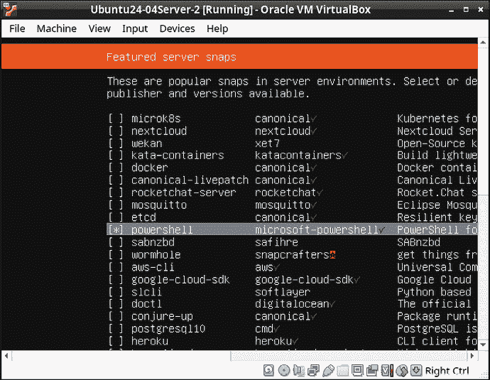
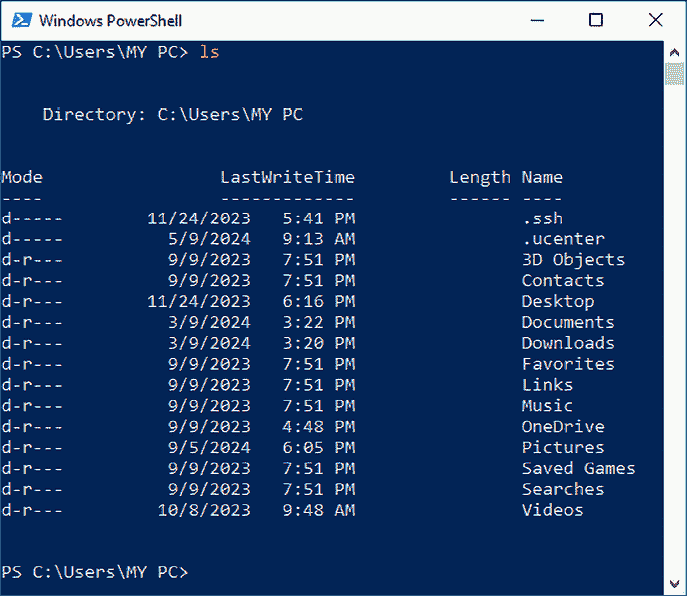
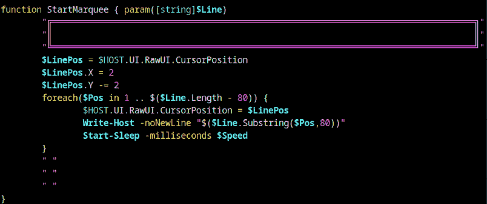
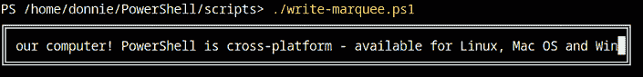
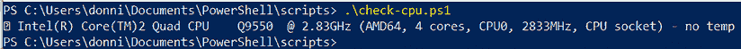

# 第二十三章：在 Linux 上使用 PowerShell

**PowerShell** 最初是一个封闭源代码的专有产品，只能安装在 Windows 操作系统上。然而现在，它是自由开源软件，并且可以在基于 Linux 和 macOS 的机器上自由使用。

在本章中，我无法给你提供一整套 PowerShell 课程，因为这需要一本完整的书籍。而是，我将提供 PowerShell 哲学的高层次概述，展示如何安装它，并提供一些有用的示例。我还会说明为什么你作为 Linux 或 Mac 管理员，可能会想要学习 PowerShell。当然，你会在整个章节中以及 *进一步阅读* 部分找到许多 PowerShell 参考资料的链接。

本章的主题包括：

+   在 Linux 和 macOS 上安装 PowerShell

+   Linux 和 Mac 管理员学习 PowerShell 的原因

+   PowerShell 脚本与传统 Linux/Unix 脚本的区别

+   查看可用的 PowerShell 命令

+   获取 PowerShell 命令的帮助

+   实际跨平台 PowerShell 脚本

如果你准备好了，我们开始吧。

# 技术要求

你可以使用 Fedora、Ubuntu 或 Debian 虚拟机进行操作。你不会使用 FreeBSD 或 OpenIndiana 虚拟机，因为 PowerShell 不支持这些操作系统。

一如既往，你可以通过以下方式获取脚本：

```
git clone https://github.com/PacktPublishing/The-Ultimate-Linux-Shell-Scripting-Guide.git 
```

# 在 Linux 和 macOS 上安装 PowerShell

我们将首先查看在 Linux 上安装 PowerShell 的方法，然后再看看如何在 macOS 上安装它。

## 通过 snap 包在 Linux 上安装 PowerShell

`snapd` 系统是一个通用的软件打包系统，由 Ubuntu 的开发者发明。它在 Ubuntu 操作系统中默认安装，并且可以安装在大多数其他 Linux 发行版上。

如果你正在设置一个新的 Ubuntu 服务器，你可以选择从 Ubuntu 安装程序中安装一些 snap 包，包括 PowerShell。如下所示：



图 23.1：在 Ubuntu 安装过程中选择 PowerShell snap 包

你可以在非 Ubuntu 发行版上安装 `snapd`，但是不同发行版的安装说明有所不同。你可以在这里找到相关的安装说明：

[`snapcraft.io/docs/installing-snapd`](https://snapcraft.io/docs/installing-snapd)

安装完 `snapd` 后，你可以通过以下方式安装 PowerShell：

```
sudo snap install powershell --classic 
```

## 在 Fedora 上安装 PowerShell

在 Fedora 系统上，你可以使用多种方法安装 PowerShell。例如，你可以通过 `.rpm` 包或 Docker 容器来安装它。你可以在这里找到每种方法的详细说明：

[`fedoramagazine.org/install-powershell-on-fedora-linux/`](https://fedoramagazine.org/install-powershell-on-fedora-linux/)

## 在 macOS 上安装 PowerShell

你可以通过 Homebrew 系统在 Mac 上安装 PowerShell。你可以在这里找到详细的安装说明：

[`learn.microsoft.com/en-us/powershell/scripting/install/installing-powershell-on-macos?view=powershell-7.4`](https://learn.microsoft.com/en-us/powershell/scripting/install/installing-powershell-on-macos?view=powershell-7.4)

## 启动 PowerShell

一旦 PowerShell 安装完成，输入 `pwsh` 命令来启动它。你的命令行界面会变成这样：

```
PS /home/donnie> 
```

现在，在我展示任何示范之前，我们先解决今天的燃眉之急。为什么像你这样使用 Linux 或 Mac 的人需要学习一个由微软发明的脚本语言？

# Linux 和 Mac 管理员学习 PowerShell 的理由

在 PowerShell 中编写脚本与在传统的 Linux 和 Unix shell 中编写脚本有些不同。但其实并不难，一旦习惯了，你甚至可能会喜欢它。无论如何，Linux 管理员有一些合理的理由想要学习 PowerShell。我们来看看其中的一些原因。

## 使用混合操作系统环境

第一个理由仅仅是出于便利性和灵活性的考虑。许多企业和组织运行混合的 Linux 和 Windows 服务器，并且通常在工作站上运行 Windows。如果你能够在 Windows 和 Linux 平台上使用相同的脚本语言，可能会非常有帮助。而且，如果你是 Windows 管理员，现在需要学习 Linux 管理，PowerShell 可能会让你更容易做到，因为你可能已经掌握了它。事实上，让我告诉你我学习 PowerShell 的一个原因。

在 2010 年和 2011 年这两年里，我和一个客户合作，他将 Nagios 公司作为他的客户之一。Nagios 公司生产 Nagios 网络监控系统，可以监控几乎所有类型的网络设备。（这包括运行 Linux 或 Windows 的服务器，以及各种网络设备。）我的客户的工作分为三个部分：编写培训文档、进行 Nagios 培训课程，并飞往全国各地为 Nagios 公司的客户设置 Nagios 监控系统。

反正，每当我的客户需要对 Windows 服务器做些什么时，他都会找我，因为我懂 Windows Server，而他不懂。

好吧，我一直守着一个黑暗的秘密，希望你们不要对我有不好的看法。其实早在 2006 年，在我接触 Linux 之前，我已经获得了 Microsoft Certified Systems Engineer (MCSE) 认证，专注于 Windows Server 2003。当我第一次接触 Linux 时，我以为我再也不会用到我的 MCSE 培训了。天啊，我错得真离谱。

不幸的是，我的 MCSE 培训并没有涉及 PowerShell，因为它在那时还没有被发明出来。因此，为了为我的客户提供 Windows Server 监控解决方案，我不得不自学 PowerShell 脚本编写。

这里的关键是，如果你参与任何类型的网络监控解决方案的设置，甚至如果你是 Linux 管理员，学习 PowerShell 也会很有用。

## PowerShell 命令可以更简洁

第二个理由是，在某些情况下，PowerShell 更容易处理。你已经看到，在传统的 Linux/Unix shell 语言中，执行某些任务的命令可能变得很长且复杂。例如，假设你想查看所有占用 200 兆字节或更多机器随机存取内存（RAM）的系统进程，并且你只想看到输出的某些字段。在传统的 Linux/Unix 方法中，你需要使用`ps`命令加上适当的选项开关，然后将`ps`输出传给`awk`，像这样：

```
donnie@fedora:~$ ps -eO rss | awk -F' ' '{ if($2 >= (1024*200)) {printf("%s\t%s\t%s\n",$1,$2,$6);}}'
PID	       RSS	 COMMAND
3215	338896	 /usr/lib64/chromium-browser/chromium-browser
3339	247596	 /usr/lib64/chromium-browser/chromium-browser
. . .
. . .
21502	614792	 /usr/lib64/firefox/firefox
23451	369392	 /usr/lib64/firefox/firefox
donnie@fedora:~$ 
```

那么，这有什么问题呢？首先，你需要熟悉`ps`的选项开关，以及各种`ps`输出字段。在这个例子中，`ps -e`命令会显示类似这样的内容：

```
donnie@fedora:~$ ps -e
    PID      TTY          TIME         CMD
      1        ?          00:00:04     systemd
      2        ?          00:00:00     kthreadd
      3        ?          00:00:00     pool_workqueue_release
. . .
. . .
    28122  ?              00:00:00     Web Content
    28229  ?              00:00:00     kworker/7:0
    28267  pts/1          00:00:00     ps
donnie@fedora:~$ 
```

但是，这并没有显示`RSS`字段，而这个字段包含了我们想要看到的内存使用数据。所以，我将添加`O rss`选项，这样最终的`ps`命令就会是`ps -eO rss`。现在它应该显示类似这样的内容：

```
PID     RSS   S TTY      TIME      COMMAND
 1      29628 S ?        00:00:04  /usr/lib/systemd/systemd --switched-root --sys
 2      0     S ?        00:00:00  [kthreadd]
 3      0     S ?        00:00:00  [pool_workqueue_release]
. . .
. . .
 27199  0     I ?        00:00:00  [kworker/8:2]
 27262  62216 S ?        00:00:00  /usr/lib64/firefox/firefox -contentproc -child
 27300  5060  R pts/1    00:00:00  ps -eO rss
donnie@fedora:~$ 
```

现在的问题是，这比我们想要看到的要多。将这个输出传给`awk`，可以过滤掉所有不需要的内容。但为了使用`awk`，你需要知道`ps`输出的每一列是什么，以便知道在`awk`命令中列出哪些字段。在这个例子中，我们想看到`PID`、`RSS`和`COMMAND`字段，它们分别是第 1 列、第 2 列和第 6 列。我们想查看所有第 2 列大于 200 兆字节的进程，在这里我们将其表示为`(1024*200)`。

请记住，兆字节的真正定义是 1024 千字节。由于`awk`无法理解字节、千字节、兆字节等单位，你必须将内存测量表达为数学公式或正常整数。（1024*200 的整数结果是 204800。）

最后，`printf`命令会按照正确的格式选项打印出我们想要查看的字段。

好的，这是可行的。但是，我们能用 PowerShell 简化一下吗？让我们看看。

```
PS /home/donnie> Get-Process | Where-Object WorkingSet -ge 200MB
 NPM(K)    PM(M)      WS(M)     CPU(s)    Id  SI ProcessName
 ------    -----      -----     ------      --  -- -----------
      0     0.00     331.27      40.27    3215 …10 chromium-browser --enable-n…
      0     0.00     227.35      11.00    3674 …10 chromium-browser --type=ren…
      0     0.00     221.48      15.93    3369 …10 chromium-browser --type=ren…
      0     0.00     228.37      19.19    3588 …10 chromium-browser --type=ren…
. . .
. . .
      0     0.00     402.61     271.87    8737 …10 soffice.bin
      0     0.00     971.86   1,004.20    5869 …12 VirtualBoxVM
PS /home/donnie> 
```

是的，我觉得这样更简单了。它更简短，这样也不容易出错。你只需要知道`WorkingSet (WS)`字段，它相当于`ps`中的`RSS`字段。此外，你可以看到，我们可以将一个命令（`Get-Process`）的输出传递给另一个命令（`Where-Object`），就像我们在 Linux/Unix 中将一个工具的输出传给另一个工具一样。最棒的是，这个命令非常直观，我认为即使我不解释，你也能理解它在做什么。

好的，让我们继续学习 PowerShell 的下一个理由。

## 增强的内建数学功能

如果你需要创建大量数学计算的脚本，PowerShell 可能正是你需要的。你可以在不加载任何外部程序的情况下进行浮点数学运算，并且提供了一个函数库来支持高级数学函数。让我们看一些例子。

首先，让我们做一个简单的除法操作，像这样：

```
PS /home/donnie> 5 / 2
2.5
PS /home/donnie> 
```

如你所见，PowerShell 默认进行浮点数学运算，不需要调用任何特殊技巧。现在，让我们在`math1.ps1`脚本中加入一些不同的数学题目，它看起来是这样的：

```
param([Float]$number1 = "" , [Float]$number2 = "")
$sum = $number1 + $number2
Write-Host "The sum of these numbers is: " $sum
Write-Host "***********"
$divideresult= $number1 / $number2
Write-Host "Division of these two numbers results in: "$divideresult
Write-Host "***********"
$multiplyresult = $number1 * $number2
Write-Host "Multiplying these two numbers results in: " $multiplyresult
Write-Host "***********"
$modulo = $number1 % $number2
Write-Host "The remainder from dividing these two numbers is: " $modulo 
```

这里首先要注意的是顶部的`param`行。这是用来创建位置参数的指令，我将用它将参数传递到脚本中。我没有使用`$1`和`$2`作为位置参数，而是用`param`来创建`$number1`和`$number2`的位置参数。注意我只用一个`param`指令就创建了这两个位置参数。如果我使用两个单独的`param`行，脚本会出错，因为它无法识别第二行`param`。另外，我已经指定了`number1`和`number2`这两个用于位置参数的变量类型是浮点数。

剩下的脚本是一个简单的演示，展示如何进行加法、除法、乘法和取模操作。我没有使用`echo`或`printf`语句，而是使用了 PowerShell 的本地命令`Write-Host`。另外，请注意，无论是定义变量还是调用其值，变量名前面都会加上`$`符号。现在，让我们使用 5 和 2 作为参数来运行脚本：

```
PS /home/donnie> ./math1.ps1 5 2
The sum of these numbers is:  7
***********
Division of these two numbers results in:  2.5
***********
Multiplying these two numbers results in:  10
***********
The remainder from dividing these two numbers is:  1
PS /home/donnie> 
```

够简单吧？好吧，在 PowerShell 中做更复杂的数学计算也同样容易。为了演示，我们创建`math2.ps1`脚本，如下所示：

```
param([Float]$number1 = "")
$tangent = [math]::Tan($number1/180*[math]::PI)
Write-Host "The tangent of $number1 degrees is:  $tangent."
Write-Host "***********"
$cosine = [math]::Cos($number1/180*[math]::PI)
Write-Host "The cosine of $number1 degrees is: "$cosine
Write-Host "***********"
$squareroot = [math]::Sqrt($number1)
Write-Host "The square root of $number1 is: " $squareroot
Write-Host "***********"
$logarithm = [math]::Log10($number1)
Write-Host "The base 10 logarithm of $number1 is: " $logarithm 
```

在这里，你可以看到我如何使用`[math]::`结构来调用计算正切、余弦、平方根和对数的函数。唯一的小问题是，正切和余弦函数默认使用弧度。如果想用角度来计算，我需要将输入的度数除以 180，然后再乘以π的值。

现在，让我们用 45 作为参数运行这个脚本：

```
PS /home/donnie> ./math2.ps1 45
The tangent of  45  degrees is:  1.
***********
The cosine of 45 degrees is:  0.7071067811865476
***********
The square root of 45 is:  6.708203932499369
***********
The base 10 logarithm of 45 is:  1.6532125137753437
PS /home/donnie> vim 
```

哦，太好了，效果不错。

你可以在这里阅读更多关于 PowerShell 数学的内容，包括它的数学函数的完整列表：[`ss64.com/ps/syntax-math.html`](https://ss64.com/ps/syntax-math.html)

[`ss64.com/ps/syntax-math.html`](https://ss64.com/ps/syntax-math.html)

接下来，让我们看看 PowerShell 与传统 Shell 的一些基本区别。

# PowerShell 脚本与传统 Linux/Unix 脚本的区别

PowerShell 仍然使用许多与其他脚本语言相同的编程结构，如函数、循环、`if`结构等。不过，正如你已经看到的，PowerShell 在基础设计上也有一些不同之处，使其与传统的 Linux/Unix Shell 脚本有所区别。让我们来看几个例子。

## 使用文件名扩展名和可执行权限

在本书中，你看到我创建了带有 `.sh` 扩展名的普通 Linux/Unix 脚本。实际上，在普通的 Linux/Unix 脚本中你不必使用任何文件扩展名。这意味着 `somescript.sh` 脚本只要文件名为 `somescript` 也能正常工作。但是对于 PowerShell 脚本，`.ps1` 扩展名对所有 PowerShell 脚本都是必需的。没有这个扩展名，你的 PowerShell 脚本将无法运行。

另一方面，不必像传统的 Linux/Unix 脚本那样设置 PowerShell 脚本的可执行权限。只要脚本文件名以 `.ps1` 结尾，并且你在 PowerShell 环境中，脚本就会运行。

## PowerShell 是面向对象的

传统的 Linux 和 Unix shell 脚本语言是严格的**过程式语言**。这意味着你创建的程序或脚本中的命令将处理来自某些外部来源的数据。

这些源可以是键盘、文件、数据库，甚至是嵌入在脚本或程序中的*here*文档。请理解数据和处理数据的命令是完全独立的实体。

在**面向对象编程**中，有时会看到称为**OOP**的东西，数据和操作数据的过程被打包在一个**对象**中。这使你能够做一些很酷的事情，比如告诉一个数值对象将自己加倍。它还允许你创建从其父对象继承特性的其他对象。

我知道这只是面向对象编程的简化解释。但是，详细的解释超出了本书的范围。当然，如果你曾经在像 C++ 或 Java 这样的语言中编程过，你会明白我在说什么。

## PowerShell 使用命令 Cmdlets

大多数 PowerShell 命令实际上被称为**Cmdlets**，你会发音为*command-lets*，而其他一些则是别名或函数。每个 Cmdlet 的形式为由连字符分隔的动词和名词，例如 `Get-Content` 用于从文件获取（读取），或者 `Set-Content` 用于向文件写入。在 Windows 机器上的工作方式是每个 Windows 子系统都有自己的一组 Cmdlets。例如，作为**域名系统**（**DNS**）服务器的 Windows 机器会有一组用于处理 DNS 的 Cmdlets，而**Microsoft Exchange**服务器则会有用于处理 Exchange 的 Cmdlets。

PowerShell 的 Linux 和 Mac 版本拥有较少的 Cmdlets 集合，因为所有的 Windows 特定内容都被剔除了。你会找到适用于 Linux 或 macOS 的所需内容，但其他内容则没有了。

如你所见，这些 Cmdlets 与 Linux/Unix 管理员习惯使用的命令有很大不同。因此，你可能考虑使用别名来帮助顺利过渡到 PowerShell。让我们接着来看看这个。

## 在 PowerShell 上使用别名

在 Windows 机器上，PowerShell 已经设置了别名，允许你使用 Linux/Unix 命令替代 PowerShell 命令。（微软这样做是为了让 Linux/Unix 管理员更容易学习 PowerShell。）例如，以下是如何在 PowerShell for Linux 上列出当前目录中文件的方式：

```
PS /home/donnie> Get-ChildItem
    Directory: /home/donnie
UnixMode         User Group    LastWriteTime       Size Name
--------         ---- -----    -------------       ---- ----
drwxr-xr-x     donnie donnie   6/29/2024 21:10     4096 bashlib-0.4
drwx------     donnie donnie   7/4/2024 23:59      4096 demo_files
. . .
. . .
-rw-rw-r--     donnie donnie   9/3/2024 22:26      67 zsh_fruits.txt
-rwxrw-r--     donnie donnie   9/4/2024 18:17      141 zsh_time.sh
PS /home/donnie> 
```

你会看到 `Get-ChildItem` 命令几乎与 `ls -l` 命令执行相同的工作。在 Windows 机器上，已经有一个 PowerShell 别名允许你使用 `ls` 命令来运行 `Get-ChildItem` 命令。以下是在我其中一台 Windows 机器上的效果：



图 23.2：在 Windows 上使用 ls PowerShell 别名

所以，是的，这看起来就像 `Get-ChildItem` 命令。但是，如果你在 Linux 或 Mac 上打开 PowerShell 会话并运行 `ls` 命令，你不会调用别名，因为默认情况下没有设置别名。相反，你将调用来自你的 Linux 或 Mac 操作系统的实际 `ls` 命令。以下是它的效果：

```
PS /home/donnie> ls
acl_demo.sh		   rootlock_1.sh
bashlib-0.4		   rootlock_2.sh
date_time.sh		   rsync_password.sh
. . .
. . .
hello.sh		   zsh_fruits.txt
My_Files		   zsh_time.sh
rootlock_1a.sh
PS /home/donnie> 
```

你会发现这看起来一点也不像 `Get-ChildItem`。实际上，这只是你普通 `ls` 命令的正常输出。

幸运的是，你可以在 PowerShell 上创建自己的别名，这可以使得输入 PowerShell 命令更加容易。你可以使用 `Set-Alias` 或 `New-Alias` 命令来创建别名。让我们首先创建一个别名，让 `ls` 命令运行 `Get-ChildItem` 命令，使用 `Set-Alias`：

```
PS /home/donnie> Set-Alias -Name ls -Value Get-ChildItem
PS /home/donnie> ls
    Directory: /home/donnie
UnixMode         User Group         LastWriteTime         Size Name
--------         ---- -----         -------------         ---- ----
drwxr-xr-x     donnie donnie      6/29/2024 21:10         4096 bashlib-0.4
drwx------     donnie donnie       7/4/2024 23:59         4096 demo_files
. . .
. . .
-rw-rw-r--     donnie donnie       9/3/2024 22:26           67 zsh_fruits.txt
-rwxrw-r--     donnie donnie       9/4/2024 18:17          141 zsh_time.sh
PS /home/donnie> 
```

另一种方法是使用 `New-Alias`，如下所示：

```
PS /home/donnie> New-Alias ls Get-ChildItem
PS /home/donnie> 
```

无论哪种方式都能正常工作，但这只是一个临时修复。一旦关闭 PowerShell 会话，你将失去这个别名。要使你的别名永久生效，你需要编辑你的 PowerShell 配置文件。你可以通过以下方式找到它的位置：

```
PS /home/donnie> echo $profile
/home/donnie/.config/powershell/Microsoft.PowerShell_profile.ps1
PS /home/donnie> 
```

唯一的问题是 `.config/` 目录是存在的，但 `powershell/` 子目录和 `Microsoft.PowerShell_profile.ps1` 文件都不在。因此，你需要创建它们。

你可以像这样使用你的正常 Linux/Mac 命令来创建 `powershell/` 子目录：

```
PS /home/donnie> mkdir .config/powershell
PS /home/donnie> 
```

然后，使用你喜欢的文本编辑器在新的 `powershell/` 子目录中创建 `Microsoft.PowerShell_profile.ps1` 文件。添加以下行以创建 `ls` 到 `Get-ChildItem` 的别名：

```
New-Alias ls Get-ChildItem 
```

你可以在这个文件中添加任意多个别名。只需记得退出你的 PowerShell 会话，然后重新登录以确保新配置文件生效。

**重要提示**：如果你打算创建在多台机器上运行的 PowerShell 脚本，请注意你创建的别名可能不会在某些机器上可用。在这种情况下，你最好放弃使用自己的别名，而是直接使用原生的 PowerShell 命令。

接下来，让我们看看如何查看可用的 PowerShell 命令。

# 查看可用的 PowerShell 命令

要查看可用的命令，只需执行：

```
PS /home/donnie> Get-Command     
CommandType     Name               Version    S
                                                                        					                           o
                                                                           					                           u
                                                                        					                           r
                                                                        					                           c
                                                                        					                           e
-----------     ----               -------    -
Alias           Get-PSResource     1.0.4.1    M
Function        cd..                                                        
Function        cd\                                                         
Function        cd~                                                         
Function        Clear-Host                                                  
Function        Compress-Archive   1.2.5      M
. . .
. . .
Cmdlet          Write-Verbose      7.0.0.0    M
Cmdlet          Write-Warning      7.0.0.0    M
PS /home/donnie> 
```

在 `CommandType` 下，你会看到别名、函数和 Cmdlet。在 `Source` 列下，你会看到字母 `M`，这意味着这些命令都存储在某个 PowerShell 模块中。

当然，Linux 上的 PowerShell 命令远没有 Windows 上的多。要查看有多少个命令，只需执行以下命令：

```
PS /home/donnie> Get-Command | Measure-Object | Select-Object -Property Count
Count
-----
  293
PS /home/donnie> 
```

在这里，我们首先将 `Get-Command` Cmdlet 的输出通过管道传输到 `Measure-Object` Cmdlet。根据帮助文件，`Measure-Object` 的官方解释是它计算某些类型对象的属性值。在这个例子中，我们只想查看其中的一项计算，显示有多少个命令。我们通过将 `Measure-Object` 的输出管道传输到 `Select-Object -Property Count` 来实现这一点，它与 Linux/Unix 中的 `wc -l` 命令作用相同。经过这些操作，我们看到这台 Linux 机器上有 293 个可用的 PowerShell 命令。

正如我在 *PowerShell 使用 Cmdlets* 部分中提到的，所有 Cmdlet 都是 *动词-名词* 格式。你可以使用 `Get-Command`，并结合 `-Verb` 或 `-Noun` 选项，查看某个特定动词或名词的所有命令。例如，让我们查看与 `Date` 名词相关的所有可用命令：

```
PS /home/donnie> Get-Command -Noun 'Date'
CommandType     Name          Version    S
                                         o
                                         u
                                         r
                                         c
                                         e
-----------     ----          ----    -
Cmdlet          Get-Date      7.0.0.0    M
Cmdlet          Set-Date      7.0.0.0    M
PS /home/donnie> 
```

我们看到 `Date` 只有两个 Cmdlet。让我们看看 `Set` 动词有多少个：

```
PS /home/donnie> Get-Command -Verb 'Set'
CommandType     Name                 Version    S
                                                o
                                                u
                                                r
                                                c
                                                e
-----------     ----                 -------    -
Function        Set-HostnameMapping  1.0.1      H
Function        Set-PSRepository     2.2.5      P
Cmdlet          Set-Alias            7.0.0.0    M
Cmdlet          Set-Clipboard        7.0.0.0    M
. . .
. . .
Cmdlet          Set-StrictMode       7.4.5.500  M
Cmdlet          Set-TraceSource      7.0.0.0    M
Cmdlet          Set-Variable         7.0.0.0    M
PS /home/donnie> 
```

现在，你可能在想如何找出这些 PowerShell 命令都做什么。好吧，让我们接着看。

# 获取 PowerShell 命令帮助

这个很简单。只需使用 `Get-Help` Cmdlet，后跟你需要了解信息的命令名称。例如，你可以这样查看 `Get-Module` Cmdlet 的信息：

```
PS /home/donnie> Get-Help Get-Module 
```

你将看到的将类似于普通的 Linux/Unix 手册页。

在每个 `Get-Help` 屏幕的底部，你会看到一些命令，告诉你如何查看更多的信息。例如，如果你需要查看如何使用 `Get-Module` Cmdlet 的示例，可以这样做：

```
PS /home/donnie> Get-Help Get-Module -Examples 
```

有时候，你需要学习的命令的帮助页面可能不可用。在这种情况下，可以运行 `Update-Help` Cmdlet，或者将 `-Online` 选项附加到 `Get-Help` 命令的末尾。

另一个很好的资源是 PowerShell 命令页面，你可以在这里找到：[`ss64.com/ps/`](https://ss64.com/ps/)

（当然，很多列出的命令是 Windows 专用的，但你也会发现不少是跨平台的。）

好的，我想这就足够解释 PowerShell 的理论了。让我们来看几个实际的 PowerShell 脚本示例。

# 跨平台 PowerShell 脚本的实际应用

为了找出一些跨平台的 PowerShell 脚本的实际应用示例，我在 DuckDuckGo 上搜索了 *PowerShell 脚本示例 Linux* 这个文本字符串。我发现的最酷的东西就是 Github 上的 *Mega Collection of PowerShell Scripts*。你可以通过执行以下命令使用 `git` 下载它：

```
git clone https://github.com/fleschutz/PowerShell.git 
```

下载完成后，进入`PowerShell/scripts/`目录，看看那里面有什么。作为我们的第一个例子，让我们看一个简单的示例，它可以在所有平台上运行。

## write-marquee.ps1 脚本

`write-marquee.ps1` 脚本真正实现了跨平台，因为它没有使用任何特定于某一操作系统的命令。它所做的只是创建一个在屏幕上流动的跑马灯消息。我不能在这里展示整个脚本，但你可以查看你本地的副本。那么，让我们只看它的各个部分，看看它是如何设置的。

在脚本的顶部，你会看到注释部分，这部分被`<#`和`#>`包围。实际上，这些不仅仅是注释。如果你执行`Get-Help ./write-marquee.ps1`，你会看到`<#`和`#>`之间的所有内容会显示为帮助屏幕，像这样：

```
PS /home/donnie/PowerShell/scripts> Get-Help ./write-marquee.ps1
NAME
    /home/donnie/PowerShell/scripts/write-marquee.ps1
SYNOPSIS
    Writes text as marquee
. . .
. . .
REMARKS
    To see the examples, type: "Get-Help /home/donnie/PowerShell/scripts/write-marquee.ps1 -Examples"
    For more information, type: "Get-Help /home/donnie/PowerShell/scripts/write-marquee.ps1 -Detailed"
    For technical information, type: "Get-Help /home/donnie/PowerShell/scripts/write-marquee.ps1 -Full"
    For online help, type: "Get-Help /home/donnie/PowerShell/scripts/write-marquee.ps1 -Online"
PS /home/donnie/PowerShell/scripts> 
```

接下来，`param([string]$Text =` 这一行创建了一个包含跑马灯消息的字符串类型变量。它看起来像这样：

```
param([string]$Text = "PowerShell is powerful - fully control your computer! PowerShell is cross-platform - available for Linux, Mac OS and Windows! PowerShell is open-source and free - see the GitHub repository at github.com/PowerShell/PowerShell! PowerShell is easy to learn - see the tutorial for beginners at guru99.com/powershell-tutorial.html! Powershell is fully documented - see the official PowerShell documentation at docs.microsoft.com/en-us/powershell", [int]$Speed = 60) # 60 ms pause 
```

变量定义末尾的`[int]$Speed = 60) # 60 ms pause`部分决定了跑马灯消息在屏幕上流动的速度。

接下来的`StartMarquee`函数是这样的：



图 23.3：StartMarquee 函数

在绘制跑马灯框并使用`$LinePos`行确保所有内容正确定位后，你会看到`foreach`循环，它会一字一字地将消息打印到屏幕上。

最后，在函数定义之后，你会看到函数调用：

```
StartMarquee "                                                                                    +++ $Text +++ $Text +++ $Text +++ $Text +++ $Text +++ $Text +++ $Text +++ $Text +++ $Text +++ $Text +++ $Text +++ $Text +++                                                                                         
"
exit 0 # success 
```

函数调用将包含跑马灯消息的`$Text`变量传递给`StartMarquee`函数。在每次迭代之间，`$Text`消息将插入三个加号符号（`+++`）。脚本会一直运行，直到遍历完所有的`$Text`消息。无论如何，下面是我在 Ubuntu Server 虚拟机上运行时的效果：



图 23.4：运行 write-marquee.ps1 脚本

很酷吧？现在，让我们看看更酷的东西。

## check-cpu.ps1 脚本

`check-cpu.ps1` 脚本尝试检索机器 CPU 的型号和名称，并获取 CPU 温度。

如果你想查看 CPU 温度，你需要直接在主机 Linux 机器上运行这个脚本，而不是在虚拟机中运行。在虚拟机中运行将无法让脚本访问主机的温度传感器。

我说“尝试”，因为当我在我的 Fedora 工作站上运行这个脚本时，显示的结果是这样的：

```
PS /home/donnie/PowerShell/scripts> ./check-cpu.ps1
✅ 64-bit CPU (16 cores, ) - 48°C OK                                                                                  
PS /home/donnie/PowerShell/scripts> 
```

所以，它只显示我正在运行某种 64 位 CPU，且有 16 个核心。实际情况是，这台机器运行的是英特尔(R) Xeon(R) CPU E5-2670，具有八个核心并启用了超线程。但是，如果我在 Windows 10 机器上运行相同的脚本，我会看到这样的结果：



图 23.5：Windows 机器上的 check-cpu.ps1 脚本

在这台古老的（大约 2008 年的）戴尔 Windows 10 Pro 机器上，脚本正确地报告 CPU 是旧款 Core 2 Quad，型号为 Q9550。而另一方面，脚本在 Linux 机器上正确地报告了 CPU 温度，但在 Windows 机器上则没有。这个部分很容易解释。只是一些计算机主板，特别是旧的主板，带有的温度传感器不兼容现代操作系统。

至于正确获取 CPU 型号，似乎 Linux 的 PowerShell 命令做不到这一点，而 Windows 的命令则可以。我们来看看脚本，看看发生了什么。

在`check-cpu.ps1`脚本的顶部，你会看到`GetCPUArchitecture`函数，它是这样的：

```
function GetCPUArchitecture {
        if ("$env:PROCESSOR_ARCHITECTURE" -ne "") { return "$env:PROCESSOR_ARCHITECTURE" }
        if ($IsLinux) {
                $Name = $PSVersionTable.OS
                if ($Name -like "*-generic *") {
                        if ([System.Environment]::Is64BitOperatingSystem) { return "x64" } else { return "x86" }
                } elseif ($Name -like "*-raspi *") {
                        if ([System.Environment]::Is64BitOperatingSystem) { return "ARM64" } else { return "ARM32" }
                } elseif ([System.Environment]::Is64BitOperatingSystem) { return "64-bit" } else { return "32-bit" }
        }
} 
```

正如你所见，这里的语法与正常的 Linux/Unix 脚本有些不同。一个区别是，PowerShell 用括号而不是方括号来包围测试条件。例如这样：

```
if ("$env:PROCESSOR_ARCHITECTURE" -ne "") { return "$env:PROCESSOR_ARCHITECTURE" } 
```

这一行的作用只是返回`PROCESSOR_ARCHITECTURE`环境变量的值，如果该变量存在的话。这个函数的其余部分专门用于 Linux，正如`if (IsLinux)`语句块所证明的。你可以看到它在检测 CPU 是否为 x86、x86_64 或 ARM。对于 ARM，它会检测是 32 位版本还是 64 位版本。

这个函数中 Windows 使用的唯一部分是第一行，即`if ("$env:PROCESSOR_ARCHITECTURE" -ne "") { return "$env:PROCESSOR_ARCHITECTURE" }`这一行。而且，在我的 Windows 10 机器上，这行代码唯一的作用是将“AMD64”字符串插入到你在上面图形中看到的信息里。在 Windows 上，所有其他的 CPU 信息都是通过**Windows 管理工具**（**WMI**）接口获取的。这部分代码位于`try`语句块的`else`分支中，从第 44 行开始。（`else`分支从第 54 行开始。）它看起来是这样的：

```
try {
        Write-Progress "Querying CPU status..."
        $status = "✅"
        $arch = GetCPUArchitecture
        if ($IsLinux) {
                $cpuName = "$arch CPU"
                $arch = ""
                $deviceID = ""
                $speed = ""
                $socket = ""
        } else {
                $details = Get-WmiObject -Class Win32_Processor
                $cpuName = $details.Name.trim()
                $arch = "$arch, "
                $deviceID = "$($details.DeviceID), "
                $speed = "$($details.MaxClockSpeed)MHz, "
                $socket = "$($details.SocketDesignation) socket"
        } 
```

在`if..else`结构中，你可以看到如果机器运行的是 Linux，它将调用`GetCPUArchitecture`函数并从中获取 CPU 信息。在`else`部分，你看到的是 Windows 的代码。尽管脚本通过`PROCESSOR_ARCHITECTURE`环境变量获取了 Windows 的一些信息，但大多数 CPU 信息是通过**Windows 管理工具**（**WMI**）子系统获取的。事实上，`PROCESSOR_ARCHITECTURE`变量没有包含我这台特定 Fedora 工作站的任何信息。所以，在这台机器上，我只能得到一个关于我运行的是 32 位还是 64 位机器，或者是 x86 还是 ARM 机器的通用消息。虽然这样，但没关系，因为我可以修改脚本来解决这个问题。

在编辑器中打开`check-cpu.ps1`脚本，向下滚动直到你看到`try`语句块中的这一行，它应该是第 47 行：

```
$arch = GetCPUArchitecture 
```

我们会保持这一行不变，因为 Windows 也使用`GetCPUArchitecture`函数。相反，我们将在`if ($IsLinux) {`这一行之后，即第 48 行，添加如下新行：

```
$arch = Get-Content /proc/cpuinfo | Select-String "model name" | Select-Object -Unique 
```

现在，`arch`变量的值不是通过`GetCPUArchitecture`函数获取，而是通过命令替换构造获取。

我们在这里看到了 PowerShell 脚本的几个不同之处。

首先，每次使用 PowerShell 变量时，都需要在变量名之前加上`$`。这意味着无论是定义变量还是调用其值，都需要加上`$`。其次，你会看到，在 PowerShell 中，命令替换构造不需要用`$( )`括起来。相反，直接像平常那样写命令即可。

好的，让我们分解这行代码。

+   `Get-Content`：这与 Linux/Unix 的`cat`命令完成了相同的工作。

+   `Select-String`：这与 Linux/Unix 的`grep`命令完成了相同的工作。

+   `Select-Object -Unique`：这与 Linux/Unix 的`uniq`命令完成了相同的工作。我们需要在这里使用它，因为我的机器有 16 个虚拟核心，而我只想看到其中一个的相关信息。

在我的 Fedora 工作站上运行修改后的脚本是这样的：

```
PS /home/donnie> ./check-cpu.ps1
⚠️model name    : Intel(R) Xeon(R) CPU E5-2670 0 @ 2.60GHz CPU (16 cores, ) - 57°C HOT                                
PS /home/donnie> 
```

这样好多了，但还不完全完美。我真想去掉输出开头的“model name”文本字符串。让我们再对脚本进行一次小改动，像这样：

```
$longarch = Get-Content /proc/cpuinfo | Select-String "model name" | Select-Object -Unique
$arch = $longarch -replace "model name\t: ", "" 
```

我在这里做的只是将原始的`$arch`行中的`$arch`改为`$longarch`。我会将这个作为我的中间变量。然后，我添加了一行新的`$arch`，使用`-replace "model name\t: ", ""`命令来删除“model name”字符串以及随后的制表符、冒号和空格。在这种情况下，`-replace`命令与 Linux/Unix 的`sed`命令完成了相同的工作。为了更好理解，这就是修改后的`try`语句块的相关部分：

```
try {
        Write-Progress "Querying CPU status..."
        $status = "✅"
        $arch = GetCPUArchitecture
        if ($IsLinux) {
                $longarch = Get-Content /proc/cpuinfo | Select-String "model name" | Select-Object -Unique
                $arch = $longarch -replace "model name\t: ", ""
                $cpuName = "$arch CPU"
                $arch = ""
                $deviceID = ""
                $speed = ""
                $socket = ""
        } 
```

运行新脚本的结果是这样的：

```
PS /home/donnie> ./check-cpu.ps1
⚠ Intel(R) Xeon(R) CPU E5-2670 0 @ 2.60GHz CPU (16 cores, ) - 62°C HOT                                                
PS /home/donnie> 
```

完美。这正是我想看到的，除了我的工作站似乎有点过热的原因。（明天，我会打开它，看看是否需要吹掉一些灰尘。）最棒的是，这仍然是一个跨平台脚本，因为我没有做任何可能影响它在 Windows 上运行的事情。

好的，我想这就是我们对 PowerShell 奥秘的介绍。让我们总结一下，然后结束这部分内容。

# 总结

在本章的最后，我向你展示了在 Linux 机器上使用 PowerShell 脚本的基本情况。我从历史背景开始，然后介绍了 PowerShell 脚本的哲学，以及它与传统 Linux/Unix Shell 脚本的区别。你还了解了如何使用 PowerShell 命令，以及如何获取命令的帮助。最后，我向你展示了一些实际的 PowerShell 脚本示例，这些脚本可以在 Windows 或 Linux 上运行。但正如我之前所说，单单一章的内容只能提供 PowerShell 脚本的高层概述。如果你想深入了解，可以通过大量的在线资源和书籍来进一步学习。

哦，我差点忘了最重要的事。我还向你解释了作为 Linux 或 Mac 管理员，你可能会考虑使用 PowerShell 脚本的一些理由。是的，它确实不同，需要一些适应。但它确实有一些明显的好处，特别是如果你需要在 Linux、macOS 和 Windows 混合环境中工作时。

这不仅是*第二十三章*的结束，也是本书的结束。在整个过程中，你从一个命令行初学者成长为一个 Shell 脚本大师。当然，你可能无法记住所有的内容，但没关系。只要你能将本书以及其他任何可以找到的资源作为参考，当你需要创建一个出色的脚本时，随时可以翻阅。

无论如何，这是一段漫长的旅程，但我很享受这过程，也希望你也一样。保重，也许我们会在某个时候再见。

# 进一步阅读

+   PowerShell Core for Linux 管理员食谱：[`www.packtpub.com/en-us/product/powershell-core-for-linux-administrators-cookbook-9781789137231`](https://www.packtpub.com/en-us/product/powershell-core-for-linux-administrators-cookbook-9781789137231)

+   我从 bash 切换到 PowerShell，一切顺利！：[`www.starkandwayne.com/blog/i-switched-from-bash-to-powershell-and-its-going-great/index.html`](https://www.starkandwayne.com/blog/i-switched-from-bash-to-powershell-and-its-going-great/index.html)

+   在 Fedora Linux 上安装 PowerShell：[`fedoramagazine.org/install-powershell-on-fedora-linux/`](https://fedoramagazine.org/install-powershell-on-fedora-linux/)

+   PowerShell 与常见 Linux/Bash 命令的等价物：[`mathieubuisson.github.io/powershell-linux-bash/`](https://mathieubuisson.github.io/powershell-linux-bash/)

+   Bash 与 PowerShell 的比较：选择合适的脚本 Shell：[`smartscripter.com/bash-vs-powershell-choosing-the-right-scripting-shell/`](https://smartscripter.com/bash-vs-powershell-choosing-the-right-scripting-shell/)

+   非 Windows 平台上的 PowerShell 差异：[`learn.microsoft.com/en-us/powershell/scripting/whats-new/unix-support?view=powershell-7.4`](https://learn.microsoft.com/en-us/powershell/scripting/whats-new/unix-support?view=powershell-7.4)

+   PowerShell 与 Linux 的 ls -al 等效命令：深入指南：[`thelinuxcode.com/equivalent-of-linux-ls-al-in-powershell/`](https://thelinuxcode.com/equivalent-of-linux-ls-al-in-powershell/)

+   Bash 与 PowerShell 备忘单：[`blog.ironmansoftware.com/daily-powershell/bash-powershell-cheatsheet/`](https://blog.ironmansoftware.com/daily-powershell/bash-powershell-cheatsheet/)

# 留下您的评论！

感谢您购买 Packt 出版的这本书——我们希望您喜欢它！您的反馈至关重要，能帮助我们改进和成长。请花点时间留下一个[亚马逊评论](https://packt.link/r/1835463576)；它只需一分钟，但对像您这样的读者来说意义重大。

扫描下面的二维码，获取您选择的免费电子书。

[`packt.link/NzOWQ`](https://packt.link/NzOWQ)


[packt.com](http://packt.com)

订阅我们的在线数字图书馆，全面访问超过 7,000 本书籍和视频，以及帮助您规划个人发展并推动职业发展的行业领先工具。欲了解更多信息，请访问我们的网站。

# 为什么要订阅？

+   用来自 4000 多位行业专家的实用电子书和视频，减少学习时间，增加编程时间

+   通过为您特别设计的技能计划提升您的学习

+   每月免费获得一本电子书或视频

+   完全可搜索，便于访问关键信息

+   复制、粘贴、打印和书签内容

在[www.packt.com](http://www.packt.com)，您还可以阅读一系列免费的技术文章，注册各种免费的通讯，并获得 Packt 书籍和电子书的独家折扣和优惠。

# 其他您可能喜欢的书籍

如果您喜欢这本书，您可能会对 Packt 出版的其他书籍感兴趣：


**Linux 内核编程**

Kaiwan N. Billimoria

ISBN: 9781803232225

+   从源代码配置并构建 6.1 LTS 内核

+   为 6.x 内核编写高质量的模块化内核代码（LKM 框架）

+   探索现代 Linux 内核架构

+   掌握内核中关于内存管理的关键内部细节

+   理解并使用各种动态内核内存分配/释放 API

+   发现关于内核中 CPU 调度的关键内部方面，包括 cgroups v2

+   更深入理解内核并发问题

+   学习如何使用关键的内核同步原语


**Linux 软件开发人员指南**

David Cohen, Christian Sturm

ISBN: 9781804616925

+   学习有用的命令行技巧和工具，使软件开发、测试和故障排除变得轻松

+   了解 Linux 和命令行环境的实际工作原理

+   创建强大、定制化的工具，并通过以开发者为中心的 Linux 工具节省成千上万行代码

+   通过 Docker、SSH 和 Shell 脚本任务获得实践经验，让你成为更高效的开发者

+   熟练掌握在 Linux 服务器上搜索日志和排查问题

+   处理那些让其他开发者头疼的常见命令行问题

# Packt 正在寻找像你这样的作者

如果你有兴趣成为 Packt 的作者，请访问 [authors.packtpub.com](http://authors.packtpub.com) 并立即申请。我们与成千上万的开发者和技术专业人士合作，帮助他们将自己的见解分享给全球技术社区。你可以进行通用申请，申请我们正在招聘的特定热门话题的作者，或者提交你自己的想法。

# 加入我们的 Discord 社区！

和其他读者、Linux 专家以及作者本人一起阅读本书。

提问、为其他读者提供解决方案、通过问我任何问题（Ask Me Anything）环节与作者互动，等等。扫描二维码或访问链接加入社区。

[`packt.link/SecNet`](https://packt.link/SecNet)


